# SGICI - Requisitos Funcionais
## Sistema de Gestão de Importações, Custos e Indicadores

---

## Sumário

| ID | Nome | Prioridade | Implementado | Observações |
|----|------|------------|--------------|-------------|
| RF001 | Cadastro de Processos de Importação | Alta | ✅ Completo | CRUD + 6 status + validações |
| RF002 | Planejamento e Simulação de Custos | Alta | ✅ Completo | Cálculo automático de impostos |
| RF003 | Cadastro de Fornecedores e Prestadores | Alta | ✅ Completo | 2 CRUDs com score |
| RF004 | Acompanhamento Logístico | Alta | ✅ Completo | 9 tipos de eventos |
| RF005 | Lançamento de Custos Reais | Alta | ✅ Completo | AJAX + status pagamento |
| RF006 | Comparação Previsto × Real | Alta | ✅ Completo | Desvio automático |
| RF007 | Fechamento do Processo | Alta | ✅ Completo | 5 transições + bloqueio |
| RF008 | Dashboards e Indicadores | Alta | ✅ Completo | 6 KPIs + gráficos |
| RF009 | Exportação de Dados | Média | ❌ Pendente | Excel/PDF não implementado |
| RF010 | Anexação de Documentos | Média | ⚠️ Parcial | Model existe, falta UI |
| RF011 | Aprovação de Processos Planejados | Média | ✅ Completo | Transição aprovar |
| RF012 | Gestão de Ocorrências | Média | ⚠️ Parcial | Model existe, falta UI |
| RF013 | Gestão de Usuários e Perfis | Alta | ✅ Completo | CRUD + Devise |
| RF014 | Auditoria de Modificações | Média | ⚠️ Parcial | AuditLog existe, falta UI |
| RF015 | Notificações Automáticas | Baixa | ❌ Pendente | Model existe, sem integração |

### Legenda
- ✅ Completo: Funcionalidade totalmente implementada e testável
- ⚠️ Parcial: Backend implementado, falta interface ou integração
- ❌ Pendente: Não implementado ou apenas planejado

---

## RF001 - Cadastro de Processos de Importação

### Descrição
O sistema deve permitir o cadastro completo de processos de importação com todos os dados necessários para acompanhamento desde o planejamento até a entrega final.

### Atores
- **Ator Principal:** Operacional
- **Atores Secundários:** Administrador (pode cadastrar também)

### Pré-condições
1. Usuário deve ter perfil Operacional ou Administrador
2. Fornecedor deve estar cadastrado no sistema
3. Usuário deve estar autenticado

### Pós-condições
1. Processo criado com status PLANEJADO
2. Número único gerado/validado
3. Registro de auditoria criado (quem criou, quando)

### Fluxo Principal
1. Operacional acessa menu "Processos de Importação"
2. Sistema exibe lista de processos existentes
3. Operacional clica em "Novo Processo"
4. Sistema exibe formulário de cadastro
5. Operacional preenche campos obrigatórios:
   - Número do processo (único)
   - Fornecedor (dropdown)
   - País de origem
   - Modal de transporte (Marítimo/Aéreo/Rodoviário)
   - Incoterm (EXW, FOB, CIF, DDP, etc.)
   - Porto/Aeroporto de origem e destino (conforme modal)
   - Moeda da operação (USD, EUR, CNY, etc.)
   - Taxa de câmbio prevista
   - Valor FOB previsto
   - Data de embarque prevista
   - Data de chegada prevista (ETA inicial)
6. Sistema valida dados conforme RN001, RN002, RN010
7. Operacional clica em "Salvar"
8. Sistema cria processo com status PLANEJADO
9. Sistema registra auditoria (RN007)
10. Sistema exibe mensagem: "Processo criado com sucesso"
11. Sistema redireciona para tela de edição do processo

### Fluxos Alternativos

**FA1 - Número de Processo Duplicado**
- No passo 6, se número já existe (RN001):
  1. Sistema exibe erro: "Número de processo já cadastrado"
  2. Operacional corrige o número
  3. Retorna ao passo 7

**FA2 - Fornecedor Não Cadastrado**
- No passo 5, se fornecedor não existe:
  1. Operacional clica em "Cadastrar Novo Fornecedor"
  2. Sistema abre modal de cadastro de fornecedor (RF003)
  3. Após cadastro, sistema retorna ao formulário
  4. Retorna ao passo 5

**FA3 - Preenchimento Parcial (Salvar Rascunho)**
- No passo 5, se Operacional quiser salvar parcialmente:
  1. Sistema valida apenas campos mínimos (número, fornecedor)
  2. Salva como rascunho (flag `rascunho: true`)
  3. Permite edição posterior

### Fluxos de Exceção

**FE1 - Validação de Datas Inválidas**
- No passo 6, se data_embarque >= data_chegada (RN002):
  1. Sistema exibe erro: "Data de embarque deve ser anterior à data de chegada prevista"
  2. Sistema mantém usuário na tela de cadastro
  3. Campos com erro são destacados em vermelho

**FE2 - Fornecedor Inativo**
- No passo 6, se fornecedor selecionado está inativo (RN005):
  1. Sistema exibe erro: "Fornecedor inativo. Favor verificar cadastro ou selecionar outro."
  2. Retorna ao passo 5

**FE3 - Taxa de Câmbio Inválida**
- No passo 6, se taxa_cambio <= 0 (RN008):
  1. Sistema exibe erro: "Taxa de câmbio deve ser maior que zero"
  2. Retorna ao passo 5

**FE4 - Modal Incompatível com Locais**
- No passo 6, se modal = Marítimo mas não informou porto (RN010):
  1. Sistema exibe erro: "Porto de origem e destino são obrigatórios para modal marítimo"
  2. Retorna ao passo 5

### Regras de Negócio Relacionadas
- RN001 - Número Único de Processo
- RN002 - Datas Cronológicas
- RN005 - Fornecedor Ativo
- RN007 - Auditoria de Modificações
- RN008 - Conversão de Moeda
- RN009 - Incoterm Define Responsabilidades
- RN010 - Modal Define Locais de Origem/Destino

### Campos do Formulário

#### Seção: Dados Básicos
| Campo | Tipo | Obrigatório | Validação | Exemplo |
|-------|------|-------------|-----------|---------|
| Número do Processo | Text | Sim | Único, alfanumérico | PI-2025-001 |
| Fornecedor | Select | Sim | Deve estar ativo | Fornecedor LTDA |
| País de Origem | Select | Sim | Lista de países | China |
| Status | Badge (read-only) | - | Automático | PLANEJADO |

#### Seção: Transporte
| Campo | Tipo | Obrigatório | Validação | Exemplo |
|-------|------|-------------|-----------|---------|
| Modal | Radio | Sim | Marítimo/Aéreo/Rodoviário | Marítimo |
| Incoterm | Select | Sim | EXW, FOB, CIF, etc. | FOB |
| Porto/Aeroporto Origem | Text | Condicional | Obrigatório se modal = Marítimo/Aéreo | Porto de Xangai |
| Porto/Aeroporto Destino | Text | Condicional | Obrigatório se modal = Marítimo/Aéreo | Porto de Santos |

#### Seção: Financeiro
| Campo | Tipo | Obrigatório | Validação | Exemplo |
|-------|------|-------------|-----------|---------|
| Moeda | Select | Sim | USD, EUR, CNY, BRL | USD |
| Taxa de Câmbio Prevista | Number | Sim | > 0 | 5.45 |
| Valor FOB Previsto | Money | Sim | > 0 | 50,000.00 |

#### Seção: Datas
| Campo | Tipo | Obrigatório | Validação | Exemplo |
|-------|------|-------------|-----------|---------|
| Data Embarque Prevista | Date | Sim | >= hoje | 15/02/2026 |
| Data Chegada Prevista (ETA) | Date | Sim | > data_embarque | 15/03/2026 |

### Diagrama de Sequência

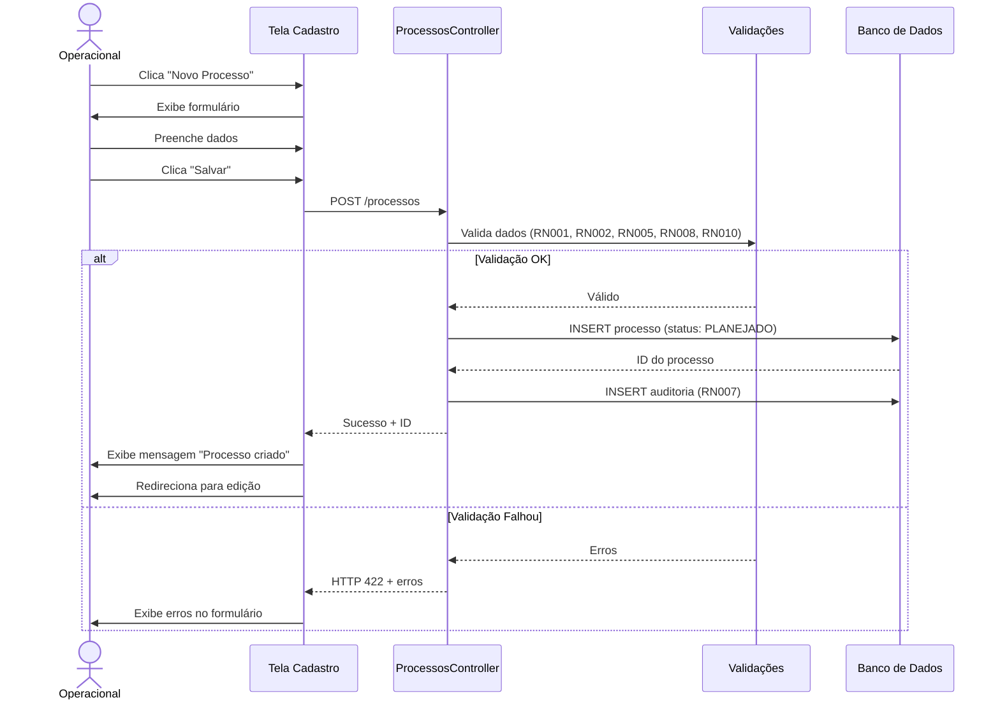
```mermaid
sequenceDiagram
    actor O as Operacional
    participant UI as Tela Cadastro
    participant C as ProcessosController
    participant V as Validações
    participant DB as Banco de Dados

    O->>UI: Clica "Novo Processo"
    UI->>O: Exibe formulário
    O->>UI: Preenche dados
    O->>UI: Clica "Salvar"
    UI->>C: POST /processos
    C->>V: Valida dados (RN001, RN002, RN005, RN008, RN010)

    alt Validação OK
        V-->>C: Válido
        C->>DB: INSERT processo (status: PLANEJADO)
        DB-->>C: ID do processo
        C->>DB: INSERT auditoria (RN007)
        C-->>UI: Sucesso + ID
        UI->>O: Exibe mensagem "Processo criado"
        UI->>O: Redireciona para edição
    else Validação Falhou
        V-->>C: Erros
        C-->>UI: HTTP 422 + erros
        UI->>O: Exibe erros no formulário
    end
```

### Protótipo/Wireframe

```
┌─────────────────────────────────────────────────────────────────┐
│  ☰  SGICI                                   Admin        👤 ▼   │
├─────────────────────────────────────────────────────────────────┤
│                                                                  │
│  Processos > Novo Processo                                       │
│                                                                  │
│  ┌────────────────────────────────────────────────────────────┐ │
│  │  Dados Básicos                                             │ │
│  │                                                            │ │
│  │  Número do Processo *       ┌────────────────────┐        │ │
│  │                            │ PI-2026-001        │        │ │
│  │                            └────────────────────┘        │ │
│  │                                                            │ │
│  │  Fornecedor *              ┌────────────────────┐        │ │
│  │                            │ Selecione...      ▼│        │ │
│  │                            └────────────────────┘        │ │
│  │                                                            │ │
│  │  País de Origem *          ┌────────────────────┐        │ │
│  │                            │ China             ▼│        │ │
│  │                            └────────────────────┘        │ │
│  └────────────────────────────────────────────────────────────┘ │
│                                                                  │
│  ┌────────────────────────────────────────────────────────────┐ │
│  │  Transporte                                                │ │
│  │                                                            │ │
│  │  Modal *        ⚪ Marítimo  ⚫ Aéreo  ⚪ Rodoviário       │ │
│  │                                                            │ │
│  │  Incoterm *                ┌────────────────────┐        │ │
│  │                            │ FOB               ▼│        │ │
│  │                            └────────────────────┘        │ │
│  │                                                            │ │
│  │  Porto Origem *            ┌────────────────────┐        │ │
│  │                            │ Porto de Xangai    │        │ │
│  │                            └────────────────────┘        │ │
│  │                                                            │ │
│  │  Porto Destino *           ┌────────────────────┐        │ │
│  │                            │ Porto de Santos    │        │ │
│  │                            └────────────────────┘        │ │
│  └────────────────────────────────────────────────────────────┘ │
│                                                                  │
│  ┌────────────────────────────────────────────────────────────┐ │
│  │  Financeiro                                                │ │
│  │                                                            │ │
│  │  Moeda *     ┌─────────┐  Taxa Câmbio * ┌──────────┐     │ │
│  │              │ USD    ▼│                 │ 5.45     │     │ │
│  │              └─────────┘                 └──────────┘     │ │
│  │                                                            │ │
│  │  Valor FOB Previsto *      ┌────────────────────┐        │ │
│  │                            │ US$ 50,000.00      │        │ │
│  │                            └────────────────────┘        │ │
│  └────────────────────────────────────────────────────────────┘ │
│                                                                  │
│  ┌────────────────────────────────────────────────────────────┐ │
│  │  Datas                                                     │ │
│  │                                                            │ │
│  │  Embarque Previsto *       Chegada Prevista (ETA) *       │ │
│  │  ┌────────────────┐        ┌────────────────┐            │ │
│  │  │ 15/02/2026  📅 │        │ 15/03/2026  📅 │            │ │
│  │  └────────────────┘        └────────────────┘            │ │
│  └────────────────────────────────────────────────────────────┘ │
│                                                                  │
│  ┌──────────┐  ┌─────────────┐                                 │
│  │ Cancelar │  │   Salvar    │                                 │
│  └──────────┘  └─────────────┘                                 │
│                                                                  │
└─────────────────────────────────────────────────────────────────┘
```

### Critérios de Aceitação
- [ ] Operacional consegue criar novo processo com todos os campos obrigatórios
- [ ] Sistema valida número único de processo
- [ ] Sistema valida datas cronológicas (embarque < chegada)
- [ ] Sistema valida fornecedor ativo
- [ ] Sistema valida campos condicionais conforme modal (porto para marítimo, aeroporto para aéreo)
- [ ] Sistema registra auditoria automaticamente (quem criou, quando)
- [ ] Processo criado inicia com status PLANEJADO
- [ ] Sistema exibe mensagem de sucesso e redireciona para edição
- [ ] Sistema exibe erros de validação de forma clara (campos destacados em vermelho)
- [ ] Dropdown de fornecedores exibe apenas fornecedores ativos

### Notas de Implementação
- Endpoint: `POST /processos`
- Controller: `ProcessosController@create`
- Model: `Processo`
- Validations: `ProcessoValidator` (ou validações no Model)
- Tela: `pages/processos/ProcessosForm.vue`
- Componentes: `IInput`, `ISelect`, `IDatePicker`

### Permissões
| Perfil | Pode Criar | Pode Editar | Pode Visualizar |
|--------|------------|-------------|-----------------|
| Administrador | ✅ | ✅ | ✅ |
| Gestor | ❌ | ❌ | ✅ (read-only) |
| Operacional | ✅ | ✅ | ✅ |

---

## RF002 - Planejamento e Simulação de Custos

### Descrição
O sistema deve permitir o cadastro de custos previstos (orçamento) para cada processo de importação, com cálculo automático de impostos e custo total previsto. Esta funcionalidade funciona como uma simulação financeira antes da execução do processo.

### Atores
- **Ator Principal:** Operacional
- **Atores Secundários:** Administrador

### Pré-condições
1. Processo de importação deve estar cadastrado (RF001)
2. Processo deve estar em status PLANEJADO ou APROVADO
3. Valor FOB previsto deve estar preenchido

### Pós-condições
1. Custos previstos salvos
2. Impostos calculados automaticamente
3. Custo Total Previsto calculado e exibido

### Fluxo Principal
1. Operacional acessa processo de importação já criado
2. Sistema exibe abas: [Dados Básicos] [Custos Previstos] [Custos Reais] [Logística] [Ocorrências]
3. Operacional clica na aba "Custos Previstos"
4. Sistema exibe formulário de custos previstos dividido em seções
5. Sistema pré-preenche FOB previsto (já informado no RF001)
6. Operacional preenche custos internacionais:
   - Frete Internacional previsto (em moeda estrangeira)
   - Seguro Internacional previsto (em moeda estrangeira)
   - Taxas de Origem previstas (em moeda estrangeira)
7. Sistema calcula automaticamente Base de Cálculo (RN004):
   ```
   Base = (FOB + Frete + Seguro) * Taxa_Câmbio_Prevista
   ```
8. Sistema calcula automaticamente impostos com alíquotas do sistema:
   - II (Imposto de Importação) = Base * Alíquota_II
   - IPI = (Base + II) * Alíquota_IPI
   - PIS/COFINS = Base * Alíquota_PIS_COFINS
   - ICMS = ((Base + II + IPI + PIS/COFINS) / (1 - Alíquota_ICMS)) * Alíquota_ICMS
9. Operacional preenche custos nacionais (em BRL):
   - Despachante Aduaneiro previsto
   - Armazenagem prevista
   - Capatazia prevista
   - Transporte Nacional previsto
   - Outros custos previstos
10. Sistema calcula **Custo Total Previsto (BRL)** automaticamente
11. Sistema exibe resumo:
    - Custos Internacionais (convertidos para BRL)
    - Impostos (BRL)
    - Custos Nacionais (BRL)
    - **Custo Total Previsto (BRL)**
    - **Custo Unitário Estimado** (se informado quantidade/peso/volume)
12. Operacional clica em "Salvar Custos Previstos"
13. Sistema valida e salva
14. Sistema exibe mensagem: "Custos previstos salvos com sucesso"

### Fluxos Alternativos

**FA1 - Incoterm CIF (Frete e Seguro Inclusos)**
- No passo 6, se Incoterm = CIF (RN009):
  1. Sistema exibe aviso: "Incoterm CIF: Frete e Seguro já estão inclusos no FOB"
  2. Sistema desabilita campos Frete e Seguro (valores = 0)
  3. Retorna ao passo 7

**FA2 - Consulta de Alíquotas**
- No passo 8, se Operacional quiser ver alíquotas configuradas:
  1. Operacional clica em "Ver Alíquotas"
  2. Sistema exibe modal com alíquotas atuais:
     - II: 14%
     - IPI: 10%
     - PIS/COFINS: 9.65%
     - ICMS: 18%
  3. Operacional fecha modal
  4. Retorna ao passo 9

**FA3 - Alterar Custos Previstos**
- A qualquer momento antes de finalizar processo:
  1. Operacional pode editar custos previstos
  2. Sistema recalcula impostos e total automaticamente
  3. Sistema registra histórico de alterações (auditoria)

### Fluxos de Exceção

**FE1 - Valor Negativo ou Zero**
- No passo 6, se valor informado <= 0:
  1. Sistema exibe erro: "Valores devem ser positivos"
  2. Campo com erro é destacado
  3. Retorna ao passo 6

**FE2 - Alíquotas Não Configuradas**
- No passo 8, se alíquotas não estão configuradas no sistema:
  1. Sistema exibe erro: "Alíquotas de impostos não configuradas. Contate o administrador."
  2. Operacional não pode salvar custos previstos
  3. Administrador deve configurar alíquotas (RF013)

**FE3 - Processo Finalizado**
- Se processo estiver em status FINALIZADO (RN015):
  1. Sistema exibe erro: "Processo finalizado não pode ser alterado"
  2. Todos os campos ficam read-only
  3. Apenas consulta é permitida

### Regras de Negócio Relacionadas
- RN004 - Cálculo Automático de Impostos
- RN007 - Auditoria de Modificações
- RN008 - Conversão de Moeda
- RN009 - Incoterm Define Responsabilidades
- RN015 - Processo Finalizado É Imutável

### Campos do Formulário

#### Seção: Custos Internacionais (em Moeda Estrangeira)
| Campo | Tipo | Obrigatório | Cálculo | Exemplo |
|-------|------|-------------|---------|---------|
| Valor FOB Previsto | Money (read-only) | Sim | Vem do RF001 | US$ 50,000.00 |
| Frete Internacional | Money | Não | Manual (ou 0 se CIF) | US$ 5,000.00 |
| Seguro Internacional | Money | Não | Manual (ou 0 se CIF) | US$ 500.00 |
| Taxas de Origem | Money | Não | Manual | US$ 200.00 |
| **Subtotal Internacional** | Money (read-only) | - | FOB + Frete + Seguro + Taxas | US$ 55,700.00 |

#### Seção: Impostos Calculados (em BRL)
| Campo | Tipo | Obrigatório | Cálculo | Exemplo |
|-------|------|-------------|---------|---------|
| Base de Cálculo BRL | Money (read-only) | - | Subtotal * Taxa_Câmbio | R$ 303,565.00 |
| II - Imposto Importação (14%) | Money (read-only) | - | Base * 0.14 | R$ 42,499.10 |
| IPI (10%) | Money (read-only) | - | (Base + II) * 0.10 | R$ 34,606.41 |
| PIS/COFINS (9.65%) | Money (read-only) | - | Base * 0.0965 | R$ 29,294.02 |
| ICMS (18%) | Money (read-only) | - | Cálculo por dentro | R$ 89,992.37 |
| **Subtotal Impostos** | Money (read-only) | - | Soma dos impostos | R$ 196,391.90 |

#### Seção: Custos Nacionais (em BRL)
| Campo | Tipo | Obrigatório | Cálculo | Exemplo |
|-------|------|-------------|---------|---------|
| Despachante Aduaneiro | Money | Não | Manual | R$ 2,500.00 |
| Armazenagem | Money | Não | Manual | R$ 1,000.00 |
| Capatazia | Money | Não | Manual | R$ 800.00 |
| Transporte Nacional | Money | Não | Manual | R$ 3,000.00 |
| Outros Custos | Money | Não | Manual | R$ 500.00 |
| **Subtotal Nacional** | Money (read-only) | - | Soma dos custos nacionais | R$ 7,800.00 |

#### Resumo Final
| Campo | Tipo | Obrigatório | Cálculo | Exemplo |
|-------|------|-------------|---------|---------|
| **CUSTO TOTAL PREVISTO** | Money (read-only, destaque) | - | Internacional + Impostos + Nacional | **R$ 507,756.90** |
| Custo Unitário (se informado peso/qtd) | Money (read-only) | - | Custo Total / Quantidade | R$ 5.08/kg |

### Diagrama de Sequência

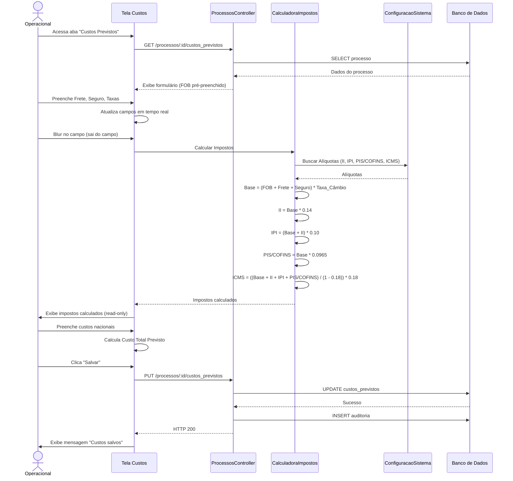
```mermaid
sequenceDiagram
    actor O as Operacional
    participant UI as Tela Custos
    participant C as ProcessosController
    participant Calc as CalculadoraImpostos
    participant Cfg as ConfiguracaoSistema
    participant DB as Banco de Dados

    O->>UI: Acessa aba "Custos Previstos"
    UI->>C: GET /processos/:id/custos_previstos
    C->>DB: SELECT processo
    DB-->>C: Dados do processo
    C-->>UI: Exibe formulário (FOB pré-preenchido)

    O->>UI: Preenche Frete, Seguro, Taxas
    UI->>UI: Atualiza campos em tempo real

    O->>UI: Blur no campo (sai do campo)
    UI->>Calc: Calcular Impostos
    Calc->>Cfg: Buscar Alíquotas (II, IPI, PIS/COFINS, ICMS)
    Cfg-->>Calc: Alíquotas
    Calc->>Calc: Base = (FOB + Frete + Seguro) * Taxa_Câmbio
    Calc->>Calc: II = Base * 0.14
    Calc->>Calc: IPI = (Base + II) * 0.10
    Calc->>Calc: PIS/COFINS = Base * 0.0965
    Calc->>Calc: ICMS = ((Base + II + IPI + PIS/COFINS) / (1 - 0.18)) * 0.18
    Calc-->>UI: Impostos calculados
    UI->>O: Exibe impostos calculados (read-only)

    O->>UI: Preenche custos nacionais
    UI->>UI: Calcula Custo Total Previsto

    O->>UI: Clica "Salvar"
    UI->>C: PUT /processos/:id/custos_previstos
    C->>DB: UPDATE custos_previstos
    DB-->>C: Sucesso
    C->>DB: INSERT auditoria
    C-->>UI: HTTP 200
    UI->>O: Exibe mensagem "Custos salvos"
```

### Diagrama de Estado dos Custos

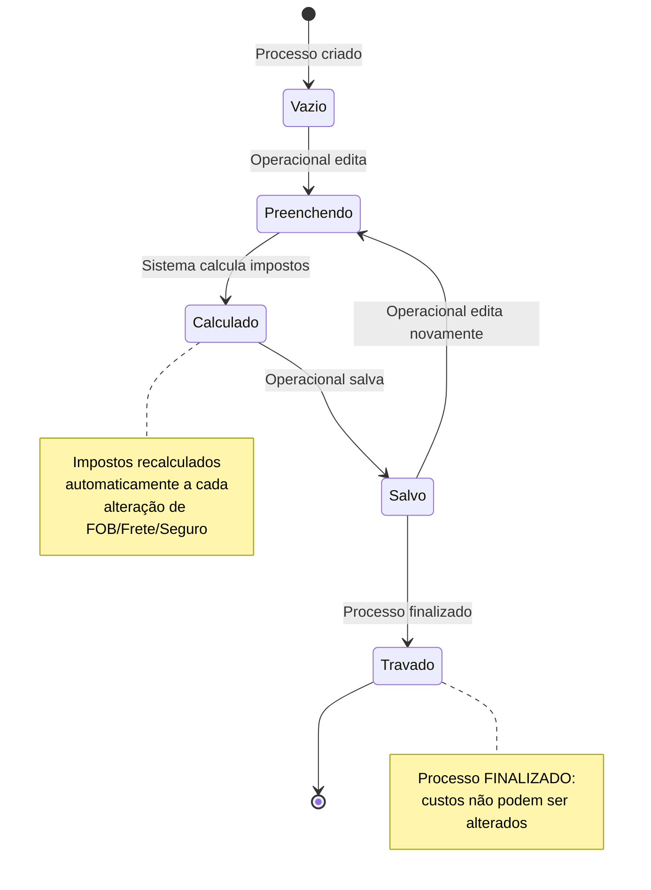
```mermaid
stateDiagram-v2
    [*] --> Vazio: Processo criado
    Vazio --> Preenchendo: Operacional edita
    Preenchendo --> Calculado: Sistema calcula impostos
    Calculado --> Salvo: Operacional salva
    Salvo --> Preenchendo: Operacional edita novamente
    Salvo --> Travado: Processo finalizado
    Travado --> [*]

    note right of Calculado
        Impostos recalculados
        automaticamente a cada
        alteração de FOB/Frete/Seguro
    end note

    note right of Travado
        Processo FINALIZADO:
        custos não podem ser alterados
    end note
```

### Protótipo/Wireframe

```
┌─────────────────────────────────────────────────────────────────┐
│  Processo PI-2026-001 | Status: PLANEJADO                        │
├─────────────────────────────────────────────────────────────────┤
│  [Dados Básicos] [Custos Previstos] [Custos Reais] [Logística]  │
│                                                                  │
│  ┌────────────────────────────────────────────────────────────┐ │
│  │  Custos Internacionais (em USD)                           │ │
│  │                                                            │ │
│  │  Valor FOB              US$ 50,000.00  (read-only)        │ │
│  │  Frete Internacional    US$ 5,000.00                      │ │
│  │  Seguro Internacional   US$ 500.00                        │ │
│  │  Taxas de Origem        US$ 200.00                        │ │
│  │  ───────────────────────────────────────────────────────  │ │
│  │  Subtotal               US$ 55,700.00                     │ │
│  │                                                            │ │
│  │  Taxa de Câmbio         5.45 BRL/USD                      │ │
│  │  Base de Cálculo        R$ 303,565.00                     │ │
│  └────────────────────────────────────────────────────────────┘ │
│                                                                  │
│  ┌────────────────────────────────────────────────────────────┐ │
│  │  Impostos Calculados (em BRL)  [Ver Alíquotas]            │ │
│  │                                                            │ │
│  │  II (14%)               R$ 42,499.10   (calculado)        │ │
│  │  IPI (10%)              R$ 34,606.41   (calculado)        │ │
│  │  PIS/COFINS (9.65%)     R$ 29,294.02   (calculado)        │ │
│  │  ICMS (18%)             R$ 89,992.37   (calculado)        │ │
│  │  ───────────────────────────────────────────────────────  │ │
│  │  Subtotal Impostos      R$ 196,391.90                     │ │
│  └────────────────────────────────────────────────────────────┘ │
│                                                                  │
│  ┌────────────────────────────────────────────────────────────┐ │
│  │  Custos Nacionais (em BRL)                                │ │
│  │                                                            │ │
│  │  Despachante Aduaneiro  R$ 2,500.00                       │ │
│  │  Armazenagem            R$ 1,000.00                       │ │
│  │  Capatazia              R$ 800.00                         │ │
│  │  Transporte Nacional    R$ 3,000.00                       │ │
│  │  Outros                 R$ 500.00                         │ │
│  │  ───────────────────────────────────────────────────────  │ │
│  │  Subtotal Nacional      R$ 7,800.00                       │ │
│  └────────────────────────────────────────────────────────────┘ │
│                                                                  │
│  ┌────────────────────────────────────────────────────────────┐ │
│  │  RESUMO FINANCEIRO                                         │ │
│  │                                                            │ │
│  │  Custos Internacionais (BRL)     R$ 303,565.00            │ │
│  │  Impostos (BRL)                  R$ 196,391.90            │ │
│  │  Custos Nacionais (BRL)          R$   7,800.00            │ │
│  │  ═══════════════════════════════════════════════════════  │ │
│  │  CUSTO TOTAL PREVISTO            R$ 507,756.90            │ │
│  │                                                            │ │
│  │  Peso Total: 10.000 kg                                    │ │
│  │  Custo por kg:  R$ 50.78/kg                               │ │
│  └────────────────────────────────────────────────────────────┘ │
│                                                                  │
│  ┌──────────┐  ┌────────────────────┐                           │
│  │ Cancelar │  │  Salvar Custos     │                           │
│  └──────────┘  └────────────────────┘                           │
│                                                                  │
└─────────────────────────────────────────────────────────────────┘
```

### Critérios de Aceitação
- [ ] Operacional consegue preencher custos previstos (FOB, frete, seguro, taxas)
- [ ] Sistema calcula impostos automaticamente ao preencher custos internacionais
- [ ] Campos de impostos são read-only (não editáveis manualmente)
- [ ] Sistema usa alíquotas configuradas no sistema (RF013)
- [ ] Sistema calcula corretamente ICMS "por dentro"
- [ ] Operacional consegue preencher custos nacionais (despachante, armazenagem, etc.)
- [ ] Sistema calcula Custo Total Previsto automaticamente
- [ ] Se Incoterm = CIF, campos Frete e Seguro são desabilitados
- [ ] Sistema converte valores em moeda estrangeira para BRL usando taxa de câmbio prevista
- [ ] Sistema exibe resumo financeiro com totais parciais e total geral
- [ ] Operacional consegue salvar e editar custos previstos múltiplas vezes
- [ ] Sistema registra auditoria de modificações
- [ ] Se processo estiver FINALIZADO, não permite edição (apenas consulta)

### Notas de Implementação
- Endpoint GET: `GET /processos/:id/custos_previstos`
- Endpoint PUT: `PUT /processos/:id/custos_previstos`
- Controller: `ProcessosController@custos_previstos` e `ProcessosController@salvar_custos_previstos`
- Service: `CalculadoraImpostosService` (para cálculos)
- Tela: `pages/processos/ProcessosForm.vue` (aba "Custos Previstos")
- Componentes: `IInput` (type="money"), `CustosPrevistos`, `ResumoFinanceiro`

### Permissões
| Perfil | Pode Editar Custos | Pode Ver Custos | Pode Configurar Alíquotas |
|--------|-------------------|-----------------|---------------------------|
| Administrador | ✅ | ✅ | ✅ |
| Gestor | ❌ | ✅ | ❌ |
| Operacional | ✅ | ✅ | ❌ |

---

## RF003 - Cadastro de Fornecedores e Prestadores

### Descrição
O sistema deve permitir o cadastro e gerenciamento de fornecedores internacionais e prestadores de serviço (freight forwarders, despachantes, seguradoras, transportadoras, armazéns) necessários para a cadeia de importação.

### Atores
- **Ator Principal:** Administrador
- **Atores Secundários:** Operacional (pode cadastrar fornecedores e prestadores)

### Pré-condições
1. Usuário deve ter perfil Administrador ou Operacional
2. Usuário deve estar autenticado

### Pós-condições
1. Fornecedor/Prestador cadastrado no sistema
2. Disponível para seleção em processos de importação
3. Registro de auditoria criado

### Fluxo Principal - Cadastro de Fornecedor Internacional

1. Operacional acessa menu "Cadastros > Fornecedores"
2. Sistema exibe lista de fornecedores cadastrados
3. Operacional clica em "Novo Fornecedor"
4. Sistema exibe formulário de cadastro de fornecedor
5. Operacional preenche campos obrigatórios:
   - Nome / Razão Social
   - País
   - CNPJ / Tax ID (identificação fiscal)
   - Endereço completo
   - Email comercial
   - Telefone
   - Pessoa de contato
   - Status (Ativo/Inativo)
6. Operacional preenche campos opcionais:
   - Website
   - Observações
7. Sistema valida dados (RN de fornecedor: CNPJ/Tax ID obrigatório, País obrigatório)
8. Operacional clica em "Salvar"
9. Sistema salva fornecedor
10. Sistema registra auditoria
11. Sistema exibe mensagem: "Fornecedor cadastrado com sucesso"
12. Sistema retorna para lista de fornecedores

### Fluxo Alternativo - Cadastro de Prestador de Serviço

1. Operacional acessa menu "Cadastros > Prestadores"
2. Sistema exibe lista de prestadores cadastrados (filtráveis por tipo)
3. Operacional clica em "Novo Prestador"
4. Sistema exibe formulário de cadastro de prestador
5. Operacional preenche campos obrigatórios:
   - Nome / Razão Social
   - Tipo de Prestador (dropdown):
     - Freight Forwarder
     - Despachante Aduaneiro
     - Seguradora
     - Transportadora Nacional
     - Armazém
     - Outros
   - CNPJ
   - Endereço completo
   - Email comercial
   - Telefone
   - Status (Ativo/Inativo)
6. Operacional preenche campos opcionais:
   - Pessoa de contato operacional
   - Pessoa de contato comercial
   - Website
   - Observações
7. Sistema valida dados (CNPJ obrigatório e válido, Tipo obrigatório)
8. Operacional clica em "Salvar"
9. Sistema salva prestador
10. Sistema registra auditoria
11. Sistema exibe mensagem: "Prestador cadastrado com sucesso"
12. Sistema retorna para lista de prestadores

### Fluxo Alternativo - Edição de Fornecedor/Prestador

1. Operacional acessa lista de fornecedores ou prestadores
2. Operacional clica no ícone "Editar" de um registro
3. Sistema exibe formulário preenchido com dados atuais
4. Operacional altera campos desejados
5. Sistema valida alterações
6. Operacional clica em "Salvar"
7. Sistema atualiza registro
8. Sistema registra auditoria (quem alterou, quando, o que mudou)
9. Sistema exibe mensagem: "Registro atualizado com sucesso"

### Fluxo Alternativo - Desativação de Fornecedor/Prestador

1. Operacional acessa lista de fornecedores ou prestadores
2. Operacional clica no ícone "Desativar" de um registro ativo
3. Sistema exibe modal de confirmação: "Deseja desativar este fornecedor/prestador?"
4. Sistema verifica se há processos ativos vinculados
5. Se houver processos ativos:
   - Sistema exibe aviso: "Este fornecedor possui X processos ativos. Processos existentes não serão afetados, mas o fornecedor não aparecerá mais para novos processos."
6. Operacional confirma desativação
7. Sistema altera status para "Inativo"
8. Sistema registra auditoria
9. Sistema exibe mensagem: "Fornecedor desativado com sucesso"
10. Fornecedor não aparece mais em dropdowns de novos processos

### Fluxos de Exceção

**FE1 - CNPJ/Tax ID Duplicado**
- No passo 7, se CNPJ/Tax ID já existe:
  1. Sistema exibe erro: "CNPJ/Tax ID já cadastrado no sistema"
  2. Sistema sugere: "Deseja editar o cadastro existente?"
  3. Retorna ao passo 5

**FE2 - CNPJ Inválido**
- No passo 7, se CNPJ brasileiro inválido (validação de dígitos verificadores):
  1. Sistema exibe erro: "CNPJ inválido"
  2. Campo é destacado em vermelho
  3. Retorna ao passo 5

**FE3 - Tentativa de Exclusão com Processos Vinculados**
- Se Operacional tentar excluir fornecedor/prestador com processos vinculados:
  1. Sistema exibe erro: "Não é possível excluir. Existem X processos vinculados."
  2. Sistema sugere: "Você pode desativar o registro ao invés de excluir."

### Regras de Negócio Relacionadas
- RN005 - Fornecedor Ativo
- RN007 - Auditoria de Modificações
- Fornecedor/Prestador com processos não pode ser excluído (apenas desativado)

### Campos do Formulário - Fornecedor Internacional

| Campo | Tipo | Obrigatório | Validação | Exemplo |
|-------|------|-------------|-----------|---------|
| Nome / Razão Social | Text | Sim | Min. 3 caracteres | ABC Manufacturing Ltd |
| País | Select | Sim | Lista de países | China |
| CNPJ / Tax ID | Text | Sim | Único | 91-1234567 |
| Endereço | Text | Sim | - | 123 Main St, Shenzhen |
| Email Comercial | Email | Sim | Formato válido | contact@abc.com |
| Telefone | Tel | Sim | - | +86 755 1234-5678 |
| Pessoa de Contato | Text | Não | - | John Wang |
| Website | URL | Não | Formato válido | https://abc.com |
| Status | Toggle | Sim | Ativo/Inativo | Ativo |
| Observações | Textarea | Não | - | Fornecedor preferencial |

### Campos do Formulário - Prestador de Serviço

| Campo | Tipo | Obrigatório | Validação | Exemplo |
|-------|------|-------------|-----------|---------|
| Nome / Razão Social | Text | Sim | Min. 3 caracteres | DHL Global Forwarding |
| Tipo de Prestador | Select | Sim | Lista fixa | Freight Forwarder |
| CNPJ | Text | Sim | CNPJ válido | 12.345.678/0001-90 |
| Endereço | Text | Sim | - | Av. Paulista, 1000 - SP |
| Email Comercial | Email | Sim | Formato válido | comercial@dhl.com.br |
| Telefone Comercial | Tel | Sim | - | (11) 3456-7890 |
| Email Operacional | Email | Não | Formato válido | operacoes@dhl.com.br |
| Telefone Operacional | Tel | Não | - | (11) 3456-7899 |
| Pessoa de Contato (Comercial) | Text | Não | - | Maria Silva |
| Pessoa de Contato (Operacional) | Text | Não | - | João Santos |
| Website | URL | Não | Formato válido | https://dhl.com.br |
| Status | Toggle | Sim | Ativo/Inativo | Ativo |
| Observações | Textarea | Não | - | Parceiro preferencial |

### Diagrama de Sequência - Cadastro de Fornecedor

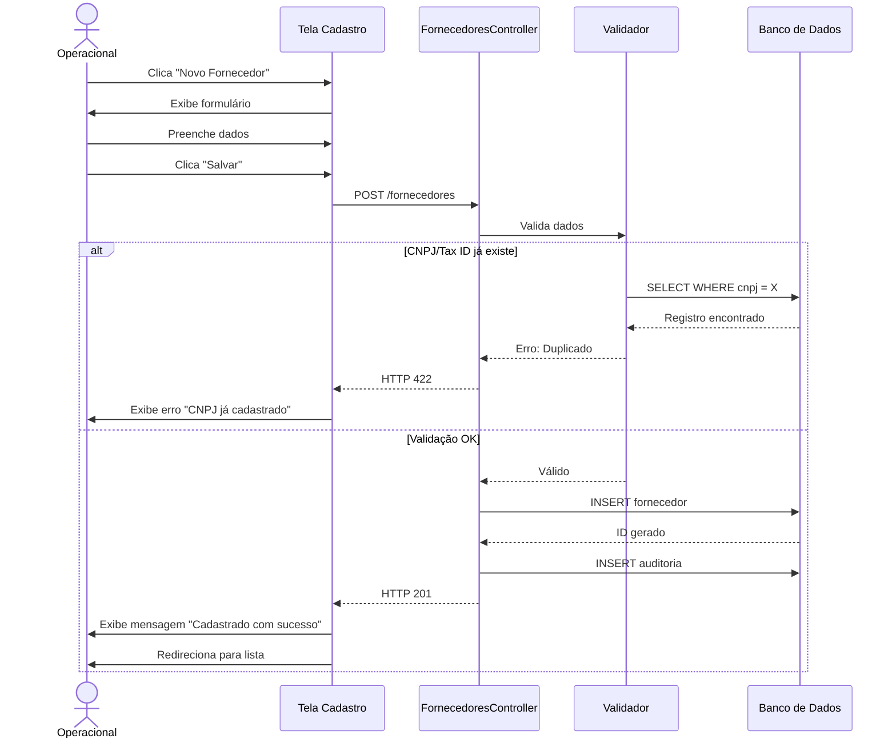
```mermaid
sequenceDiagram
    actor O as Operacional
    participant UI as Tela Cadastro
    participant C as FornecedoresController
    participant V as Validador
    participant DB as Banco de Dados

    O->>UI: Clica "Novo Fornecedor"
    UI->>O: Exibe formulário
    O->>UI: Preenche dados
    O->>UI: Clica "Salvar"
    UI->>C: POST /fornecedores
    C->>V: Valida dados

    alt CNPJ/Tax ID já existe
        V->>DB: SELECT WHERE cnpj = X
        DB-->>V: Registro encontrado
        V-->>C: Erro: Duplicado
        C-->>UI: HTTP 422
        UI->>O: Exibe erro "CNPJ já cadastrado"
    else Validação OK
        V-->>C: Válido
        C->>DB: INSERT fornecedor
        DB-->>C: ID gerado
        C->>DB: INSERT auditoria
        C-->>UI: HTTP 201
        UI->>O: Exibe mensagem "Cadastrado com sucesso"
        UI->>O: Redireciona para lista
    end
```

### Diagrama de Estado - Fornecedor/Prestador

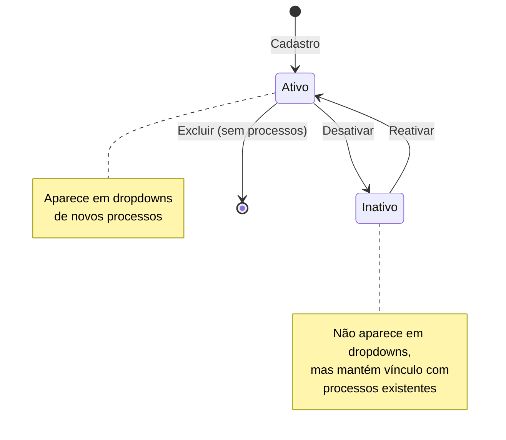
```mermaid
stateDiagram-v2
    [*] --> Ativo: Cadastro
    Ativo --> Inativo: Desativar
    Inativo --> Ativo: Reativar
    Ativo --> [*]: Excluir (sem processos)

    note right of Ativo
        Aparece em dropdowns
        de novos processos
    end note

    note right of Inativo
        Não aparece em dropdowns,
        mas mantém vínculo com
        processos existentes
    end note
```

### Protótipo - Lista de Fornecedores

```
┌─────────────────────────────────────────────────────────────────┐
│  ☰  SGICI                                   Admin        👤 ▼   │
├─────────────────────────────────────────────────────────────────┤
│                                                                  │
│  Cadastros > Fornecedores                                        │
│                                                                  │
│  ┌──────────────────────────────┐  ┌───────────────────────┐   │
│  │ 🔍 Buscar por nome...        │  │ [+ Novo Fornecedor]   │   │
│  └──────────────────────────────┘  └───────────────────────┘   │
│                                                                  │
│  ┌────────────────────────────────────────────────────────────┐ │
│  │ Nome             │ País   │ CNPJ/Tax ID │ Status │ Ações   │ │
│  ├────────────────────────────────────────────────────────────┤ │
│  │ ABC Manufact...  │ China  │ 91-1234567  │ 🟢Ativo│ ✏️ 🗑️   │ │
│  │ XYZ Suppliers    │ EUA    │ 12-3456789  │ 🟢Ativo│ ✏️ 🗑️   │ │
│  │ Global Imports   │ Taiwan │ 98-7654321  │ ⚫Inativo│ ✏️    │ │
│  └────────────────────────────────────────────────────────────┘ │
│                                                                  │
│  Exibindo 1-10 de 45 fornecedores      [◀️] [1] [2] [3] [▶️]    │
│                                                                  │
└─────────────────────────────────────────────────────────────────┘
```

### Protótipo - Formulário de Fornecedor

```
┌─────────────────────────────────────────────────────────────────┐
│  Cadastros > Fornecedores > Novo                                 │
├─────────────────────────────────────────────────────────────────┤
│                                                                  │
│  ┌────────────────────────────────────────────────────────────┐ │
│  │  Dados do Fornecedor                                       │ │
│  │                                                            │ │
│  │  Nome / Razão Social *     ┌────────────────────────────┐ │ │
│  │                            │ ABC Manufacturing Ltd      │ │ │
│  │                            └────────────────────────────┘ │ │
│  │                                                            │ │
│  │  País *          ┌────────┐  CNPJ/Tax ID * ┌───────────┐ │ │
│  │                  │ China ▼│                 │91-1234567 │ │ │
│  │                  └────────┘                 └───────────┘ │ │
│  │                                                            │ │
│  │  Endereço *                ┌────────────────────────────┐ │ │
│  │                            │ 123 Main St, Shenzhen      │ │ │
│  │                            └────────────────────────────┘ │ │
│  │                                                            │ │
│  │  Email * ┌───────────────────┐ Telefone * ┌────────────┐│ │
│  │          │contact@abc.com    │            │+86 755...  ││ │
│  │          └───────────────────┘            └────────────┘│ │
│  │                                                            │ │
│  │  Pessoa de Contato         ┌────────────────────────────┐ │ │
│  │                            │ John Wang                  │ │ │
│  │                            └────────────────────────────┘ │ │
│  │                                                            │ │
│  │  Website                   ┌────────────────────────────┐ │ │
│  │                            │ https://abc.com            │ │ │
│  │                            └────────────────────────────┘ │ │
│  │                                                            │ │
│  │  Status              ┌─────────────────┐                 │ │
│  │                      │ ⚪ Ativo  ⚫ Inativo │               │ │
│  │                      └─────────────────┘                 │ │
│  │                                                            │ │
│  │  Observações                                              │ │
│  │  ┌──────────────────────────────────────────────────────┐ │ │
│  │  │                                                      │ │ │
│  │  │ Fornecedor preferencial para eletrônicos            │ │ │
│  │  │                                                      │ │ │
│  │  └──────────────────────────────────────────────────────┘ │ │
│  └────────────────────────────────────────────────────────────┘ │
│                                                                  │
│  ┌──────────┐  ┌─────────────┐                                 │
│  │ Cancelar │  │   Salvar    │                                 │
│  └──────────┘  └─────────────┘                                 │
│                                                                  │
└─────────────────────────────────────────────────────────────────┘
```

### Critérios de Aceitação
- [ ] Operacional/Admin consegue cadastrar fornecedores internacionais
- [ ] Sistema valida CNPJ/Tax ID único
- [ ] Sistema valida CNPJ brasileiro (dígitos verificadores)
- [ ] Operacional/Admin consegue cadastrar prestadores de serviço
- [ ] Sistema permite seleção de tipo de prestador (Freight Forwarder, Despachante, etc.)
- [ ] Sistema valida campos obrigatórios
- [ ] Operacional/Admin consegue editar fornecedores/prestadores existentes
- [ ] Sistema permite desativar fornecedores/prestadores
- [ ] Fornecedores/prestadores inativos não aparecem em dropdowns de novos processos
- [ ] Fornecedores/prestadores inativos mantêm vínculo com processos existentes
- [ ] Sistema impede exclusão de fornecedores/prestadores com processos vinculados
- [ ] Sistema registra auditoria de todas as operações
- [ ] Sistema exibe mensagens de erro claras para validações

### Notas de Implementação
- Endpoints:
  - `GET /fornecedores` - Lista
  - `POST /fornecedores` - Criar
  - `GET /fornecedores/:id` - Visualizar
  - `PUT /fornecedores/:id` - Editar
  - `DELETE /fornecedores/:id` - Desativar (soft delete)
  - Mesma estrutura para `/prestadores`
- Controllers: `FornecedoresController`, `PrestadoresController`
- Models: `Fornecedor`, `Prestador`
- Telas:
  - `pages/fornecedores/FornecedoresIndex.vue`
  - `pages/fornecedores/FornecedoresForm.vue`
  - `pages/prestadores/PrestadoresIndex.vue`
  - `pages/prestadores/PrestadoresForm.vue`
- Componentes: `IInput`, `ISelect`, `DataTable`, `ConfirmationModal`

### Permissões
| Perfil | Pode Cadastrar | Pode Editar | Pode Desativar | Pode Excluir |
|--------|----------------|-------------|----------------|--------------|
| Administrador | ✅ | ✅ | ✅ | ✅ (se sem vínculos) |
| Gestor | ❌ | ❌ | ❌ | ❌ |
| Operacional | ✅ | ✅ | ✅ | ❌ |

---

## RF004 - Acompanhamento Logístico

### Descrição
O sistema deve permitir o registro e acompanhamento de eventos logísticos durante todo o ciclo de vida do processo de importação, desde o embarque até a entrega final.

### Atores
- **Ator Principal:** Operacional
- **Atores Secundários:** Administrador

### Pré-condições
1. Processo de importação deve estar cadastrado
2. Processo deve estar em status APROVADO ou superior
3. Usuário deve ter perfil Operacional ou Administrador

### Pós-condições
1. Eventos logísticos registrados
2. Status do processo atualizado conforme eventos
3. Datas reais registradas
4. Desvios de prazo calculados automaticamente
5. Ocorrências criadas automaticamente se atrasos significativos

### Fluxo Principal - Registro de Embarque

1. Operacional recebe aviso do freight forwarder: "Carga embarcou"
2. Operacional acessa processo de importação
3. Sistema exibe abas: [Dados Básicos] [Custos] [Logística] [Ocorrências]
4. Operacional clica na aba "Logística"
5. Sistema exibe timeline de eventos logísticos
6. Operacional clica em "Registrar Embarque"
7. Sistema exibe modal com campos:
   - Data de Embarque Real (date picker)
   - Número do Container / AWB / Placa (conforme modal)
   - ETA (Estimated Time of Arrival) - data prevista de chegada
   - Observações (opcional)
8. Operacional preenche dados
9. Sistema valida:
   - Data de embarque <= hoje (RN002)
   - Data de embarque <= ETA
10. Operacional clica em "Salvar Embarque"
11. Sistema salva evento de embarque
12. Sistema altera status do processo para **EM TRÂNSITO**
13. Sistema compara data_embarque_real vs data_embarque_prevista:
    - Se atraso > 2 dias: exibe modal sugerindo criar ocorrência
    - Se no prazo: apenas registra
14. Sistema libera lançamento de custos reais (RF005)
15. Sistema registra auditoria
16. Sistema exibe mensagem: "Embarque registrado com sucesso"
17. Sistema atualiza timeline com evento "Embarcado"

### Fluxo Alternativo - Atualização de ETA

1. Operacional recebe atualização do freight forwarder: "ETA alterado"
2. Operacional acessa aba "Logística" do processo
3. Operacional clica em "Atualizar ETA"
4. Sistema exibe campo com ETA atual e campo para novo ETA
5. Operacional informa novo ETA
6. Sistema valida: novo ETA >= hoje
7. Operacional clica em "Salvar"
8. Sistema atualiza ETA
9. Sistema registra histórico de alterações de ETA
10. Sistema registra auditoria
11. Se novo ETA >> data_chegada_prevista (atraso > 7 dias):
    - Sistema sugere criar ocorrência (RF012)

### Fluxo Alternativo - Registro de Chegada

1. Operacional recebe aviso: "Carga chegou no Porto de Santos"
2. Operacional acessa aba "Logística" do processo
3. Operacional clica em "Registrar Chegada"
4. Sistema exibe modal com campos:
   - Data de Chegada Real (date picker)
   - Local de Chegada (confirmação)
   - Observações (opcional)
5. Operacional preenche dados
6. Sistema valida:
   - Data de chegada >= data de embarque (RN002)
   - Data de chegada <= hoje
7. Operacional clica em "Salvar Chegada"
8. Sistema salva evento de chegada
9. Sistema calcula desvio de prazo:
   ```
   Desvio = data_chegada_real - data_chegada_prevista (em dias)
   ```
10. Se desvio > 7 dias:
    - Sistema cria ocorrência automaticamente (RN012)
    - Sistema exibe modal: "Detectado atraso de X dias. Ocorrência criada automaticamente."
11. Sistema registra auditoria
12. Sistema exibe mensagem: "Chegada registrada com sucesso"
13. Sistema atualiza timeline com evento "Chegou"

### Fluxo Alternativo - Registro de Desembaraço

1. Despachante aduaneiro inicia processo na Receita Federal (fora do sistema)
2. Operacional registra início do desembaraço:
   - Data Início Desembaraço
   - Número da DI (Declaração de Importação)
3. Sistema salva evento "Desembaraço Iniciado"
4. Despachante aguarda liberação da Receita Federal
5. Receita Federal libera a carga
6. Operacional registra fim do desembaraço:
   - Data Fim Desembaraço
   - Valores dos impostos efetivos (conforme DI)
7. Sistema salva evento "Desembaraçado"
8. Sistema altera status do processo para **DESEMBARAÇADO**
9. Sistema lança automaticamente custos reais dos impostos (RF005)
10. Sistema calcula desvio: impostos reais vs previstos
11. Sistema registra auditoria

### Fluxo Alternativo - Registro de Entrega Final

1. Transportadora nacional entrega carga no destino final
2. Operacional registra entrega:
   - Data de Entrega Final
   - Local de Entrega
   - Responsável pelo Recebimento
   - Observações
3. Sistema valida:
   - Data de entrega >= data de desembaraço (RN002)
   - Data de entrega <= hoje
4. Sistema salva evento "Entregue"
5. Sistema habilita botão "Finalizar Processo" (RF007)
6. Sistema registra auditoria

### Fluxos de Exceção

**FE1 - Data de Embarque Futura**
- No passo 9 do fluxo principal, se data_embarque > hoje:
  1. Sistema exibe erro: "Data de embarque não pode ser futura"
  2. Retorna ao passo 8

**FE2 - Data de Chegada Anterior ao Embarque**
- No passo 6 do fluxo de chegada, se data_chegada < data_embarque (RN002):
  1. Sistema exibe erro: "Data de chegada deve ser posterior ao embarque"
  2. Retorna ao passo 5

**FE3 - DI Não Informada**
- No passo 6 do fluxo de desembaraço, se DI não informada:
  1. Sistema exibe erro: "Número da DI é obrigatório para registrar desembaraço"
  2. Campo é destacado
  3. Retorna ao passo 6

**FE4 - Processo Finalizado**
- Se processo estiver em status FINALIZADO (RN015):
  1. Sistema exibe erro: "Processo finalizado não pode ser alterado"
  2. Todos os botões de edição ficam ocultos
  3. Apenas consulta é permitida

### Regras de Negócio Relacionadas
- RN002 - Datas Cronológicas
- RN007 - Auditoria de Modificações
- RN012 - Atraso > 7 Dias Cria Ocorrência
- RN015 - Processo Finalizado É Imutável

### Eventos Logísticos Disponíveis

| Evento | Campos | Muda Status Para | Gatilhos |
|--------|--------|------------------|----------|
| Embarque | Data, Container/AWB, ETA | EM TRÂNSITO | Libera custos reais, Verifica atraso |
| Atualização ETA | Novo ETA | - | Histórico de ETAs, Verifica atraso |
| Chegada | Data, Local | - | Calcula desvio, Cria ocorrência se atraso > 7 dias |
| Início Desembaraço | Data, Número DI | - | - |
| Fim Desembaraço | Data, Impostos reais | DESEMBARAÇADO | Lança impostos reais |
| Entrega Final | Data, Local, Responsável | - | Habilita finalização |

### Diagrama de Sequência - Registro de Embarque

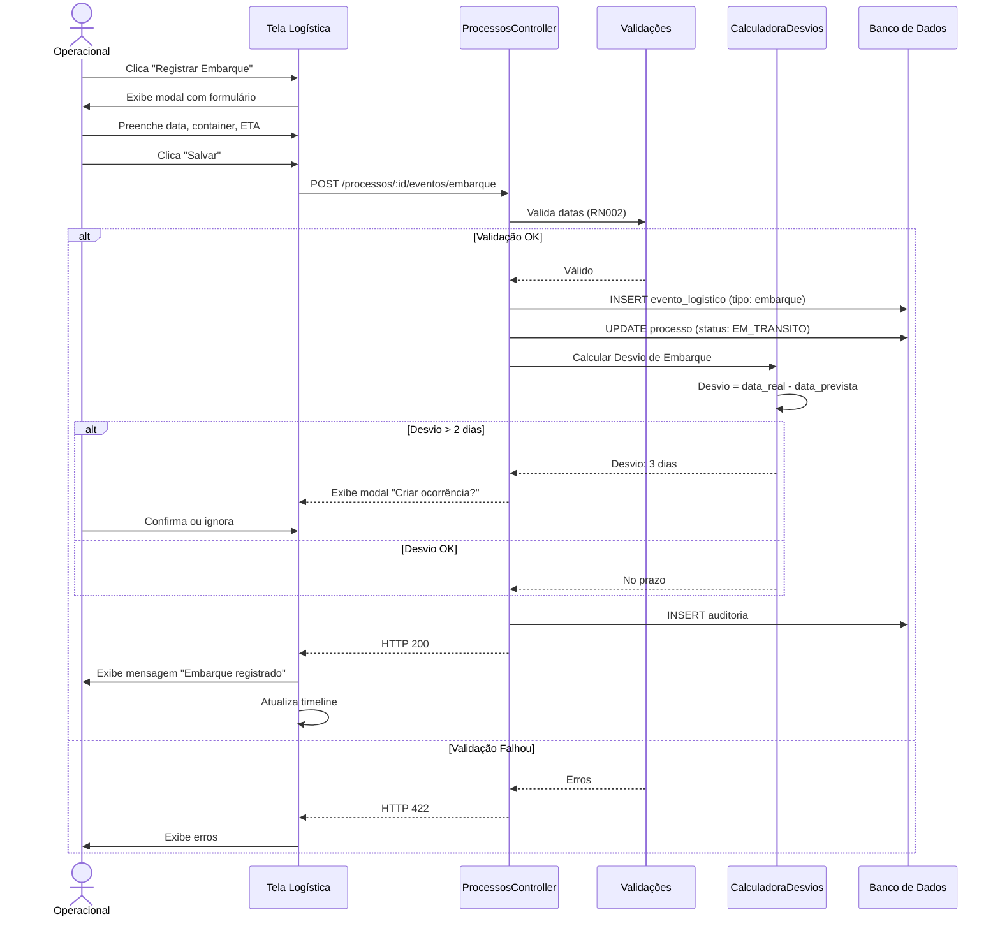
```mermaid
sequenceDiagram
    actor O as Operacional
    participant UI as Tela Logística
    participant C as ProcessosController
    participant V as Validações
    participant Calc as CalculadoraDesvios
    participant DB as Banco de Dados

    O->>UI: Clica "Registrar Embarque"
    UI->>O: Exibe modal com formulário
    O->>UI: Preenche data, container, ETA
    O->>UI: Clica "Salvar"
    UI->>C: POST /processos/:id/eventos/embarque
    C->>V: Valida datas (RN002)

    alt Validação OK
        V-->>C: Válido
        C->>DB: INSERT evento_logistico (tipo: embarque)
        C->>DB: UPDATE processo (status: EM_TRANSITO)
        C->>Calc: Calcular Desvio de Embarque
        Calc->>Calc: Desvio = data_real - data_prevista

        alt Desvio > 2 dias
            Calc-->>C: Desvio: 3 dias
            C-->>UI: Exibe modal "Criar ocorrência?"
            O->>UI: Confirma ou ignora
        else Desvio OK
            Calc-->>C: No prazo
        end

        C->>DB: INSERT auditoria
        C-->>UI: HTTP 200
        UI->>O: Exibe mensagem "Embarque registrado"
        UI->>UI: Atualiza timeline
    else Validação Falhou
        V-->>C: Erros
        C-->>UI: HTTP 422
        UI->>O: Exibe erros
    end
```

### Diagrama de Estado - Fluxo Logístico

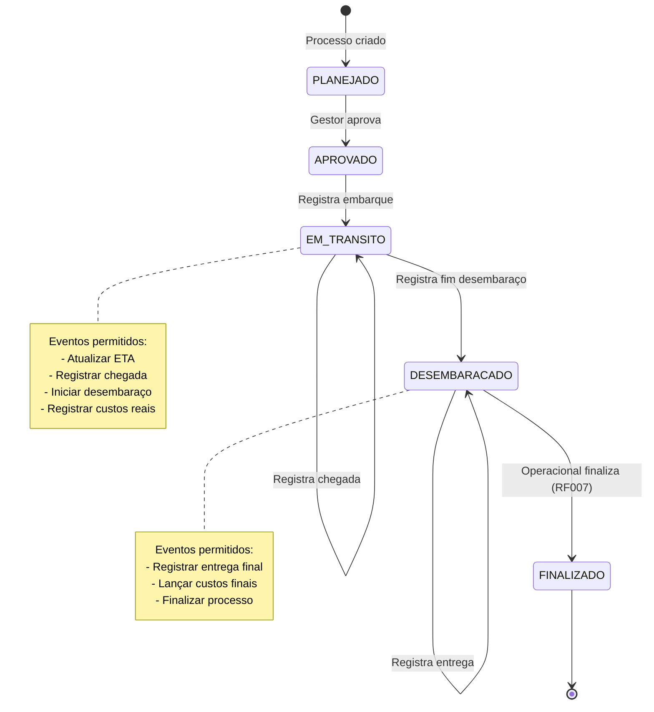
```mermaid
stateDiagram-v2
    [*] --> PLANEJADO: Processo criado
    PLANEJADO --> APROVADO: Gestor aprova
    APROVADO --> EM_TRANSITO: Registra embarque
    EM_TRANSITO --> EM_TRANSITO: Atualiza ETA
    EM_TRANSITO --> EM_TRANSITO: Registra chegada
    EM_TRANSITO --> DESEMBARACADO: Registra fim desembaraço
    DESEMBARACADO --> DESEMBARACADO: Registra entrega
    DESEMBARACADO --> FINALIZADO: Operacional finaliza (RF007)
    FINALIZADO --> [*]

    note right of EM_TRANSITO
        Eventos permitidos:
        - Atualizar ETA
        - Registrar chegada
        - Iniciar desembaraço
        - Registrar custos reais
    end note

    note right of DESEMBARACADO
        Eventos permitidos:
        - Registrar entrega final
        - Lançar custos finais
        - Finalizar processo
    end note
```

### Protótipo - Timeline de Eventos Logísticos

```
┌─────────────────────────────────────────────────────────────────┐
│  Processo PI-2026-001 | Status: EM TRÂNSITO                      │
├─────────────────────────────────────────────────────────────────┤
│  [Dados Básicos] [Custos] [Logística] [Ocorrências]             │
│                                                                  │
│  ┌────────────────────────────────────────────────────────────┐ │
│  │  Timeline de Eventos                                       │ │
│  │                                                            │ │
│  │  ✅ Embarcado                         15/02/2026          │ │
│  │      Porto de Xangai                                      │ │
│  │      Container: ABCD1234567                               │ │
│  │      ETA Inicial: 15/03/2026                              │ │
│  │      Desvio: +2 dias (atrasou em relação ao previsto)    │ │
│  │                                                            │ │
│  │  🔄 ETA Atualizado                    20/02/2026          │ │
│  │      Novo ETA: 18/03/2026                                 │ │
│  │      Motivo: Condições climáticas no porto                │ │
│  │                                                            │ │
│  │  ✅ Chegou                            18/03/2026          │ │
│  │      Porto de Santos                                      │ │
│  │      Desvio: +3 dias                                      │ │
│  │      🔴 Ocorrência criada automaticamente                 │ │
│  │                                                            │ │
│  │  🔄 Desembaraço Iniciado              19/03/2026          │ │
│  │      DI: 26/1234567-8                                     │ │
│  │                                                            │ │
│  │  ⏳ Aguardando Desembaraço...                             │ │
│  │      Próximo passo: Registrar fim do desembaraço          │ │
│  │                                                            │ │
│  └────────────────────────────────────────────────────────────┘ │
│                                                                  │
│  ┌───────────────────┐  ┌───────────────────┐                   │
│  │ Atualizar ETA     │  │ Registrar         │                   │
│  └───────────────────┘  │ Desembaraço       │                   │
│                         └───────────────────┘                   │
│                                                                  │
│  ┌────────────────────────────────────────────────────────────┐ │
│  │  Resumo de Prazos                                          │ │
│  │                                                            │ │
│  │  Embarque Previsto:  13/02/2026  |  Real: 15/02/2026 (+2)│ │
│  │  Chegada Prevista:   15/03/2026  |  Real: 18/03/2026 (+3)│ │
│  │  Desembaraço:        -           |  Em andamento         │ │
│  │  Entrega Prevista:   25/03/2026  |  Pendente             │ │
│  │                                                            │ │
│  │  Lead Time Previsto: 40 dias                              │ │
│  │  Lead Time Atual:    43 dias (até o momento)              │ │
│  └────────────────────────────────────────────────────────────┘ │
│                                                                  │
└─────────────────────────────────────────────────────────────────┘
```

### Critérios de Aceitação
- [ ] Operacional consegue registrar embarque com data, container/AWB e ETA
- [ ] Sistema valida datas cronológicas (embarque < chegada < desembaraço < entrega)
- [ ] Sistema altera status para EM TRÂNSITO ao registrar embarque
- [ ] Sistema calcula desvios de prazo automaticamente
- [ ] Sistema sugere criar ocorrência quando atraso > 2 dias no embarque
- [ ] Sistema cria ocorrência automaticamente quando atraso > 7 dias na chegada (RN012)
- [ ] Operacional consegue atualizar ETA múltiplas vezes
- [ ] Sistema mantém histórico de alterações de ETA
- [ ] Operacional consegue registrar chegada, desembaraço e entrega final
- [ ] Sistema altera status para DESEMBARAÇADO ao registrar fim do desembaraço
- [ ] Sistema exibe timeline visual com todos os eventos
- [ ] Sistema exibe resumo de prazos (previsto vs real) com desvios calculados
- [ ] Sistema registra auditoria de todos os eventos logísticos
- [ ] Se processo FINALIZADO, não permite edição (apenas consulta)

### Notas de Implementação
- Endpoints:
  - `POST /processos/:id/eventos/embarque`
  - `PUT /processos/:id/eventos/eta`
  - `POST /processos/:id/eventos/chegada`
  - `POST /processos/:id/eventos/desembaraco_inicio`
  - `POST /processos/:id/eventos/desembaraco_fim`
  - `POST /processos/:id/eventos/entrega`
- Controller: `ProcessosController` (ou `EventosLogisticosController`)
- Model: `EventoLogistico` (relacionamento com `Processo`)
- Service: `CalculadoraDesviosService` (calcular desvios de prazo)
- Tela: `pages/processos/ProcessosForm.vue` (aba "Logística")
- Componentes: `TimelineEventos`, `ModalEvento`, `ResumoPrazos`

### Permissões
| Perfil | Pode Registrar Eventos | Pode Ver Eventos | Pode Editar Eventos |
|--------|------------------------|------------------|---------------------|
| Administrador | ✅ | ✅ | ✅ |
| Gestor | ❌ | ✅ | ❌ |
| Operacional | ✅ | ✅ | ✅ (se processo não finalizado) |

---

## RF005 - Lançamento de Custos Reais

### Descrição
O sistema deve permitir o lançamento de custos efetivos (reais) conforme as faturas e documentos fiscais chegam, possibilitando a comparação com os custos previstos.

### Atores
- **Ator Principal:** Operacional
- **Atores Secundários:** Administrador

### Pré-condições
1. Processo deve estar em status EM TRÂNSITO ou superior (RN003)
2. Processo não pode estar FINALIZADO (RN015)
3. Usuário deve ter perfil Operacional ou Administrador

### Pós-condições
1. Custos reais lançados e salvos
2. Desvios calculados automaticamente (real vs previsto)
3. Custo Total Real atualizado
4. Alerta ao Gestor se desvio > 10% (RN011)

### Fluxo Principal

1. Operacional recebe fatura de custo (ex: fatura do frete internacional)
2. Operacional acessa processo de importação
3. Operacional clica na aba "Custos Reais"
4. Sistema exibe formulário de custos reais dividido em seções (mesma estrutura dos custos previstos)
5. Sistema exibe lado a lado: Custo Previsto | Custo Real | Desvio
6. Operacional preenche custo real:
   - Categoria (Frete Internacional, Seguro, Despachante, etc.)
   - Valor Real (em moeda original ou BRL)
   - Moeda (se diferente de BRL)
   - Data do Custo
   - Número da Fatura/Nota Fiscal
   - Fornecedor/Prestador (vinculado)
   - Observações (opcional)
7. Sistema valida:
   - Valor > 0
   - Data <= hoje
   - Número de fatura obrigatório
8. Operacional clica em "Adicionar Custo"
9. Sistema salva custo real
10. Sistema calcula automaticamente:
    - Conversão para BRL (se moeda estrangeira)
    - Desvio = (Custo Real - Custo Previsto) / Custo Previsto * 100
11. Sistema atualiza Custo Total Real
12. Sistema exibe desvio na tabela:
    - Verde se desvio <= 5%
    - Amarelo se desvio entre 5% e 10%
    - Vermelho se desvio > 10%
13. Se desvio total > 10% (RN011):
    - Sistema envia notificação ao Gestor (RF015)
14. Sistema registra auditoria
15. Sistema exibe mensagem: "Custo real lançado com sucesso"

### Fluxo Alternativo - Lançamento Automático de Impostos via DI

1. Operacional registra fim do desembaraço (RF004)
2. Operacional informa valores dos impostos conforme DI:
   - II (Imposto de Importação)
   - IPI
   - PIS/COFINS
   - ICMS
3. Sistema lança automaticamente custos reais de impostos
4. Sistema calcula desvio: impostos reais vs previstos
5. Sistema registra auditoria

### Fluxo Alternativo - Edição de Custo Real

1. Operacional identifica erro em custo lançado
2. Operacional clica em "Editar" no custo real
3. Sistema exibe modal com dados atuais
4. Operacional corrige dados
5. Sistema valida
6. Operacional clica em "Salvar"
7. Sistema atualiza custo real
8. Sistema recalcula desvio e total
9. Sistema registra auditoria (histórico de alterações)
10. Sistema exibe mensagem: "Custo atualizado"

### Fluxo Alternativo - Exclusão de Custo Real

1. Operacional identifica custo lançado incorretamente
2. Operacional clica em "Excluir" no custo real
3. Sistema exibe modal de confirmação: "Deseja excluir este custo?"
4. Operacional confirma
5. Sistema exclui custo real (ou soft delete)
6. Sistema recalcula desvio e total
7. Sistema registra auditoria
8. Sistema exibe mensagem: "Custo excluído"

### Fluxos de Exceção

**FE1 - Processo Não Permite Custos Reais**
- No passo 3, se processo está em status PLANEJADO ou APROVADO (RN003):
  1. Sistema exibe mensagem: "Custos reais só podem ser lançados após o embarque da carga"
  2. Aba "Custos Reais" fica desabilitada
  3. Operacional deve registrar embarque primeiro (RF004)

**FE2 - Número de Fatura Duplicado**
- No passo 7, se número de fatura já foi lançado:
  1. Sistema exibe aviso: "Este número de fatura já foi lançado. Deseja continuar?"
  2. Operacional pode confirmar (custo extra) ou cancelar

**FE3 - Processo Finalizado**
- Se processo está em status FINALIZADO (RN015):
  1. Sistema exibe erro: "Processo finalizado não pode ser alterado"
  2. Aba "Custos Reais" fica read-only
  3. Apenas consulta é permitida

**FE4 - Valor Negativo ou Zero**
- No passo 7, se valor <= 0:
  1. Sistema exibe erro: "Valor deve ser positivo"
  2. Campo é destacado
  3. Retorna ao passo 6

### Regras de Negócio Relacionadas
- RN003 - Custos Reais Apenas Após Embarque
- RN007 - Auditoria de Modificações
- RN008 - Conversão de Moeda
- RN011 - Desvio de Custo > 10% Alerta Gestor
- RN015 - Processo Finalizado É Imutável

### Campos do Formulário - Lançamento de Custo Real

| Campo | Tipo | Obrigatório | Validação | Exemplo |
|-------|------|-------------|-----------|---------|
| Categoria | Select | Sim | Lista fixa | Frete Internacional |
| Valor Real | Money | Sim | > 0 | 5,200.00 |
| Moeda | Select | Sim | USD, EUR, BRL, etc. | USD |
| Data do Custo | Date | Sim | <= hoje | 20/02/2026 |
| Número Fatura/NF | Text | Sim | - | INV-2026-001 |
| Fornecedor/Prestador | Select | Sim | - | DHL Global Forwarding |
| Observações | Textarea | Não | - | Incluiu taxa de segurança |

### Categorias de Custos Reais

| Categoria | Moeda Típica | Obrigatoriedade |
|-----------|--------------|-----------------|
| FOB Real | Moeda Estrangeira | Alta (principal) |
| Frete Internacional Real | Moeda Estrangeira | Alta |
| Seguro Internacional Real | Moeda Estrangeira | Média |
| Taxas de Origem Reais | Moeda Estrangeira | Baixa |
| II Real | BRL | Alta (via DI) |
| IPI Real | BRL | Alta (via DI) |
| PIS/COFINS Real | BRL | Alta (via DI) |
| ICMS Real | BRL | Alta (via DI) |
| Despachante Real | BRL | Alta |
| Armazenagem Real | BRL | Média |
| Capatazia Real | BRL | Média |
| Transporte Nacional Real | BRL | Alta |
| Extras | BRL | Baixa |

### Diagrama de Sequência - Lançamento de Custo Real

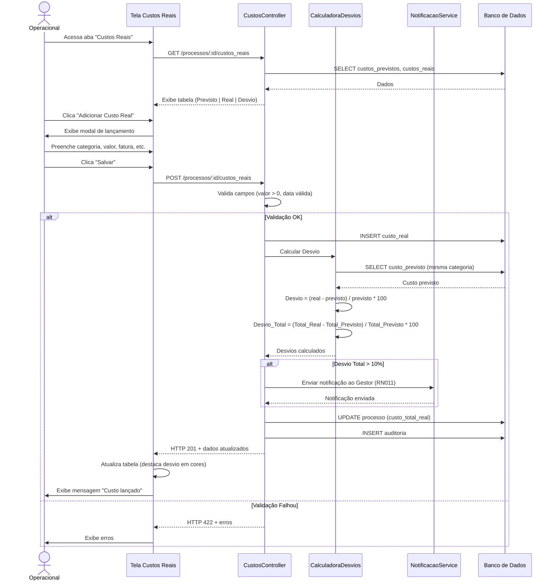
```mermaid
sequenceDiagram
    actor O as Operacional
    participant UI as Tela Custos Reais
    participant C as CustosController
    participant Calc as CalculadoraDesvios
    participant N as NotificacaoService
    participant DB as Banco de Dados

    O->>UI: Acessa aba "Custos Reais"
    UI->>C: GET /processos/:id/custos_reais
    C->>DB: SELECT custos_previstos, custos_reais
    DB-->>C: Dados
    C-->>UI: Exibe tabela (Previsto | Real | Desvio)

    O->>UI: Clica "Adicionar Custo Real"
    UI->>O: Exibe modal de lançamento
    O->>UI: Preenche categoria, valor, fatura, etc.
    O->>UI: Clica "Salvar"
    UI->>C: POST /processos/:id/custos_reais
    C->>C: Valida campos (valor > 0, data válida)

    alt Validação OK
        C->>DB: INSERT custo_real
        C->>Calc: Calcular Desvio
        Calc->>DB: SELECT custo_previsto (mesma categoria)
        DB-->>Calc: Custo previsto
        Calc->>Calc: Desvio = (real - previsto) / previsto * 100
        Calc->>Calc: Desvio_Total = (Total_Real - Total_Previsto) / Total_Previsto * 100
        Calc-->>C: Desvios calculados

        alt Desvio Total > 10%
            C->>N: Enviar notificação ao Gestor (RN011)
            N-->>C: Notificação enviada
        end

        C->>DB: UPDATE processo (custo_total_real)
        C->>DB: INSERT auditoria
        C-->>UI: HTTP 201 + dados atualizados
        UI->>UI: Atualiza tabela (destaca desvio em cores)
        UI->>O: Exibe mensagem "Custo lançado"
    else Validação Falhou
        C-->>UI: HTTP 422 + erros
        UI->>O: Exibe erros
    end
```

### Protótipo - Tela de Custos Reais

```
┌─────────────────────────────────────────────────────────────────┐
│  Processo PI-2026-001 | Status: EM TRÂNSITO                      │
├─────────────────────────────────────────────────────────────────┤
│  [Dados Básicos] [Custos Previstos] [Custos Reais] [Logística]  │
│                                                                  │
│  ┌────────────────────────────────────────────────────────────┐ │
│  │  Custos Reais                   [+ Adicionar Custo Real]   │ │
│  ├────────────────────────────────────────────────────────────┤ │
│  │ Categoria         │ Previsto  │ Real     │ Desvio │ Ações  │ │
│  ├────────────────────────────────────────────────────────────┤ │
│  │ FOB               │$50,000.00 │$51,000.00│🟡 +2% │ ✏️ 🗑️  │ │
│  │ Frete Internac.   │$ 5,000.00 │$ 5,200.00│🟡 +4% │ ✏️ 🗑️  │ │
│  │ Seguro            │$   500.00 │$   500.00│🟢  0% │ ✏️ 🗑️  │ │
│  │ II (Imposto)      │R$42,499.10│R$43,000.00│🟢 +1%│        │ │
│  │ IPI               │R$34,606.41│R$35,100.00│🟢 +1%│        │ │
│  │ Despachante       │R$ 2,500.00│R$ 3,000.00│🟡 +20%│ ✏️ 🗑️ │ │
│  │ Transporte Nac.   │R$ 3,000.00│     -    │  -   │ [Lanc.]│ │
│  │ Armazenagem       │R$ 1,000.00│     -    │  -   │ [Lanc.]│ │
│  ├────────────────────────────────────────────────────────────┤ │
│  │ **TOTAL**         │R$507,756.90│R$525,100.00│🔴+3.4%│      │ │
│  └────────────────────────────────────────────────────────────┘ │
│                                                                  │
│  ⚠️ Atenção: Desvio de custo detectado (+3.4%). Gestor foi      │
│     notificado automaticamente.                                  │
│                                                                  │
│  ┌────────────────────────────────────────────────────────────┐ │
│  │  Resumo de Desvios                                         │ │
│  │                                                            │ │
│  │  Custos Internacionais:  +2.5%  (dentro do esperado)      │ │
│  │  Impostos:               +1.2%  (dentro do esperado)      │ │
│  │  Custos Nacionais:       +15%   ⚠️ (revisar)              │ │
│  │  Custos Extras:          R$ 1.200  (não previstos)        │ │
│  └────────────────────────────────────────────────────────────┘ │
│                                                                  │
└─────────────────────────────────────────────────────────────────┘
```

### Modal - Adicionar Custo Real

```
┌─────────────────────────────────────────────────────────┐
│  Adicionar Custo Real                               ✕   │
├─────────────────────────────────────────────────────────┤
│                                                         │
│  Categoria *                                            │
│  ┌─────────────────────────────────────────────────┐   │
│  │ Frete Internacional                           ▼ │   │
│  └─────────────────────────────────────────────────┘   │
│                                                         │
│  Valor Real *           Moeda *                         │
│  ┌──────────────────┐  ┌──────────┐                    │
│  │ 5,200.00         │  │ USD    ▼ │                    │
│  └──────────────────┘  └──────────┘                    │
│                                                         │
│  Data do Custo *        Número Fatura/NF *              │
│  ┌──────────────────┐  ┌─────────────────────────┐    │
│  │ 20/02/2026    📅 │  │ INV-2026-001            │    │
│  └──────────────────┘  └─────────────────────────┘    │
│                                                         │
│  Fornecedor/Prestador *                                 │
│  ┌─────────────────────────────────────────────────┐   │
│  │ DHL Global Forwarding                         ▼ │   │
│  └─────────────────────────────────────────────────┘   │
│                                                         │
│  Observações                                            │
│  ┌─────────────────────────────────────────────────┐   │
│  │ Incluiu taxa de segurança adicional             │   │
│  │                                                 │   │
│  └─────────────────────────────────────────────────┘   │
│                                                         │
│  ┌──────────────────┐                                  │
│  │ Custo Previsto:  │ US$ 5,000.00                     │
│  │ Custo Real:      │ US$ 5,200.00                     │
│  │ Desvio:          │ +4% (R$ 1,090.00)                │
│  └──────────────────┘                                  │
│                                                         │
│  ┌──────────┐  ┌─────────────┐                         │
│  │ Cancelar │  │   Salvar    │                         │
│  └──────────┘  └─────────────┘                         │
│                                                         │
└─────────────────────────────────────────────────────────┘
```

### Critérios de Aceitação
- [ ] Operacional consegue lançar custos reais após processo estar EM TRÂNSITO (RN003)
- [ ] Sistema exibe tabela comparativa: Previsto | Real | Desvio
- [ ] Sistema calcula desvio automaticamente ao lançar custo real
- [ ] Sistema exibe desvio com cores: verde (<= 5%), amarelo (5-10%), vermelho (> 10%)
- [ ] Sistema calcula Custo Total Real automaticamente
- [ ] Sistema envia notificação ao Gestor se desvio total > 10% (RN011)
- [ ] Operacional consegue editar custos reais lançados (se processo não finalizado)
- [ ] Operacional consegue excluir custos reais lançados (se processo não finalizado)
- [ ] Sistema lança impostos reais automaticamente ao registrar fim do desembaraço (RF004)
- [ ] Sistema converte valores em moeda estrangeira para BRL usando taxa de câmbio real (ou prevista como fallback)
- [ ] Sistema registra auditoria de todos os lançamentos, edições e exclusões
- [ ] Se processo FINALIZADO, não permite edição (apenas consulta)
- [ ] Sistema valida número de fatura obrigatório
- [ ] Sistema valida valor > 0 e data <= hoje

### Notas de Implementação
- Endpoints:
  - `GET /processos/:id/custos_reais`
  - `POST /processos/:id/custos_reais`
  - `PUT /processos/:id/custos_reais/:custo_id`
  - `DELETE /processos/:id/custos_reais/:custo_id`
- Controller: `CustosReaisController`
- Model: `CustoReal` (relacionamento com `Processo`, `Fornecedor`, `Prestador`)
- Service: `CalculadoraDesviosService` (calcular desvios)
- Tela: `pages/processos/ProcessosForm.vue` (aba "Custos Reais")
- Componentes: `TabelaCustosReais`, `ModalCustoReal`, `ResumoDesvios`

### Permissões
| Perfil | Pode Lançar Custos | Pode Editar Custos | Pode Excluir Custos | Pode Ver Custos |
|--------|-------------------|-------------------|---------------------|-----------------|
| Administrador | ✅ | ✅ | ✅ | ✅ |
| Gestor | ❌ | ❌ | ❌ | ✅ |
| Operacional | ✅ | ✅ (se não finalizado) | ✅ (se não finalizado) | ✅ |

---

## RF006 - Comparação Previsto × Real

### Descrição
O sistema deve exibir comparação consolidada entre custos previstos e custos reais, destacando desvios e facilitando a tomada de decisão sobre ajustes orçamentários e aprovações.

### Atores
- **Ator Principal:** Gestor
- **Atores Secundários:** Operacional, Administrador

### Pré-condições
1. Processo deve ter custos previstos cadastrados (RF002)
2. Processo deve ter ao menos alguns custos reais lançados (RF005)
3. Usuário deve estar autenticado

### Pós-condições
1. Relatório de comparação exibido
2. Desvios percentuais e absolutos calculados
3. Insights de custos gerados

### Fluxo Principal

1. Gestor acessa menu "Processos de Importação"
2. Gestor seleciona um processo em andamento ou finalizado
3. Sistema exibe abas: [Dados Básicos] [Custos Previstos] [Custos Reais] [Comparação] [Logística]
4. Gestor clica na aba "Comparação"
5. Sistema exibe relatório de comparação dividido em seções:
   - **Resumo Geral**
   - **Custos Internacionais**
   - **Impostos**
   - **Custos Nacionais**
   - **Desvios por Categoria**
6. Sistema exibe para cada categoria:
   - Valor Previsto (BRL)
   - Valor Real (BRL)
   - Diferença Absoluta (BRL)
   - Diferença Percentual (%)
   - Indicador visual (🟢 🟡 🔴)
7. Sistema calcula totais:
   - **Custo Total Previsto**
   - **Custo Total Real**
   - **Desvio Total Absoluto**
   - **Desvio Total Percentual**
8. Sistema exibe gráfico comparativo (barras lado a lado)
9. Sistema exibe indicadores:
   - 🟢 Verde: desvio <= 5%
   - 🟡 Amarelo: desvio entre 5% e 10%
   - 🔴 Vermelho: desvio > 10%
10. Gestor pode exportar relatório (Excel/PDF) - RF009

### Fluxos Alternativos

**FA1 - Comparação Parcial (Processo em Andamento)**
- No passo 5, se processo ainda não tem todos os custos reais lançados:
  1. Sistema exibe aviso: "Comparação parcial - alguns custos ainda não foram lançados"
  2. Sistema exibe apenas categorias que possuem valores reais
  3. Sistema marca categorias pendentes com badge "Pendente"

**FA2 - Filtrar por Categoria**
- No passo 6, se Gestor quiser filtrar categorias:
  1. Gestor seleciona checkbox de categorias desejadas
  2. Sistema atualiza visualização exibindo apenas categorias selecionadas
  3. Sistema recalcula totais considerando apenas filtro

**FA3 - Visualização por Período**
- Se houver múltiplos processos:
  1. Gestor pode comparar processos do mesmo período
  2. Sistema exibe tabela comparativa entre processos
  3. Sistema calcula médias e tendências

### Fluxos de Exceção

**FE1 - Custos Previstos Não Cadastrados**
- No passo 5, se não há custos previstos cadastrados:
  1. Sistema exibe erro: "Custos previstos não cadastrados. Não é possível gerar comparação."
  2. Sistema exibe link: "Cadastrar Custos Previstos"

**FE2 - Nenhum Custo Real Lançado**
- No passo 5, se não há custos reais lançados:
  1. Sistema exibe aviso: "Nenhum custo real lançado ainda. Aguardando lançamentos."
  2. Sistema exibe apenas custos previstos

### Regras de Negócio Relacionadas
- RN004 - Cálculo Automático de Impostos
- RN007 - Auditoria de Modificações
- RN008 - Conversão de Moeda
- RN011 - Desvio de Custo > 10% Alerta Gestor

### Estrutura do Relatório de Comparação

#### Seção: Resumo Geral
| Métrica | Previsto | Real | Desvio Absoluto | Desvio % | Status |
|---------|----------|------|-----------------|----------|--------|
| Custo Total | R$ 507,756.90 | R$ 525,100.00 | +R$ 17,343.10 | +3.4% | 🟢 |

#### Seção: Custos Internacionais
| Categoria | Previsto | Real | Diferença | Desvio % | Status |
|-----------|----------|------|-----------|----------|--------|
| FOB | R$ 272,500.00 | R$ 278,000.00 | +R$ 5,500.00 | +2.0% | 🟢 |
| Frete Internacional | R$ 27,250.00 | R$ 28,340.00 | +R$ 1,090.00 | +4.0% | 🟢 |
| Seguro Internacional | R$ 2,725.00 | R$ 2,725.00 | R$ 0.00 | 0% | 🟢 |
| Taxas de Origem | R$ 1,090.00 | R$ 1,200.00 | +R$ 110.00 | +10.1% | 🔴 |
| **Subtotal** | **R$ 303,565.00** | **R$ 310,265.00** | **+R$ 6,700.00** | **+2.2%** | 🟢 |

#### Seção: Impostos
| Categoria | Previsto | Real | Diferença | Desvio % | Status |
|-----------|----------|------|-----------|----------|--------|
| II | R$ 42,499.10 | R$ 43,000.00 | +R$ 500.90 | +1.2% | 🟢 |
| IPI | R$ 34,606.41 | R$ 35,100.00 | +R$ 493.59 | +1.4% | 🟢 |
| PIS/COFINS | R$ 29,294.02 | R$ 29,650.00 | +R$ 355.98 | +1.2% | 🟢 |
| ICMS | R$ 89,992.37 | R$ 91,200.00 | +R$ 1,207.63 | +1.3% | 🟢 |
| **Subtotal** | **R$ 196,391.90** | **R$ 198,950.00** | **+R$ 2,558.10** | **+1.3%** | 🟢 |

#### Seção: Custos Nacionais
| Categoria | Previsto | Real | Diferença | Desvio % | Status |
|-----------|----------|------|-----------|----------|--------|
| Despachante | R$ 2,500.00 | R$ 3,000.00 | +R$ 500.00 | +20.0% | 🔴 |
| Armazenagem | R$ 1,000.00 | R$ 1,100.00 | +R$ 100.00 | +10.0% | 🟡 |
| Capatazia | R$ 800.00 | R$ 900.00 | +R$ 100.00 | +12.5% | 🔴 |
| Transporte Nacional | R$ 3,000.00 | R$ 3,200.00 | +R$ 200.00 | +6.7% | 🟡 |
| Outros | R$ 500.00 | R$ 685.00 | +R$ 185.00 | +37.0% | 🔴 |
| **Subtotal** | **R$ 7,800.00** | **R$ 8,885.00** | **+R$ 1,085.00** | **+13.9%** | 🔴 |

### Diagrama de Sequência

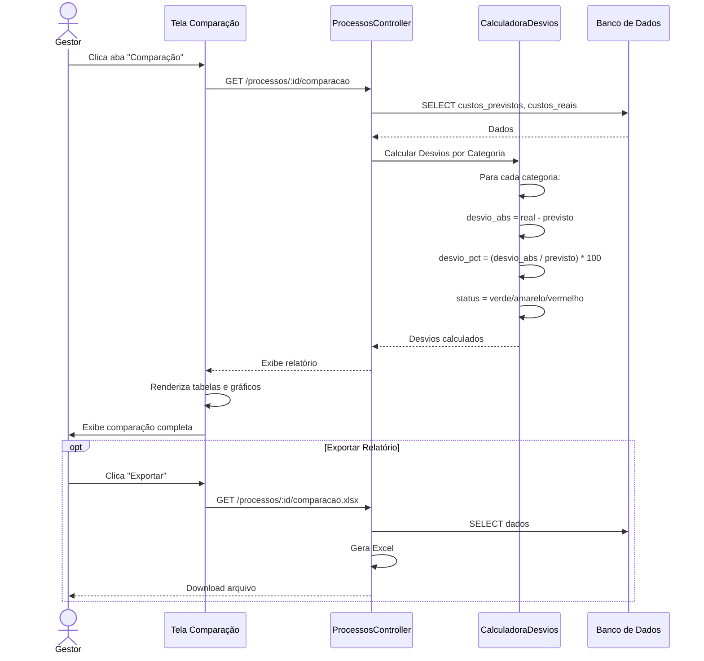
```mermaid
sequenceDiagram
    actor G as Gestor
    participant UI as Tela Comparação
    participant C as ProcessosController
    participant Calc as CalculadoraDesvios
    participant DB as Banco de Dados

    G->>UI: Clica aba "Comparação"
    UI->>C: GET /processos/:id/comparacao
    C->>DB: SELECT custos_previstos, custos_reais
    DB-->>C: Dados
    C->>Calc: Calcular Desvios por Categoria
    Calc->>Calc: Para cada categoria:
    Calc->>Calc:   desvio_abs = real - previsto
    Calc->>Calc:   desvio_pct = (desvio_abs / previsto) * 100
    Calc->>Calc:   status = verde/amarelo/vermelho
    Calc-->>C: Desvios calculados
    C-->>UI: Exibe relatório
    UI->>UI: Renderiza tabelas e gráficos
    UI->>G: Exibe comparação completa

    opt Exportar Relatório
        G->>UI: Clica "Exportar"
        UI->>C: GET /processos/:id/comparacao.xlsx
        C->>DB: SELECT dados
        C->>C: Gera Excel
        C-->>G: Download arquivo
    end
```

### Diagrama de Estado - Indicadores de Desvio

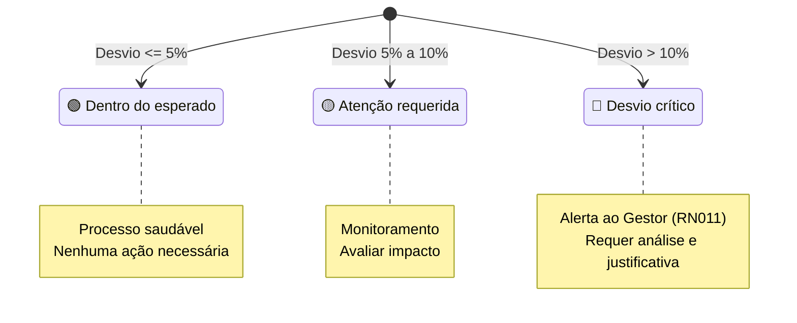
```mermaid
stateDiagram-v2
    [*] --> Verde: Desvio <= 5%
    [*] --> Amarelo: Desvio 5% a 10%
    [*] --> Vermelho: Desvio > 10%

    Verde: 🟢 Dentro do esperado
    Amarelo: 🟡 Atenção requerida
    Vermelho: 🔴 Desvio crítico

    note right of Verde
        Processo saudável
        Nenhuma ação necessária
    end note

    note right of Amarelo
        Monitoramento
        Avaliar impacto
    end note

    note right of Vermelho
        Alerta ao Gestor (RN011)
        Requer análise e justificativa
    end note
```

### Protótipo - Tela de Comparação

```
┌─────────────────────────────────────────────────────────────────┐
│  Processo PI-2026-001 | Status: EM TRÂNSITO                      │
├─────────────────────────────────────────────────────────────────┤
│  [Dados Básicos] [Custos Previstos] [Custos Reais] [Comparação]│
│                                                                  │
│  ┌────────────────────────────────────────────────────────────┐ │
│  │  RESUMO GERAL                        [Exportar Excel] [PDF]│ │
│  │                                                            │ │
│  │  ┌─────────────────┬──────────────┬────────────────┐      │ │
│  │  │ CUSTO TOTAL     │ PREVISTO     │ REAL           │      │ │
│  │  ├─────────────────┼──────────────┼────────────────┤      │ │
│  │  │                 │R$ 507,756.90 │R$ 525,100.00   │      │ │
│  │  │ Desvio          │              │+R$ 17,343.10   │      │ │
│  │  │ Percentual      │              │🟢 +3.4%        │      │ │
│  │  └─────────────────┴──────────────┴────────────────┘      │ │
│  └────────────────────────────────────────────────────────────┘ │
│                                                                  │
│  ┌────────────────────────────────────────────────────────────┐ │
│  │  CUSTOS INTERNACIONAIS                                     │ │
│  ├────────────┬─────────────┬─────────────┬──────────┬───────┤ │
│  │ Categoria  │ Previsto    │ Real        │ Diferença│Status │ │
│  ├────────────┼─────────────┼─────────────┼──────────┼───────┤ │
│  │ FOB        │R$272,500.00 │R$278,000.00 │🟢 +2.0% │       │ │
│  │ Frete Int. │R$ 27,250.00 │R$ 28,340.00 │🟢 +4.0% │       │ │
│  │ Seguro     │R$  2,725.00 │R$  2,725.00 │🟢  0%   │       │ │
│  │ Taxas Orig.│R$  1,090.00 │R$  1,200.00 │🔴+10.1% │       │ │
│  ├────────────┼─────────────┼─────────────┼──────────┼───────┤ │
│  │ SUBTOTAL   │R$303,565.00 │R$310,265.00 │🟢 +2.2% │       │ │
│  └────────────┴─────────────┴─────────────┴──────────┴───────┘ │
│                                                                  │
│  ┌────────────────────────────────────────────────────────────┐ │
│  │  IMPOSTOS                                                  │ │
│  ├────────────┬─────────────┬─────────────┬──────────┬───────┤ │
│  │ II         │R$ 42,499.10 │R$ 43,000.00 │🟢 +1.2% │       │ │
│  │ IPI        │R$ 34,606.41 │R$ 35,100.00 │🟢 +1.4% │       │ │
│  │ PIS/COFINS │R$ 29,294.02 │R$ 29,650.00 │🟢 +1.2% │       │ │
│  │ ICMS       │R$ 89,992.37 │R$ 91,200.00 │🟢 +1.3% │       │ │
│  ├────────────┼─────────────┼─────────────┼──────────┼───────┤ │
│  │ SUBTOTAL   │R$196,391.90 │R$198,950.00 │🟢 +1.3% │       │ │
│  └────────────┴─────────────┴─────────────┴──────────┴───────┘ │
│                                                                  │
│  ┌────────────────────────────────────────────────────────────┐ │
│  │  CUSTOS NACIONAIS                                          │ │
│  ├────────────┬─────────────┬─────────────┬──────────┬───────┤ │
│  │ Despachante│R$  2,500.00 │R$  3,000.00 │🔴+20.0% │       │ │
│  │ Armazenag. │R$  1,000.00 │R$  1,100.00 │🟡+10.0% │       │ │
│  │ Capatazia  │R$    800.00 │R$    900.00 │🔴+12.5% │       │ │
│  │ Transp.Nac.│R$  3,000.00 │R$  3,200.00 │🟡 +6.7% │       │ │
│  │ Outros     │R$    500.00 │R$    685.00 │🔴+37.0% │       │ │
│  ├────────────┼─────────────┼─────────────┼──────────┼───────┤ │
│  │ SUBTOTAL   │R$  7,800.00 │R$  8,885.00 │🔴+13.9% │ ⚠️    │ │
│  └────────────┴─────────────┴─────────────┴──────────┴───────┘ │
│                                                                  │
│  ⚠️ Custos Nacionais com desvio crítico (+13.9%)                │
│     Gestor foi notificado automaticamente                        │
│                                                                  │
│  ┌────────────────────────────────────────────────────────────┐ │
│  │  GRÁFICO COMPARATIVO                                       │ │
│  │                                                            │ │
│  │  [Gráfico de barras lado a lado: Previsto vs Real]        │ │
│  │  por categoria                                             │ │
│  └────────────────────────────────────────────────────────────┘ │
│                                                                  │
└─────────────────────────────────────────────────────────────────┘
```

### Critérios de Aceitação
- [ ] Gestor consegue visualizar comparação Previsto × Real de todos os custos
- [ ] Sistema calcula desvio absoluto e percentual para cada categoria
- [ ] Sistema exibe indicadores visuais: verde (<= 5%), amarelo (5-10%), vermelho (> 10%)
- [ ] Sistema exibe comparação dividida por seções: Internacionais, Impostos, Nacionais
- [ ] Sistema calcula totais parciais por seção
- [ ] Sistema calcula Custo Total Previsto vs Real
- [ ] Sistema calcula Desvio Total Absoluto e Percentual
- [ ] Gestor pode exportar relatório de comparação (Excel/PDF)
- [ ] Sistema exibe aviso se comparação for parcial (custos ainda pendentes)
- [ ] Sistema destaca categorias com desvio crítico (> 10%)
- [ ] Sistema exibe gráfico comparativo visual
- [ ] Relatório atualiza automaticamente ao lançar novos custos reais

### Notas de Implementação
- Endpoint: `GET /processos/:id/comparacao`
- Endpoint: `GET /processos/:id/comparacao.xlsx` (exportação)
- Endpoint: `GET /processos/:id/comparacao.pdf` (exportação)
- Controller: `ProcessosController@comparacao`
- Service: `CalculadoraDesviosService`, `ExportacaoService`
- Tela: `pages/processos/ProcessosForm.vue` (aba "Comparação")
- Componentes: `TabelaComparacao`, `GraficoComparativo`, `ResumoDesvios`

### Permissões
| Perfil | Pode Ver Comparação | Pode Exportar |
|--------|-------------------|---------------|
| Administrador | ✅ | ✅ |
| Gestor | ✅ | ✅ |
| Operacional | ✅ | ❌ |

---

## RF007 - Fechamento do Processo

### Descrição
O sistema deve permitir o fechamento (finalização) de processos de importação, consolidando todas as informações, tornando o processo imutável e calculando métricas finais como lead time e desvios totais.

### Atores
- **Ator Principal:** Operacional
- **Atores Secundários:** Administrador, Gestor (apenas visualiza)

### Pré-condições
1. Processo deve estar em status DESEMBARAÇADO (RF004)
2. Entrega final deve estar registrada (RF004)
3. Todos os custos obrigatórios devem estar lançados
4. Usuário deve ter perfil Operacional ou Administrador

### Pós-condições
1. Processo finalizado com status FINALIZADO
2. Processo torna-se imutável (read-only)
3. Métricas finais calculadas e persistidas:
   - Lead time total
   - Custo total consolidado
   - Desvios totais (custo e prazo)
4. Registro de auditoria de finalização

### Fluxo Principal

1. Operacional verifica que processo está completo:
   - Entrega final registrada
   - Todos os custos reais lançados
   - Documentação anexada (opcional)
2. Operacional acessa processo na tela de edição
3. Sistema verifica se processo pode ser finalizado
4. Sistema exibe botão "Finalizar Processo" (habilitado apenas se pré-requisitos atendidos)
5. Operacional clica em "Finalizar Processo"
6. Sistema exibe modal de confirmação:
   - "Deseja finalizar este processo?"
   - Resumo de métricas finais (preview):
     - Lead time total
     - Custo total real
     - Desvio de custo total
     - Desvio de prazo total
   - Aviso: "Após finalizar, o processo não poderá ser editado"
7. Operacional confirma finalização
8. Sistema executa consolidação:
   - Calcula lead time total (data_entrega_final - data_embarque_real)
   - Calcula custo total real final
   - Calcula desvio de custo: (custo_real - custo_previsto) / custo_previsto * 100
   - Calcula desvio de prazo: (data_entrega_final - data_entrega_prevista) em dias
9. Sistema altera status para **FINALIZADO**
10. Sistema persiste métricas finais na tabela do processo
11. Sistema registra auditoria com data e usuário que finalizou
12. Sistema exibe mensagem: "Processo finalizado com sucesso"
13. Sistema redireciona para visualização read-only do processo

### Fluxos Alternativos

**FA1 - Pré-requisitos Não Atendidos**
- No passo 3, se processo não está pronto para finalizar:
  1. Sistema exibe botão "Finalizar Processo" desabilitado
  2. Sistema exibe checklist de pendências:
     - ❌ Entrega final não registrada
     - ❌ Custos reais pendentes: Transporte Nacional, Armazenagem
     - ✅ Desembaraço concluído
  3. Operacional deve resolver pendências antes de finalizar

**FA2 - Reabertura de Processo (Excepcional)**
- Se necessário reabrir processo finalizado (excepcional):
  1. Apenas Administrador pode reabrir
  2. Administrador acessa processo finalizado
  3. Administrador clica em "Reabrir Processo"
  4. Sistema exibe modal de confirmação com justificativa obrigatória
  5. Administrador informa motivo da reabertura
  6. Sistema altera status para EM TRÂNSITO ou DESEMBARAÇADO (conforme apropriado)
  7. Sistema registra auditoria de reabertura (quem, quando, motivo)
  8. Sistema exibe aviso: "Processo reaberto. Métricas finais serão recalculadas ao finalizar novamente."

### Fluxos de Exceção

**FE1 - Processo Não Está Desembaraçado**
- No passo 3, se status != DESEMBARAÇADO:
  1. Sistema exibe erro: "Processo deve estar desembaraçado para ser finalizado"
  2. Botão "Finalizar Processo" fica desabilitado

**FE2 - Entrega Final Não Registrada**
- No passo 3, se entrega final não registrada:
  1. Sistema exibe erro: "Entrega final deve ser registrada antes de finalizar"
  2. Sistema exibe link: "Registrar Entrega Final"

**FE3 - Custos Obrigatórios Pendentes**
- No passo 3, se custos obrigatórios não lançados:
  1. Sistema exibe erro: "Custos obrigatórios não lançados"
  2. Sistema lista custos pendentes: "Transporte Nacional, Armazenagem"

### Regras de Negócio Relacionadas
- RN007 - Auditoria de Modificações
- RN013 - Lead Time Total
- RN014 - Consolidação de Métricas
- RN015 - Processo Finalizado É Imutável

### Métricas Calculadas no Fechamento

| Métrica | Cálculo | Exemplo |
|---------|---------|---------|
| Lead Time Total | data_entrega_final - data_embarque_real | 45 dias |
| Custo Total Real | Soma de todos os custos reais | R$ 525,100.00 |
| Desvio de Custo Absoluto | custo_real - custo_previsto | +R$ 17,343.10 |
| Desvio de Custo Percentual | (desvio_abs / previsto) * 100 | +3.4% |
| Desvio de Prazo | data_entrega_final - data_entrega_prevista (dias) | +5 dias |
| Lead Time Médio por Modal | Calculado por modal de transporte | Marítimo: 42 dias |

### Diagrama de Sequência - Finalização

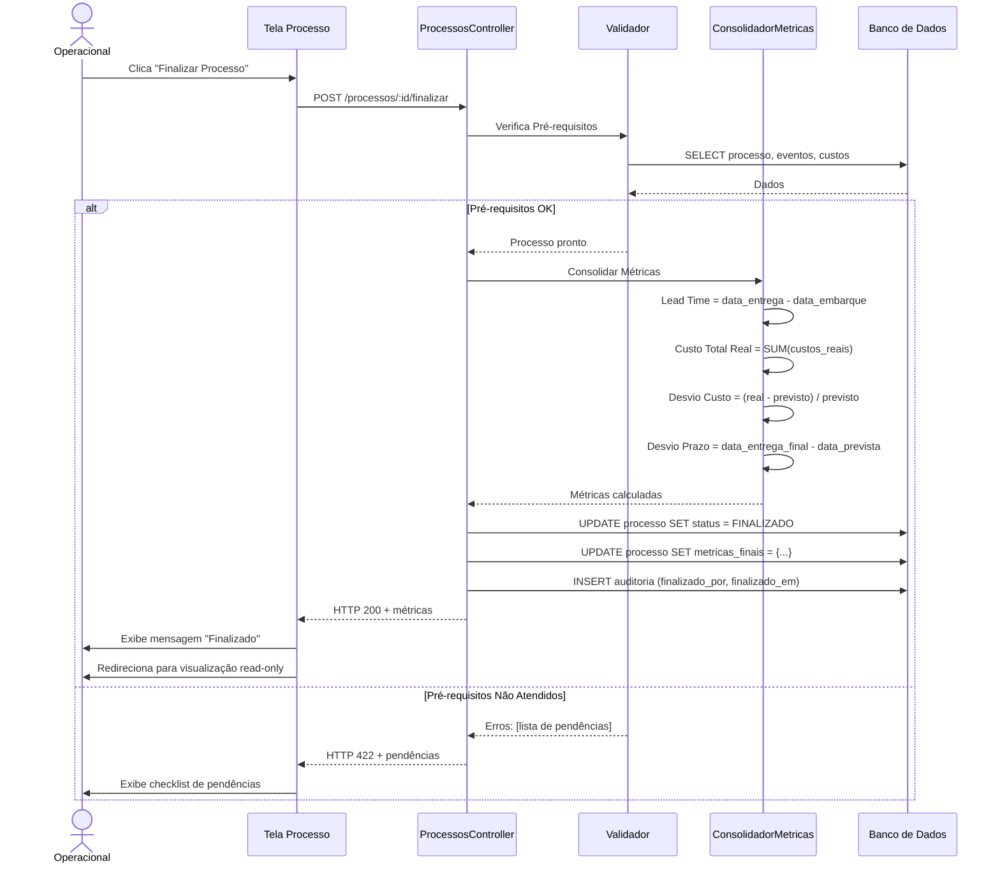
```mermaid
sequenceDiagram
    actor O as Operacional
    participant UI as Tela Processo
    participant C as ProcessosController
    participant V as Validador
    participant Calc as ConsolidadorMetricas
    participant DB as Banco de Dados

    O->>UI: Clica "Finalizar Processo"
    UI->>C: POST /processos/:id/finalizar
    C->>V: Verifica Pré-requisitos
    V->>DB: SELECT processo, eventos, custos
    DB-->>V: Dados

    alt Pré-requisitos OK
        V-->>C: Processo pronto
        C->>Calc: Consolidar Métricas
        Calc->>Calc: Lead Time = data_entrega - data_embarque
        Calc->>Calc: Custo Total Real = SUM(custos_reais)
        Calc->>Calc: Desvio Custo = (real - previsto) / previsto
        Calc->>Calc: Desvio Prazo = data_entrega_final - data_prevista
        Calc-->>C: Métricas calculadas

        C->>DB: UPDATE processo SET status = FINALIZADO
        C->>DB: UPDATE processo SET metricas_finais = {...}
        C->>DB: INSERT auditoria (finalizado_por, finalizado_em)
        C-->>UI: HTTP 200 + métricas
        UI->>O: Exibe mensagem "Finalizado"
        UI->>O: Redireciona para visualização read-only
    else Pré-requisitos Não Atendidos
        V-->>C: Erros: [lista de pendências]
        C-->>UI: HTTP 422 + pendências
        UI->>O: Exibe checklist de pendências
    end
```

### Diagrama de Estado - Status do Processo

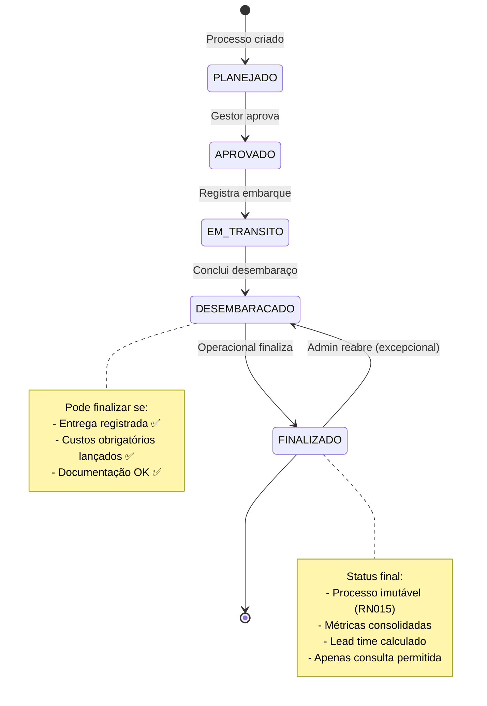
```mermaid
stateDiagram-v2
    [*] --> PLANEJADO: Processo criado
    PLANEJADO --> APROVADO: Gestor aprova
    APROVADO --> EM_TRANSITO: Registra embarque
    EM_TRANSITO --> DESEMBARACADO: Conclui desembaraço
    DESEMBARACADO --> FINALIZADO: Operacional finaliza
    FINALIZADO --> [*]

    FINALIZADO --> DESEMBARACADO: Admin reabre (excepcional)

    note right of FINALIZADO
        Status final:
        - Processo imutável (RN015)
        - Métricas consolidadas
        - Lead time calculado
        - Apenas consulta permitida
    end note

    note right of DESEMBARACADO
        Pode finalizar se:
        - Entrega registrada ✅
        - Custos obrigatórios lançados ✅
        - Documentação OK ✅
    end note
```

### Protótipo - Modal de Finalização

```
┌─────────────────────────────────────────────────────────┐
│  Finalizar Processo                                 ✕   │
├─────────────────────────────────────────────────────────┤
│                                                         │
│  ⚠️ Atenção: Após finalizar, o processo não poderá     │
│     ser editado.                                        │
│                                                         │
│  ┌────────────────────────────────────────────────┐    │
│  │  RESUMO DE MÉTRICAS FINAIS                     │    │
│  │                                                │    │
│  │  Lead Time Total:       45 dias                │    │
│  │  Lead Time Previsto:    40 dias                │    │
│  │  Desvio de Prazo:       +5 dias (atrasou)     │    │
│  │                                                │    │
│  │  Custo Total Real:      R$ 525,100.00          │    │
│  │  Custo Total Previsto:  R$ 507,756.90          │    │
│  │  Desvio de Custo:       +3.4% (🟢 aceitável)   │    │
│  │                                                │    │
│  │  Ocorrências Registradas: 2                    │    │
│  └────────────────────────────────────────────────┘    │
│                                                         │
│  Checklist de Pré-requisitos:                           │
│  ✅ Processo desembaraçado                              │
│  ✅ Entrega final registrada                            │
│  ✅ Todos os custos obrigatórios lançados               │
│  ✅ Documentos principais anexados                      │
│                                                         │
│  Confirma a finalização deste processo?                 │
│                                                         │
│  ┌──────────┐  ┌─────────────┐                         │
│  │ Cancelar │  │  Finalizar  │                         │
│  └──────────┘  └─────────────┘                         │
│                                                         │
└─────────────────────────────────────────────────────────┘
```

### Protótipo - Processo Finalizado (Read-Only)

```
┌─────────────────────────────────────────────────────────────────┐
│  Processo PI-2026-001 | Status: 🟢 FINALIZADO                    │
│  Finalizado em: 20/03/2026 às 14:30 por João Silva              │
├─────────────────────────────────────────────────────────────────┤
│  [Dados Básicos] [Custos] [Logística] [Comparação] [Métricas]  │
│                                                                  │
│  ⚠️ Processo finalizado - Apenas consulta                       │
│                                                                  │
│  ┌────────────────────────────────────────────────────────────┐ │
│  │  MÉTRICAS FINAIS CONSOLIDADAS                              │ │
│  │                                                            │ │
│  │  Lead Time Total:             45 dias                      │ │
│  │  Lead Time Previsto:          40 dias                      │ │
│  │  Desvio de Prazo:             +5 dias (🔴 atrasou)        │ │
│  │                                                            │ │
│  │  Custo Total Real:            R$ 525,100.00               │ │
│  │  Custo Total Previsto:        R$ 507,756.90               │ │
│  │  Desvio de Custo:             +3.4% (🟢 aceitável)        │ │
│  │                                                            │ │
│  │  Data Embarque:               15/02/2026 (real)           │ │
│  │  Data Chegada:                18/03/2026 (real)           │ │
│  │  Data Entrega Final:          25/03/2026 (real)           │ │
│  │                                                            │ │
│  │  Ocorrências Registradas:     2 (1 resolvida)             │ │
│  │  Documentos Anexados:         12 arquivos                 │ │
│  └────────────────────────────────────────────────────────────┘ │
│                                                                  │
│  ┌─────────────────────┐  ┌──────────────────────┐             │
│  │ Exportar Relatório  │  │ Reabrir (Admin)      │             │
│  └─────────────────────┘  └──────────────────────┘             │
│                                                                  │
└─────────────────────────────────────────────────────────────────┘
```

### Critérios de Aceitação
- [ ] Operacional consegue finalizar processo apenas se pré-requisitos atendidos
- [ ] Sistema valida que processo está DESEMBARAÇADO
- [ ] Sistema valida que entrega final foi registrada
- [ ] Sistema valida que custos obrigatórios foram lançados
- [ ] Sistema exibe checklist visual de pré-requisitos
- [ ] Sistema calcula lead time total (embarque → entrega final)
- [ ] Sistema calcula custo total real consolidado
- [ ] Sistema calcula desvios de custo e prazo
- [ ] Sistema altera status para FINALIZADO ao confirmar
- [ ] Sistema torna processo imutável (read-only) após finalização
- [ ] Sistema registra auditoria de finalização (quem, quando)
- [ ] Apenas Administrador pode reabrir processo finalizado (excepcional)
- [ ] Sistema exibe modal de confirmação com resumo de métricas antes de finalizar
- [ ] Sistema exibe aviso claro que processo não poderá ser editado após finalização
- [ ] Processo finalizado permite apenas consulta (todas as abas read-only)

### Notas de Implementação
- Endpoint: `POST /processos/:id/finalizar`
- Endpoint: `POST /processos/:id/reabrir` (apenas Admin)
- Controller: `ProcessosController@finalizar`, `ProcessosController@reabrir`
- Service: `ConsolidadorMetricasService` (calcular métricas finais)
- Model: `Processo` (campo `status`, `metricas_finais` JSONB)
- Tela: `pages/processos/ProcessosForm.vue`
- Componentes: `ModalFinalizacao`, `ChecklistPreRequisitos`, `MetricasFinais`

### Permissões
| Perfil | Pode Finalizar | Pode Reabrir | Pode Ver Finalizados |
|--------|----------------|--------------|----------------------|
| Administrador | ✅ | ✅ | ✅ |
| Gestor | ❌ | ❌ | ✅ |
| Operacional | ✅ | ❌ | ✅ |

---

## RF008 - Dashboards e Indicadores

### Descrição
O sistema deve exibir dashboards gerenciais com indicadores-chave (KPIs) de desempenho, permitindo que gestores visualizem a evolução dos processos de importação, custos consolidados, prazos médios e tendências ao longo do tempo.

### Atores
- **Ator Principal:** Gestor
- **Atores Secundários:** Administrador

### Pré-condições
1. Usuário deve ter perfil Gestor ou Administrador
2. Sistema deve ter ao menos alguns processos cadastrados
3. Usuário deve estar autenticado

### Pós-condições
1. Dashboard exibido com dados atualizados
2. Gráficos e indicadores renderizados
3. Filtros aplicados conforme seleção do usuário

### Fluxo Principal

1. Gestor acessa menu "Dashboards"
2. Sistema exibe dashboard principal com indicadores consolidados
3. Sistema calcula e exibe KPIs principais:
   - **Total de Processos** (por status)
   - **Custo Total Acumulado** (mês atual vs mês anterior)
   - **Lead Time Médio** (por modal de transporte)
   - **Desvio Médio de Custo** (%)
   - **Desvio Médio de Prazo** (dias)
   - **Processos Atrasados**
   - **Processos com Custo Excedido**
4. Sistema exibe gráficos:
   - **Evolução Mensal de Processos** (line chart)
   - **Custos por País de Origem** (pie chart)
   - **Custos por Fornecedor** (bar chart)
   - **Custos por Modal de Transporte** (bar chart)
   - **Lead Time por Modal** (bar chart comparativo)
5. Sistema exibe tabela de "Processos Recentes" com status e alertas
6. Sistema permite aplicar filtros:
   - Período (data início/fim)
   - Status (Planejado, Em Trânsito, Finalizado, etc.)
   - País de origem
   - Fornecedor
   - Modal de transporte
7. Gestor seleciona filtros desejados
8. Sistema atualiza dashboard conforme filtros aplicados
9. Gestor pode exportar dashboard (PDF) - RF009

### Fluxos Alternativos

**FA1 - Drill-down em Gráfico**
- No passo 4, se Gestor clicar em segmento de gráfico:
  1. Sistema exibe detalhes daquele segmento (ex: processos daquele país)
  2. Sistema pode redirecionar para lista filtrada de processos
  3. Gestor pode voltar ao dashboard principal

**FA2 - Dashboard Sem Dados**
- No passo 2, se não há processos cadastrados:
  1. Sistema exibe mensagem: "Nenhum processo cadastrado ainda"
  2. Sistema exibe link: "Cadastrar Primeiro Processo"
  3. KPIs exibem valor zero ou "N/A"

**FA3 - Salvar Filtros Favoritos**
- No passo 7, se Gestor quiser salvar combinação de filtros:
  1. Gestor clica em "Salvar Filtros"
  2. Sistema exibe modal para nomear filtro
  3. Gestor informa nome: "Processos China 2025"
  4. Sistema salva preferência do usuário
  5. Filtro aparece em dropdown "Filtros Salvos"

### Fluxos de Exceção

**FE1 - Erro ao Calcular KPIs**
- No passo 3, se erro ao calcular indicadores:
  1. Sistema exibe mensagem: "Erro ao carregar indicadores. Tente novamente."
  2. Sistema registra erro no log
  3. Sistema exibe KPIs com valor "Erro"

**FE2 - Timeout em Gráficos Pesados**
- No passo 4, se consulta demorar mais de 30s:
  1. Sistema exibe mensagem: "Carregando dados... Isso pode levar alguns segundos."
  2. Sistema processa em background
  3. Sistema exibe gráficos conforme finalizados

### Regras de Negócio Relacionadas
- RN013 - Lead Time Total
- RN014 - Consolidação de Métricas
- RN011 - Desvio de Custo > 10% Alerta Gestor

### KPIs (Indicadores-Chave)

| KPI | Fórmula | Exemplo | Meta |
|-----|---------|---------|------|
| Total de Processos | COUNT(*) por status | 45 processos (15 finalizados) | - |
| Custo Total Acumulado | SUM(custo_total_real) WHERE mes_atual | R$ 15,2 milhões | - |
| Lead Time Médio | AVG(lead_time_total) | 42 dias | <= 45 dias |
| Desvio Médio de Custo | AVG(desvio_custo_percentual) | +2.5% | <= 5% |
| Desvio Médio de Prazo | AVG(desvio_prazo_dias) | +3 dias | <= 5 dias |
| Taxa de Processos no Prazo | COUNT(desvio_prazo <= 0) / COUNT(*) | 72% | >= 80% |
| Taxa de Processos no Orçamento | COUNT(desvio_custo <= 5%) / COUNT(*) | 85% | >= 90% |

### Diagrama de Sequência

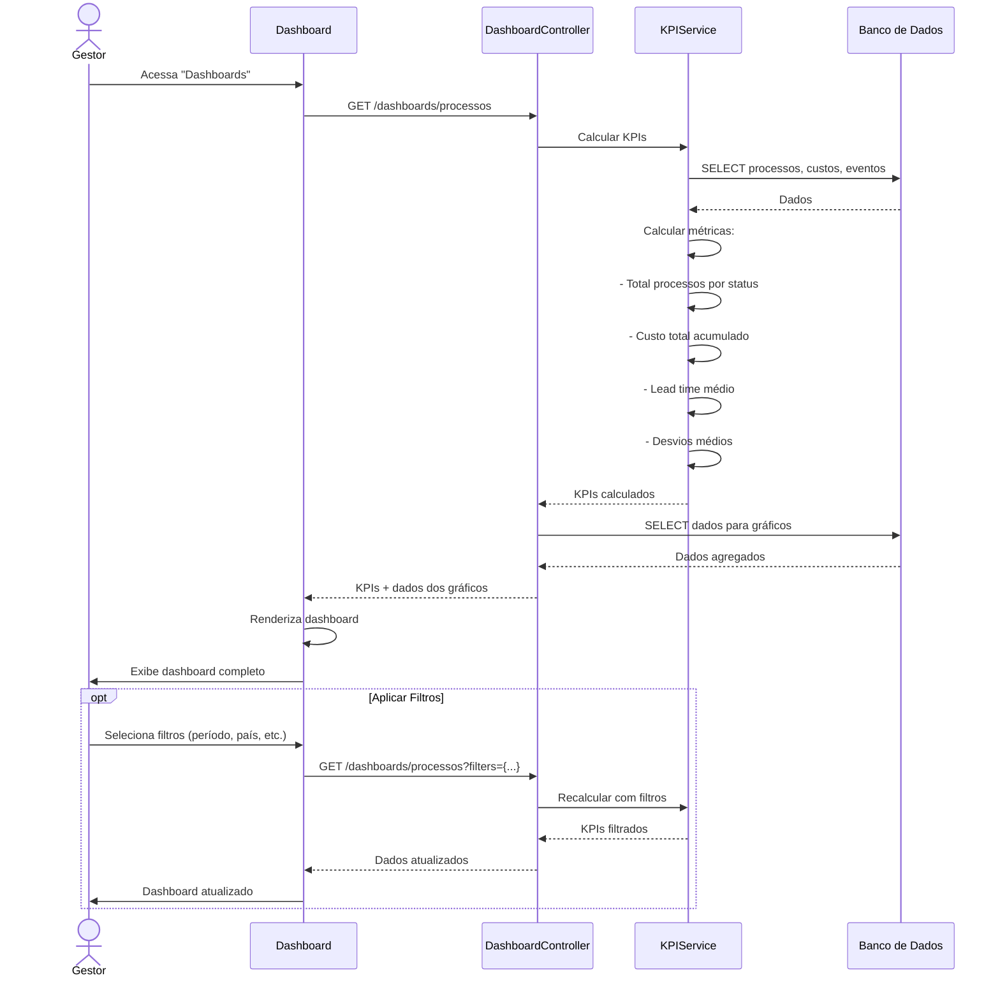
```mermaid
sequenceDiagram
    actor G as Gestor
    participant UI as Dashboard
    participant C as DashboardController
    participant KPI as KPIService
    participant DB as Banco de Dados

    G->>UI: Acessa "Dashboards"
    UI->>C: GET /dashboards/processos
    C->>KPI: Calcular KPIs
    KPI->>DB: SELECT processos, custos, eventos
    DB-->>KPI: Dados
    KPI->>KPI: Calcular métricas:
    KPI->>KPI:   - Total processos por status
    KPI->>KPI:   - Custo total acumulado
    KPI->>KPI:   - Lead time médio
    KPI->>KPI:   - Desvios médios
    KPI-->>C: KPIs calculados
    C->>DB: SELECT dados para gráficos
    DB-->>C: Dados agregados
    C-->>UI: KPIs + dados dos gráficos
    UI->>UI: Renderiza dashboard
    UI->>G: Exibe dashboard completo

    opt Aplicar Filtros
        G->>UI: Seleciona filtros (período, país, etc.)
        UI->>C: GET /dashboards/processos?filters={...}
        C->>KPI: Recalcular com filtros
        KPI-->>C: KPIs filtrados
        C-->>UI: Dados atualizados
        UI->>G: Dashboard atualizado
    end
```

### Protótipo - Dashboard Principal

```
┌─────────────────────────────────────────────────────────────────┐
│  ☰  SGICI - Dashboard                       Gestor       👤 ▼   │
├─────────────────────────────────────────────────────────────────┤
│                                                                  │
│  ┌────────────────────────────────────────────────────────────┐ │
│  │  FILTROS                                                   │ │
│  │  Período: [01/01/2026] a [31/12/2026]                     │ │
│  │  Status: [Todos ▼]  País: [Todos ▼]  Modal: [Todos ▼]    │ │
│  │  [Aplicar] [Limpar] [Salvar Filtros]                      │ │
│  └────────────────────────────────────────────────────────────┘ │
│                                                                  │
│  ┌──────────────┐ ┌──────────────┐ ┌──────────────┐            │
│  │ PROCESSOS    │ │ CUSTO TOTAL  │ │ LEAD TIME    │            │
│  │              │ │              │ │              │            │
│  │    45        │ │ R$ 15,2 Mi   │ │  42 dias     │            │
│  │  +5 (12%)    │ │ +8.5% vs mês │ │ 🟡 +3d meta  │            │
│  └──────────────┘ └──────────────┘ └──────────────┘            │
│                                                                  │
│  ┌──────────────┐ ┌──────────────┐ ┌──────────────┐            │
│  │ DESVIO CUSTO │ │ DESVIO PRAZO │ │ ATRASADOS    │            │
│  │              │ │              │ │              │            │
│  │  +2.5%       │ │  +3 dias     │ │     8        │            │
│  │ 🟢 Aceitável │ │ 🟢 Aceitável │ │ 🔴 Crítico   │            │
│  └──────────────┘ └──────────────┘ └──────────────┘            │
│                                                                  │
│  ┌────────────────────────────────────────────────────────────┐ │
│  │  EVOLUÇÃO MENSAL DE PROCESSOS (2026)                       │ │
│  │                                                            │ │
│  │  [Gráfico de linhas: Jan - Dez]                           │ │
│  │  - Planejados: linha azul                                 │ │
│  │  - Finalizados: linha verde                               │ │
│  │  - Em trânsito: linha amarela                             │ │
│  └────────────────────────────────────────────────────────────┘ │
│                                                                  │
│  ┌─────────────────────────────┐ ┌─────────────────────────────┐│
│  │ CUSTOS POR PAÍS             │ │ CUSTOS POR MODAL            ││
│  │                             │ │                             ││
│  │ [Gráfico Pizza]             │ │ [Gráfico Barras]            ││
│  │ - China: 45%                │ │ - Marítimo: R$ 8,5M         ││
│  │ - EUA: 25%                  │ │ - Aéreo: R$ 5,2M            ││
│  │ - Alemanha: 18%             │ │ - Rodoviário: R$ 1,5M       ││
│  │ - Outros: 12%               │ │                             ││
│  └─────────────────────────────┘ └─────────────────────────────┘│
│                                                                  │
│  ┌────────────────────────────────────────────────────────────┐ │
│  │  PROCESSOS RECENTES                                        │ │
│  ├──────────┬────────────┬──────────┬────────────┬───────────┤ │
│  │ Processo │ Fornecedor │ Status   │ Lead Time  │ Desvio    │ │
│  ├──────────┼────────────┼──────────┼────────────┼───────────┤ │
│  │ PI-001   │ ABC China  │🟢 Finali │ 42d        │ 🟢 +1.2%  │ │
│  │ PI-002   │ XYZ USA    │🟡 Trâns. │ 28d (parc.)│ 🟡 +5.5%  │ │
│  │ PI-003   │ DEF Alem.  │🔴 Atraso │ 55d        │ 🔴 +15%   │ │
│  └──────────┴────────────┴──────────┴────────────┴───────────┘ │
│                                                                  │
│  [Exportar Dashboard PDF]                                        │
│                                                                  │
└─────────────────────────────────────────────────────────────────┘
```

### Critérios de Aceitação
- [ ] Gestor consegue visualizar dashboard com KPIs consolidados
- [ ] Sistema calcula Total de Processos por status
- [ ] Sistema calcula Custo Total Acumulado (mês atual vs anterior)
- [ ] Sistema calcula Lead Time Médio geral e por modal
- [ ] Sistema calcula Desvio Médio de Custo e Prazo
- [ ] Sistema exibe gráfico de Evolução Mensal de Processos
- [ ] Sistema exibe gráfico de Custos por País de Origem
- [ ] Sistema exibe gráfico de Custos por Fornecedor (top 10)
- [ ] Sistema exibe gráfico de Custos por Modal de Transporte
- [ ] Sistema exibe gráfico de Lead Time Médio por Modal
- [ ] Sistema exibe tabela de Processos Recentes com alertas
- [ ] Gestor pode aplicar filtros (período, status, país, fornecedor, modal)
- [ ] Dashboard atualiza automaticamente ao aplicar filtros
- [ ] Sistema exibe indicadores visuais (🟢 🟡 🔴) conforme metas
- [ ] Gestor pode exportar dashboard como PDF
- [ ] Dashboard carrega em menos de 5 segundos (caching de KPIs)

### Notas de Implementação
- Endpoint: `GET /dashboards/processos`
- Endpoint: `GET /dashboards/processos.pdf` (exportação)
- Controller: `DashboardsController@processos`
- Service: `KPIService` (calcular indicadores), `CachingService` (cachear KPIs)
- Tela: `pages/dashboards/DashboardProcessos.vue`
- Componentes: `KPICard`, `LineChart`, `PieChart`, `BarChart`, `DataTable`
- Bibliotecas: Chart.js ou ApexCharts para gráficos

### Permissões
| Perfil | Pode Ver Dashboard | Pode Exportar |
|--------|-------------------|---------------|
| Administrador | ✅ | ✅ |
| Gestor | ✅ | ✅ |
| Operacional | ❌ | ❌ |

---

## RF009 - Exportação de Dados

### Descrição
O sistema deve permitir a exportação de dados de processos, custos e relatórios gerenciais em formatos Excel (.xlsx) e PDF, facilitando a análise externa e compartilhamento de informações.

### Atores
- **Ator Principal:** Gestor
- **Atores Secundários:** Administrador, Operacional (exports limitados)

### Pré-condições
1. Usuário deve estar autenticado
2. Deve haver dados para exportar
3. Usuário deve ter permissão de exportação

### Pós-condições
1. Arquivo gerado no formato solicitado
2. Download iniciado automaticamente no navegador
3. Registro de auditoria de exportação

### Fluxo Principal - Exportar Lista de Processos (Excel)

1. Gestor acessa tela "Processos de Importação"
2. Gestor aplica filtros desejados (status, período, país, etc.)
3. Sistema exibe lista filtrada
4. Gestor clica em "Exportar Excel"
5. Sistema exibe modal de opções de exportação:
   - Formato: Excel ou PDF
   - Colunas a incluir (checkboxes)
   - Incluir custos previstos (sim/não)
   - Incluir custos reais (sim/não)
   - Incluir ocorrências (sim/não)
6. Gestor seleciona opções e clica "Exportar"
7. Sistema gera arquivo Excel (.xlsx) com:
   - Aba "Processos": dados dos processos
   - Aba "Custos Previstos": custos previstos (se selecionado)
   - Aba "Custos Reais": custos reais (se selecionado)
   - Aba "Resumo": totalizadores e médias
8. Sistema registra auditoria: quem exportou, quando, filtros aplicados
9. Sistema inicia download do arquivo
10. Sistema exibe mensagem: "Exportação realizada com sucesso"

### Fluxos Alternativos

**FA1 - Exportar Processo Individual (PDF)**
- No passo 1, se Gestor estiver visualizando processo específico:
  1. Gestor clica em "Exportar PDF"
  2. Sistema gera relatório PDF completo do processo com:
     - Dados básicos
     - Custos previstos vs reais
     - Timeline de eventos logísticos
     - Ocorrências
     - Métricas finais (se finalizado)
     - Anexos (links)
  3. Sistema adiciona cabeçalho com logo e dados da empresa
  4. Sistema adiciona rodapé com data/hora de geração
  5. Sistema inicia download do PDF

**FA2 - Exportar Dashboard (PDF)**
- Se Gestor estiver no dashboard:
  1. Gestor clica em "Exportar Dashboard PDF"
  2. Sistema gera PDF com:
     - KPIs principais
     - Gráficos (convertidos em imagens)
     - Tabela de processos recentes
     - Data de geração e filtros aplicados
  3. Sistema inicia download

**FA3 - Exportar Comparação de Custos (Excel)**
- Se Gestor estiver na aba "Comparação" de um processo:
  1. Gestor clica em "Exportar Comparação"
  2. Sistema gera Excel com:
     - Tabela de comparação previsto vs real
     - Desvios calculados
     - Gráficos (se suportado)
  3. Sistema inicia download

### Fluxos de Exceção

**FE1 - Nenhum Dado para Exportar**
- No passo 3, se lista estiver vazia:
  1. Sistema desabilita botão "Exportar"
  2. Sistema exibe mensagem: "Nenhum dado para exportar"

**FE2 - Erro ao Gerar Arquivo**
- No passo 7, se erro ao gerar arquivo:
  1. Sistema exibe erro: "Erro ao gerar arquivo. Tente novamente."
  2. Sistema registra erro no log
  3. Sistema não cria registro de auditoria

**FE3 - Arquivo Muito Grande (> 50MB)**
- No passo 7, se arquivo exceder limite:
  1. Sistema exibe erro: "Exportação muito grande. Aplique filtros para reduzir dados."
  2. Sistema sugere aplicar filtros de período ou status

### Regras de Negócio Relacionadas
- RN007 - Auditoria de Modificações
- Exportações são limitadas a 10.000 registros por vez
- Arquivos gerados devem incluir data/hora de geração
- Exportações sensíveis (com custos) requerem perfil Gestor ou Admin

### Formatos de Exportação

#### Excel (.xlsx)

**Estrutura Multi-Aba:**

**Aba "Processos":**
| Número | Fornecedor | País | Modal | Status | Data Embarque | Data Entrega | Lead Time | Custo Previsto | Custo Real | Desvio % |
|--------|------------|------|-------|--------|---------------|--------------|-----------|----------------|------------|----------|
| PI-001 | ABC | China | Marítimo | Finalizado | 15/02/26 | 25/03/26 | 42 | R$ 507.756,90 | R$ 525.100,00 | +3.4% |

**Aba "Custos Previstos":**
| Processo | Categoria | Valor (Moeda) | Valor (BRL) |
|----------|-----------|---------------|-------------|
| PI-001 | FOB | US$ 50,000.00 | R$ 272,500.00 |
| PI-001 | Frete | US$ 5,000.00 | R$ 27,250.00 |

**Aba "Resumo":**
| Métrica | Valor |
|---------|-------|
| Total de Processos | 45 |
| Custo Total Acumulado | R$ 15.200.000,00 |
| Lead Time Médio | 42 dias |
| Desvio Médio de Custo | +2.5% |

#### PDF

**Estrutura do Relatório:**

```
┌─────────────────────────────────────────────────────────────┐
│  [LOGO EMPRESA]                        SGICI                │
│                                                              │
│  RELATÓRIO DE PROCESSO DE IMPORTAÇÃO                        │
│  Processo: PI-2026-001                                      │
│  Gerado em: 15/01/2026 14:30                               │
├─────────────────────────────────────────────────────────────┤
│                                                              │
│  DADOS BÁSICOS                                              │
│  Número: PI-2026-001                                        │
│  Fornecedor: ABC Manufacturing Ltd (China)                  │
│  Status: Finalizado                                         │
│  Modal: Marítimo                                            │
│  Incoterm: FOB                                              │
│                                                              │
│  PRAZOS                                                     │
│  Embarque Previsto:  13/02/2026  |  Real: 15/02/2026       │
│  Chegada Prevista:   15/03/2026  |  Real: 18/03/2026       │
│  Entrega Prevista:   22/03/2026  |  Real: 25/03/2026       │
│  Lead Time: 42 dias (previsto: 40 dias)                    │
│                                                              │
│  CUSTOS                                                     │
│  Custo Total Previsto:  R$ 507,756.90                      │
│  Custo Total Real:      R$ 525,100.00                      │
│  Desvio:               +R$ 17,343.10 (+3.4%)               │
│                                                              │
│  [Gráfico de comparação]                                    │
│                                                              │
│  EVENTOS LOGÍSTICOS                                         │
│  ✅ 15/02/2026 - Embarcado (Porto Xangai)                   │
│  ✅ 18/03/2026 - Chegou (Porto Santos)                      │
│  ✅ 20/03/2026 - Desembaraçado (DI: 26/1234567-8)          │
│  ✅ 25/03/2026 - Entregue                                   │
│                                                              │
│  OCORRÊNCIAS                                                │
│  1. Atraso no embarque (+2 dias) - Resolvida               │
│  2. Atraso na chegada (+3 dias) - Resolvida                │
│                                                              │
├─────────────────────────────────────────────────────────────┤
│  Página 1 de 1                      gerado por SGICI v1.0   │
└─────────────────────────────────────────────────────────────┘
```

### Diagrama de Sequência - Exportação Excel

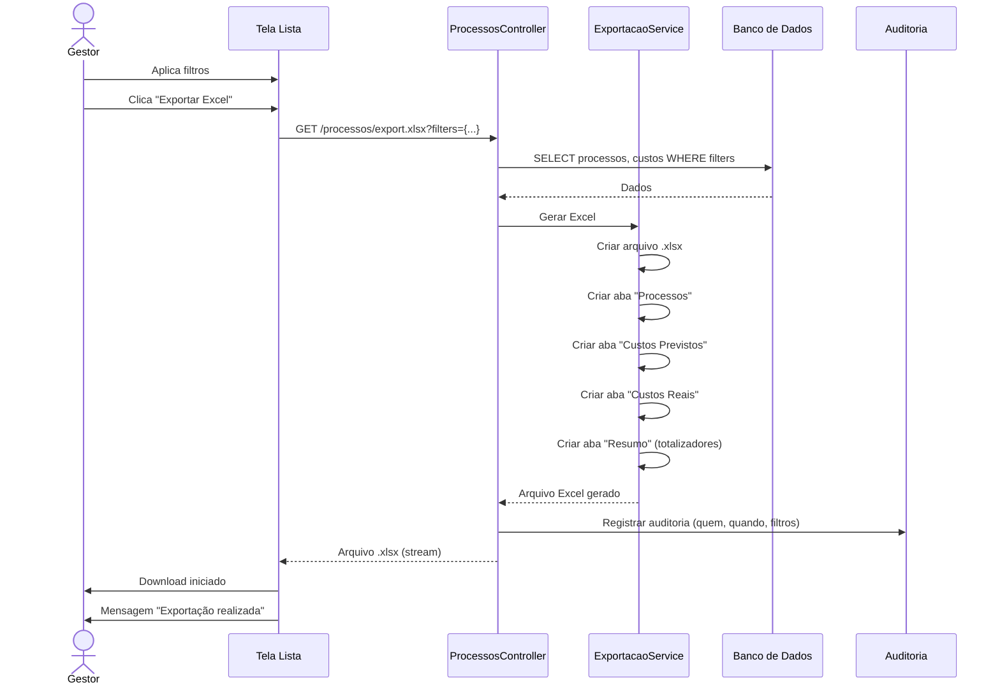
```mermaid
sequenceDiagram
    actor G as Gestor
    participant UI as Tela Lista
    participant C as ProcessosController
    participant Exp as ExportacaoService
    participant DB as Banco de Dados
    participant Aud as Auditoria

    G->>UI: Aplica filtros
    G->>UI: Clica "Exportar Excel"
    UI->>C: GET /processos/export.xlsx?filters={...}
    C->>DB: SELECT processos, custos WHERE filters
    DB-->>C: Dados
    C->>Exp: Gerar Excel
    Exp->>Exp: Criar arquivo .xlsx
    Exp->>Exp: Criar aba "Processos"
    Exp->>Exp: Criar aba "Custos Previstos"
    Exp->>Exp: Criar aba "Custos Reais"
    Exp->>Exp: Criar aba "Resumo" (totalizadores)
    Exp-->>C: Arquivo Excel gerado
    C->>Aud: Registrar auditoria (quem, quando, filtros)
    C-->>UI: Arquivo .xlsx (stream)
    UI->>G: Download iniciado
    UI->>G: Mensagem "Exportação realizada"
```

### Critérios de Aceitação
- [ ] Gestor consegue exportar lista de processos em Excel (.xlsx)
- [ ] Arquivo Excel contém múltiplas abas (Processos, Custos, Resumo)
- [ ] Gestor consegue exportar processo individual em PDF
- [ ] PDF contém dados completos: básicos, custos, logística, ocorrências
- [ ] Gestor consegue exportar dashboard em PDF
- [ ] PDF do dashboard contém KPIs e gráficos convertidos em imagens
- [ ] Gestor consegue exportar comparação de custos em Excel
- [ ] Sistema permite selecionar colunas a incluir na exportação
- [ ] Sistema aplica filtros ativos à exportação
- [ ] Sistema adiciona cabeçalho e rodapé em PDFs (logo, data de geração)
- [ ] Sistema registra auditoria de todas as exportações
- [ ] Sistema limita exportações a 10.000 registros por vez
- [ ] Sistema exibe erro se tentar exportar lista vazia
- [ ] Arquivo gerado inicia download automaticamente
- [ ] Exportação completa em menos de 30 segundos (para até 1.000 registros)

### Notas de Implementação
- Endpoints:
  - `GET /processos/export.xlsx` - Lista de processos em Excel
  - `GET /processos/:id/export.pdf` - Processo individual em PDF
  - `GET /dashboards/processos/export.pdf` - Dashboard em PDF
  - `GET /processos/:id/comparacao/export.xlsx` - Comparação em Excel
- Controller: `ProcessosController@export_excel`, `ProcessosController@export_pdf`
- Service: `ExportacaoService` (gerar arquivos)
- Bibliotecas:
  - **Ruby**: `axlsx` ou `caxlsx_rails` (Excel), `wicked_pdf` ou `prawn` (PDF)
  - **Charts em PDF**: converter gráficos para imagens via `puppeteer` ou `chart.js` server-side
- Tela: Botões de exportação em `ProcessosIndex.vue`, `ProcessosForm.vue`, `DashboardProcessos.vue`

### Permissões
| Perfil | Pode Exportar Lista | Pode Exportar Processo | Pode Exportar com Custos | Pode Exportar Dashboard |
|--------|-------------------|----------------------|--------------------------|------------------------|
| Administrador | ✅ | ✅ | ✅ | ✅ |
| Gestor | ✅ | ✅ | ✅ | ✅ |
| Operacional | ✅ (limitado) | ✅ | ❌ | ❌ |

---

## RF010 - Anexação de Documentos

### Descrição
O sistema deve permitir o upload e gerenciamento de documentos relacionados aos processos de importação (faturas comerciais, packing lists, certificados, DI, etc.), organizando-os por tipo e mantendo histórico de versões.

### Atores
- **Ator Principal:** Operacional
- **Atores Secundários:** Administrador

### Pré-condições
1. Processo de importação deve estar cadastrado
2. Usuário deve ter perfil Operacional ou Administrador
3. Arquivo deve atender requisitos técnicos (tamanho, formato)

### Pós-condições
1. Documento anexado ao processo
2. Metadata do documento registrada (tipo, nome, tamanho, data upload)
3. Documento disponível para download/visualização
4. Registro de auditoria

### Fluxo Principal - Upload de Documento

1. Operacional acessa processo de importação
2. Operacional clica na aba "Documentos"
3. Sistema exibe lista de documentos já anexados
4. Operacional clica em "Anexar Documento"
5. Sistema exibe modal de upload com campos:
   - Tipo de Documento (dropdown)
   - Arquivo (file picker)
   - Descrição (opcional)
6. Operacional seleciona tipo de documento:
   - Fatura Comercial (Commercial Invoice)
   - Packing List
   - Certificado de Origem
   - Bill of Lading (BL) ou AWB
   - Declaração de Importação (DI)
   - Comprovante de Pagamento
   - Outros
7. Operacional seleciona arquivo do computador
8. Sistema valida arquivo:
   - Formato permitido: PDF, XLSX, PNG, JPG, DOCX
   - Tamanho máximo: 10MB por arquivo
9. Operacional preenche descrição (opcional)
10. Operacional clica em "Upload"
11. Sistema faz upload do arquivo para storage (S3, local, etc.)
12. Sistema gera nome único para evitar conflitos: `processo_id/tipo_documento/timestamp_nome_original`
13. Sistema registra metadata na tabela `documentos`:
    - processo_id
    - tipo_documento
    - nome_original
    - nome_armazenado
    - tamanho_bytes
    - formato (extensão)
    - uploaded_by (usuário)
    - uploaded_at
    - descricao
14. Sistema registra auditoria
15. Sistema exibe mensagem: "Documento anexado com sucesso"
16. Sistema atualiza lista de documentos

### Fluxos Alternativos

**FA1 - Download de Documento**
- No passo 3, se Operacional quiser baixar documento:
  1. Operacional clica no nome do documento ou ícone de download
  2. Sistema verifica permissão (usuário pode ver documentos do processo)
  3. Sistema gera URL assinada temporária (se S3) ou faz stream direto
  4. Navegador inicia download do arquivo

**FA2 - Visualizar Documento (Preview)**
- No passo 3, se documento for PDF ou imagem:
  1. Operacional clica em "Visualizar"
  2. Sistema abre modal com preview do documento
  3. Sistema exibe documento inline (se PDF) ou imagem
  4. Operacional pode fechar preview ou fazer download

**FA3 - Substituir Documento (Nova Versão)**
- Se operacional quiser substituir documento existente:
  1. Operacional clica em "Substituir" no documento existente
  2. Sistema abre modal de upload
  3. Operacional seleciona novo arquivo
  4. Sistema mantém documento anterior como versão antiga (soft delete ou flag)
  5. Sistema anexa nova versão com timestamp
  6. Sistema registra histórico de versões
  7. Sistema exibe mensagem: "Documento atualizado"

**FA4 - Excluir Documento**
- Se operacional quiser remover documento:
  1. Operacional clica em "Excluir"
  2. Sistema exibe confirmação: "Deseja excluir este documento?"
  3. Operacional confirma
  4. Sistema remove arquivo do storage (ou soft delete)
  5. Sistema registra auditoria de exclusão
  6. Sistema exibe mensagem: "Documento excluído"

### Fluxos de Exceção

**FE1 - Formato de Arquivo Não Permitido**
- No passo 8, se formato não permitido (ex: .exe):
  1. Sistema exibe erro: "Formato não permitido. Formatos aceitos: PDF, XLSX, PNG, JPG, DOCX"
  2. Upload é bloqueado
  3. Operacional deve selecionar arquivo válido

**FE2 - Arquivo Muito Grande**
- No passo 8, se arquivo > 10MB:
  1. Sistema exibe erro: "Arquivo muito grande (máximo: 10MB)"
  2. Upload é bloqueado
  3. Sistema sugere: "Comprima o arquivo ou divida em partes menores"

**FE3 - Erro no Upload (Storage Indisponível)**
- No passo 11, se erro ao fazer upload:
  1. Sistema exibe erro: "Erro ao fazer upload. Tente novamente."
  2. Sistema registra erro no log
  3. Sistema não cria registro na tabela documentos
  4. Operacional pode tentar novamente

**FE4 - Processo Finalizado**
- No passo 2, se processo está FINALIZADO (RN015):
  1. Sistema exibe erro: "Processo finalizado. Não é possível anexar documentos."
  2. Botão "Anexar Documento" fica desabilitado
  3. Apenas visualização e download são permitidos

### Regras de Negócio Relacionadas
- RN007 - Auditoria de Modificações
- RN015 - Processo Finalizado É Imutável
- Formatos permitidos: PDF, XLSX, PNG, JPG, DOCX
- Tamanho máximo por arquivo: 10MB
- Nome do arquivo armazenado deve ser único (usar timestamp ou UUID)

### Tipos de Documentos

| Tipo | Obrigatório | Quando Anexar | Exemplo |
|------|-------------|---------------|---------|
| Fatura Comercial | Sim | Após confirmação do pedido | invoice_001.pdf |
| Packing List | Sim | Antes do embarque | packing_list.pdf |
| Certificado de Origem | Não | Antes do desembaraço (se necessário) | certificate_origin.pdf |
| Bill of Lading (BL) | Sim (marítimo) | Após embarque | bl_123456.pdf |
| AWB (Air Waybill) | Sim (aéreo) | Após embarque | awb_789012.pdf |
| Declaração de Importação (DI) | Sim | Após desembaraço | di_26_1234567_8.pdf |
| Comprovante Pagamento | Sim | Após pagamento | comprovante_wire.pdf |
| Licenças/Anuências | Não | Antes do desembaraço (se necessário) | licenca_anvisa.pdf |
| Outros | Não | Conforme necessário | contrato.pdf |

### Diagrama de Sequência - Upload de Documento

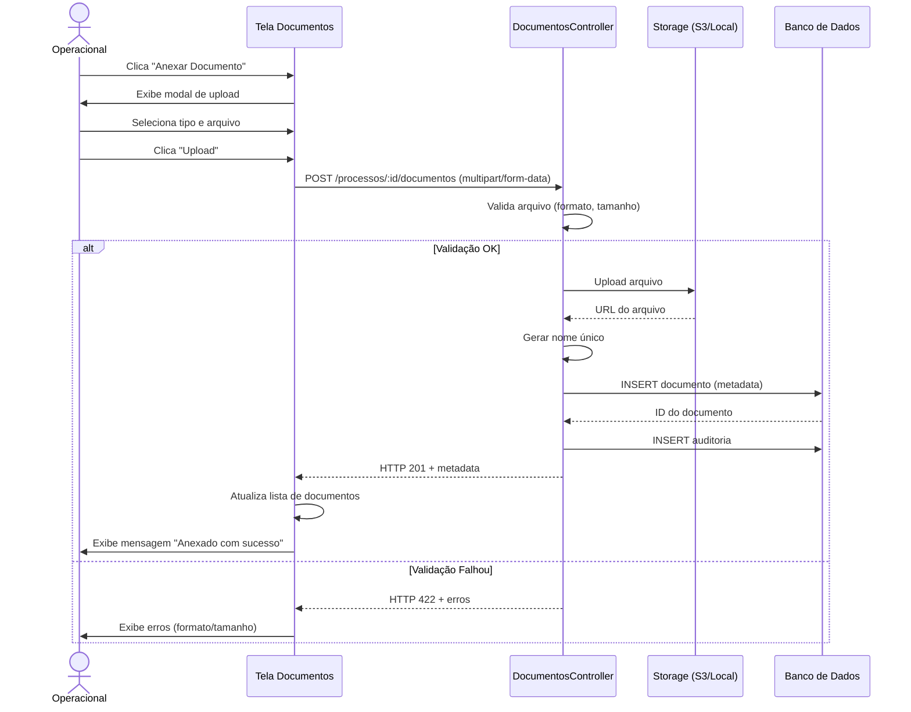
```mermaid
sequenceDiagram
    actor O as Operacional
    participant UI as Tela Documentos
    participant C as DocumentosController
    participant Storage as Storage (S3/Local)
    participant DB as Banco de Dados

    O->>UI: Clica "Anexar Documento"
    UI->>O: Exibe modal de upload
    O->>UI: Seleciona tipo e arquivo
    O->>UI: Clica "Upload"
    UI->>C: POST /processos/:id/documentos (multipart/form-data)
    C->>C: Valida arquivo (formato, tamanho)

    alt Validação OK
        C->>Storage: Upload arquivo
        Storage-->>C: URL do arquivo
        C->>C: Gerar nome único
        C->>DB: INSERT documento (metadata)
        DB-->>C: ID do documento
        C->>DB: INSERT auditoria
        C-->>UI: HTTP 201 + metadata
        UI->>UI: Atualiza lista de documentos
        UI->>O: Exibe mensagem "Anexado com sucesso"
    else Validação Falhou
        C-->>UI: HTTP 422 + erros
        UI->>O: Exibe erros (formato/tamanho)
    end
```

### Protótipo - Aba Documentos

```
┌─────────────────────────────────────────────────────────────────┐
│  Processo PI-2026-001 | Status: EM TRÂNSITO                      │
├─────────────────────────────────────────────────────────────────┤
│  [Dados Básicos] [Custos] [Logística] [Documentos] [Ocorrências]│
│                                                                  │
│  ┌────────────────────────────────────────────────────────────┐ │
│  │  DOCUMENTOS ANEXADOS              [+ Anexar Documento]     │ │
│  ├───────────────────┬─────────┬──────────┬────────┬─────────┤ │
│  │ Nome              │ Tipo    │ Tamanho  │ Data   │ Ações   │ │
│  ├───────────────────┼─────────┼──────────┼────────┼─────────┤ │
│  │ 📄 invoice_001.pdf│ Fatura  │ 1.2 MB   │15/02/26│👁️ 📥 🗑️│ │
│  │ 📄 packing_list...│ Packing │ 850 KB   │15/02/26│👁️ 📥 🗑️│ │
│  │ 📄 bl_123456.pdf  │ BL      │ 450 KB   │18/02/26│👁️ 📥 🗑️│ │
│  │ 📄 di_26_123...   │ DI      │ 2.1 MB   │20/03/26│👁️ 📥 🗑️│ │
│  └───────────────────┴─────────┴──────────┴────────┴─────────┘ │
│                                                                  │
│  Total: 4 documentos (4.6 MB)                                    │
│                                                                  │
│  ┌────────────────────────────────────────────────────────────┐ │
│  │  CHECKLIST DE DOCUMENTOS OBRIGATÓRIOS                      │ │
│  │                                                            │ │
│  │  ✅ Fatura Comercial                                       │ │
│  │  ✅ Packing List                                           │ │
│  │  ✅ Bill of Lading (BL)                                    │ │
│  │  ✅ Declaração de Importação (DI)                          │ │
│  │  ❌ Comprovante de Pagamento         [Anexar]             │ │
│  │  ⚠️ Certificado de Origem (opcional) [Anexar]             │ │
│  └────────────────────────────────────────────────────────────┘ │
│                                                                  │
└─────────────────────────────────────────────────────────────────┘
```

### Modal - Anexar Documento

```
┌─────────────────────────────────────────────────────────┐
│  Anexar Documento                                   ✕   │
├─────────────────────────────────────────────────────────┤
│                                                         │
│  Tipo de Documento *                                    │
│  ┌─────────────────────────────────────────────────┐   │
│  │ Fatura Comercial                              ▼ │   │
│  └─────────────────────────────────────────────────┘   │
│                                                         │
│  Arquivo *                                              │
│  ┌─────────────────────────────────────────────────┐   │
│  │ [Selecionar Arquivo]                            │   │
│  │                                                 │   │
│  │ Formatos aceitos: PDF, XLSX, PNG, JPG, DOCX    │   │
│  │ Tamanho máximo: 10MB                            │   │
│  └─────────────────────────────────────────────────┘   │
│                                                         │
│  Descrição                                              │
│  ┌─────────────────────────────────────────────────┐   │
│  │ Fatura referente ao pedido #12345               │   │
│  │                                                 │   │
│  └─────────────────────────────────────────────────┘   │
│                                                         │
│  ┌──────────┐  ┌─────────────┐                         │
│  │ Cancelar │  │   Upload    │                         │
│  └──────────┘  └─────────────┘                         │
│                                                         │
└─────────────────────────────────────────────────────────┘
```

### Critérios de Aceitação
- [ ] Operacional consegue anexar documentos a processos de importação
- [ ] Sistema valida formato de arquivo (apenas PDF, XLSX, PNG, JPG, DOCX)
- [ ] Sistema valida tamanho de arquivo (máximo 10MB)
- [ ] Sistema permite categorizar documento por tipo
- [ ] Sistema gera nome único para evitar conflitos
- [ ] Sistema armazena metadata (nome, tipo, tamanho, data, quem anexou)
- [ ] Operacional consegue visualizar preview de PDFs e imagens
- [ ] Operacional consegue fazer download de documentos
- [ ] Operacional consegue substituir documento (upload nova versão)
- [ ] Operacional consegue excluir documento (com confirmação)
- [ ] Sistema exibe checklist de documentos obrigatórios com status (✅ ❌)
- [ ] Sistema registra auditoria de upload, download e exclusão
- [ ] Se processo FINALIZADO, não permite upload/exclusão (apenas visualização)
- [ ] Sistema exibe erro claro se formato/tamanho inválido
- [ ] Upload completa em menos de 10 segundos para arquivos de até 5MB

### Notas de Implementação
- Endpoints:
  - `POST /processos/:id/documentos` - Upload
  - `GET /processos/:id/documentos` - Listar
  - `GET /processos/:id/documentos/:doc_id` - Download
  - `DELETE /processos/:id/documentos/:doc_id` - Excluir
- Controller: `DocumentosController`
- Model: `Documento` (relacionamento com `Processo`)
- Storage: AWS S3, Azure Blob ou filesystem local (configurável via ENV)
- Bibliotecas: `aws-sdk-s3` (Ruby), `carrierwave` ou `shrine` (upload)
- Tela: `pages/processos/ProcessosForm.vue` (aba "Documentos")
- Componentes: `DocumentosList`, `ModalUploadDocumento`, `DocumentoPreview`

### Permissões
| Perfil | Pode Anexar | Pode Visualizar | Pode Excluir | Pode Substituir |
|--------|-------------|-----------------|--------------|-----------------|
| Administrador | ✅ | ✅ | ✅ | ✅ |
| Gestor | ❌ | ✅ | ❌ | ❌ |
| Operacional | ✅ | ✅ | ✅ (se não finalizado) | ✅ (se não finalizado) |

---

## RF011 - Aprovação de Processos

### Descrição
O sistema deve permitir que processos planejados passem por aprovação de um Gestor antes de avançarem para execução, garantindo revisão prévia de custos e prazos.

### Atores
- **Ator Principal:** Gestor
- **Atores Secundários:** Operacional (solicita aprovação)

### Pré-condições
1. Processo deve estar em status PLANEJADO
2. Custos previstos devem estar cadastrados
3. Usuário solicitante deve ter perfil Operacional
4. Usuário aprovador deve ter perfil Gestor ou Administrador

### Pós-condições
1. Processo aprovado com status APROVADO
2. Processo rejeitado volta para PLANEJADO com justificativa
3. Notificação enviada ao solicitante
4. Registro de auditoria de aprovação/rejeição

### Fluxo Principal - Solicitar Aprovação

1. Operacional finaliza cadastro do processo e custos previstos
2. Operacional clica em "Solicitar Aprovação"
3. Sistema valida se processo está completo:
   - Dados básicos preenchidos
   - Custos previstos cadastrados
   - Fornecedor ativo
4. Sistema exibe modal de confirmação:
   - "Deseja solicitar aprovação deste processo?"
   - Resumo: Fornecedor, Modal, Custo Total Previsto, Lead Time Previsto
5. Operacional confirma solicitação
6. Sistema altera status para **AGUARDANDO APROVAÇÃO**
7. Sistema envia notificação ao Gestor (email/sistema) - RF015
8. Sistema registra auditoria: quem solicitou, quando
9. Sistema exibe mensagem: "Aprovação solicitada com sucesso"
10. Operacional não pode mais editar processo até aprovação

### Fluxo Alternativo - Aprovar Processo

1. Gestor recebe notificação de processo pendente de aprovação
2. Gestor acessa menu "Processos Pendentes de Aprovação"
3. Sistema exibe lista de processos aguardando aprovação
4. Gestor clica em processo para revisar
5. Sistema exibe detalhes completos:
   - Dados básicos
   - Custos previstos detalhados
   - Comparação com processos similares anteriores (se houver)
   - Indicadores: custo/kg, lead time estimado, etc.
6. Gestor revisa informações
7. Gestor clica em "Aprovar"
8. Sistema exibe modal de confirmação: "Deseja aprovar este processo?"
9. Gestor pode adicionar observação (opcional)
10. Gestor confirma aprovação
11. Sistema altera status para **APROVADO**
12. Sistema registra auditoria: quem aprovou, quando, observação
13. Sistema envia notificação ao Operacional: "Processo aprovado"
14. Sistema exibe mensagem: "Processo aprovado com sucesso"
15. Processo fica liberado para execução (registrar embarque, etc.)

### Fluxo Alternativo - Rejeitar Processo

1. No passo 7 do fluxo de aprovação, se Gestor identificar problemas:
2. Gestor clica em "Rejeitar"
3. Sistema exibe modal obrigatório com campo "Justificativa da Rejeição"
4. Gestor informa motivo da rejeição:
   - "Custo FOB muito elevado. Renegociar com fornecedor."
   - "Prazo de entrega não atende necessidade. Avaliar modal aéreo."
   - "Fornecedor sem aprovação prévia. Cadastrar fornecedor alternativo."
5. Gestor clica em "Confirmar Rejeição"
6. Sistema altera status para **PLANEJADO** (volta status inicial)
7. Sistema registra auditoria: quem rejeitou, quando, justificativa
8. Sistema envia notificação ao Operacional com justificativa
9. Sistema exibe mensagem: "Processo rejeitado. Operacional foi notificado."
10. Operacional pode editar processo e reenviar para aprovação

### Fluxos de Exceção

**FE1 - Processo Incompleto**
- No passo 3 do fluxo principal, se processo está incompleto:
  1. Sistema exibe erro: "Processo incompleto. Complete os dados antes de solicitar aprovação."
  2. Sistema lista pendências:
     - ❌ Custos previstos não cadastrados
     - ❌ Data de embarque não informada
     - ✅ Dados básicos OK
  3. Botão "Solicitar Aprovação" fica desabilitado

**FE2 - Processo Já Aprovado**
- Se Operacional tentar solicitar aprovação de processo já aprovado:
  1. Sistema exibe erro: "Este processo já foi aprovado"
  2. Botão "Solicitar Aprovação" fica oculto

**FE3 - Rejeição Sem Justificativa**
- No passo 4 do fluxo de rejeição, se Gestor não preencher justificativa:
  1. Sistema exibe erro: "Justificativa obrigatória para rejeição"
  2. Campo é destacado em vermelho
  3. Botão "Confirmar Rejeição" fica desabilitado

### Regras de Negócio Relacionadas
- RN007 - Auditoria de Modificações
- RN016 - Processo em Aprovação É Imutável (até aprovação/rejeição)
- Apenas Gestor ou Administrador pode aprovar/rejeitar
- Rejeição requer justificativa obrigatória
- Operacional não pode editar processo enquanto aguarda aprovação

### Diagrama de Sequência - Fluxo de Aprovação

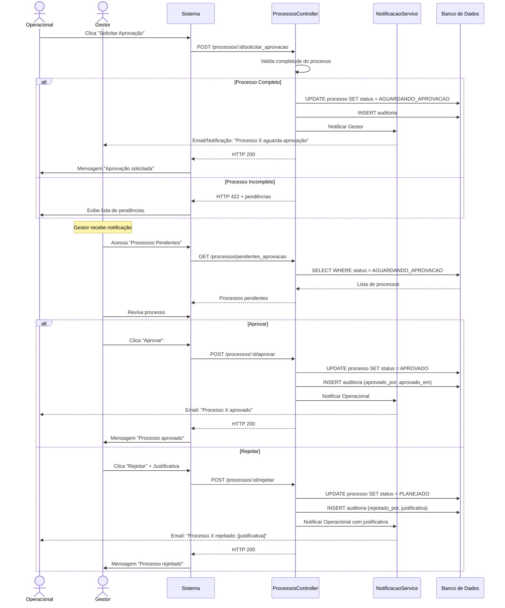
```mermaid
sequenceDiagram
    actor Op as Operacional
    actor G as Gestor
    participant UI as Sistema
    participant C as ProcessosController
    participant N as NotificacaoService
    participant DB as Banco de Dados

    Op->>UI: Clica "Solicitar Aprovação"
    UI->>C: POST /processos/:id/solicitar_aprovacao
    C->>C: Valida completude do processo
    alt Processo Completo
        C->>DB: UPDATE processo SET status = AGUARDANDO_APROVACAO
        C->>DB: INSERT auditoria
        C->>N: Notificar Gestor
        N-->>G: Email/Notificação: "Processo X aguarda aprovação"
        C-->>UI: HTTP 200
        UI->>Op: Mensagem "Aprovação solicitada"
    else Processo Incompleto
        C-->>UI: HTTP 422 + pendências
        UI->>Op: Exibe lista de pendências
    end

    Note over G: Gestor recebe notificação
    G->>UI: Acessa "Processos Pendentes"
    UI->>C: GET /processos/pendentes_aprovacao
    C->>DB: SELECT WHERE status = AGUARDANDO_APROVACAO
    DB-->>C: Lista de processos
    C-->>UI: Processos pendentes
    G->>UI: Revisa processo

    alt Aprovar
        G->>UI: Clica "Aprovar"
        UI->>C: POST /processos/:id/aprovar
        C->>DB: UPDATE processo SET status = APROVADO
        C->>DB: INSERT auditoria (aprovado_por, aprovado_em)
        C->>N: Notificar Operacional
        N-->>Op: Email: "Processo X aprovado"
        C-->>UI: HTTP 200
        UI->>G: Mensagem "Processo aprovado"
    else Rejeitar
        G->>UI: Clica "Rejeitar" + Justificativa
        UI->>C: POST /processos/:id/rejeitar
        C->>DB: UPDATE processo SET status = PLANEJADO
        C->>DB: INSERT auditoria (rejeitado_por, justificativa)
        C->>N: Notificar Operacional com justificativa
        N-->>Op: Email: "Processo X rejeitado: [justificativa]"
        C-->>UI: HTTP 200
        UI->>G: Mensagem "Processo rejeitado"
    end
```

### Diagrama de Estado - Status com Aprovação

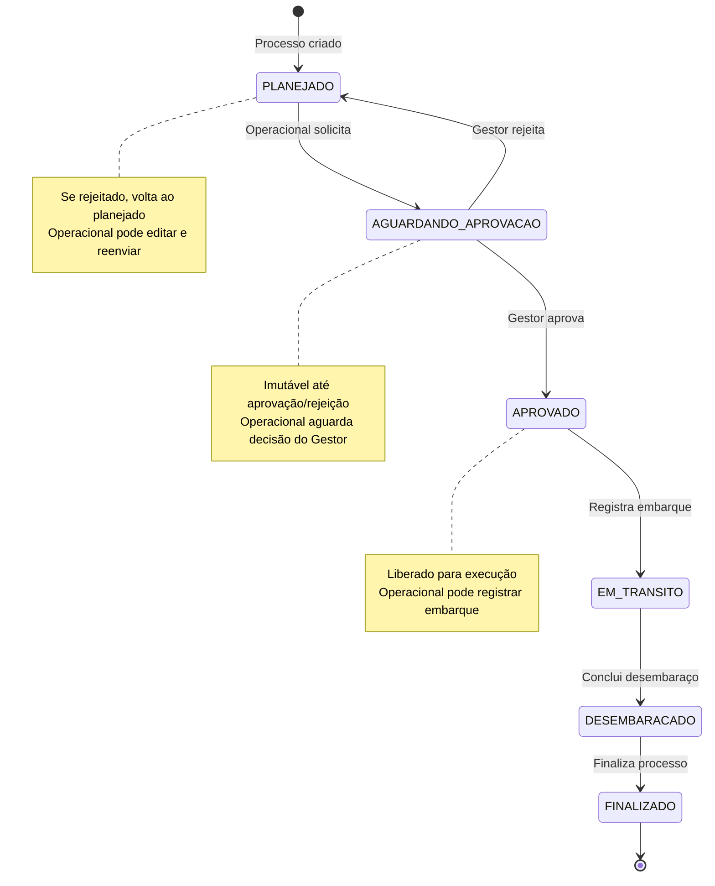
```mermaid
stateDiagram-v2
    [*] --> PLANEJADO: Processo criado
    PLANEJADO --> AGUARDANDO_APROVACAO: Operacional solicita
    AGUARDANDO_APROVACAO --> APROVADO: Gestor aprova
    AGUARDANDO_APROVACAO --> PLANEJADO: Gestor rejeita
    APROVADO --> EM_TRANSITO: Registra embarque
    EM_TRANSITO --> DESEMBARACADO: Conclui desembaraço
    DESEMBARACADO --> FINALIZADO: Finaliza processo
    FINALIZADO --> [*]

    note right of AGUARDANDO_APROVACAO
        Imutável até aprovação/rejeição
        Operacional aguarda decisão do Gestor
    end note

    note right of APROVADO
        Liberado para execução
        Operacional pode registrar embarque
    end note

    note right of PLANEJADO
        Se rejeitado, volta ao planejado
        Operacional pode editar e reenviar
    end note
```

### Protótipo - Lista de Processos Pendentes (Gestor)

```
┌─────────────────────────────────────────────────────────────────┐
│  ☰  SGICI - Processos Pendentes de Aprovação    Gestor   👤 ▼   │
├─────────────────────────────────────────────────────────────────┤
│                                                                  │
│  🔔 Você tem 3 processos aguardando aprovação                    │
│                                                                  │
│  ┌────────────────────────────────────────────────────────────┐ │
│  │ Processo │ Solicitante│ Fornecedor│ Custo Prev.│ Ações     │ │
│  ├──────────┼────────────┼───────────┼────────────┼───────────┤ │
│  │ PI-001   │ João Silva │ ABC China │ R$ 507.7k  │ [Ver Det.]│ │
│  │ PI-002   │ Maria Lima │ XYZ USA   │ R$ 325.5k  │ [Ver Det.]│ │
│  │ PI-003   │ João Silva │ DEF Alem. │ R$ 890.2k  │ [Ver Det.]│ │
│  └──────────┴────────────┴───────────┴────────────┴───────────┘ │
│                                                                  │
└─────────────────────────────────────────────────────────────────┘
```

### Protótipo - Tela de Aprovação (Gestor)

```
┌─────────────────────────────────────────────────────────────────┐
│  Processo PI-2026-001 | Status: AGUARDANDO APROVAÇÃO             │
│  Solicitado por: João Silva em 14/01/2026 às 10:30             │
├─────────────────────────────────────────────────────────────────┤
│                                                                  │
│  ┌────────────────────────────────────────────────────────────┐ │
│  │  RESUMO PARA APROVAÇÃO                                     │ │
│  │                                                            │ │
│  │  Fornecedor:        ABC Manufacturing Ltd (China)          │ │
│  │  Modal:             Marítimo                               │ │
│  │  Incoterm:          FOB                                    │ │
│  │  Porto Origem:      Xangai                                 │ │
│  │  Porto Destino:     Santos                                 │ │
│  │                                                            │ │
│  │  Embarque Previsto: 15/02/2026                             │ │
│  │  Chegada Prevista:  15/03/2026                             │ │
│  │  Lead Time:         40 dias                                │ │
│  │                                                            │ │
│  │  Custo Total Previsto:  R$ 507,756.90                     │ │
│  │  Custo por kg:          R$ 50.78/kg                        │ │
│  └────────────────────────────────────────────────────────────┘ │
│                                                                  │
│  ┌────────────────────────────────────────────────────────────┐ │
│  │  DETALHAMENTO DE CUSTOS                                    │ │
│  │                                                            │ │
│  │  Custos Internacionais:   R$ 303,565.00                   │ │
│  │  Impostos:                R$ 196,391.90                    │ │
│  │  Custos Nacionais:        R$   7,800.00                   │ │
│  │  ──────────────────────────────────────────────────────── │ │
│  │  TOTAL:                   R$ 507,756.90                    │ │
│  └────────────────────────────────────────────────────────────┘ │
│                                                                  │
│  ┌────────────────────────────────────────────────────────────┐ │
│  │  COMPARAÇÃO COM PROCESSOS SIMILARES                        │ │
│  │                                                            │ │
│  │  Processos anteriores da China (último ano):               │ │
│  │  - Custo médio:       R$ 495.000,00 (🟡 +2.6% acima)      │ │
│  │  - Lead time médio:   42 dias (🟢 dentro do esperado)     │ │
│  └────────────────────────────────────────────────────────────┘ │
│                                                                  │
│  Observações (opcional):                                         │
│  ┌────────────────────────────────────────────────────────────┐ │
│  │                                                            │ │
│  └────────────────────────────────────────────────────────────┘ │
│                                                                  │
│  ┌───────────────┐  ┌────────────────┐                          │
│  │ ❌ Rejeitar    │  │ ✅ Aprovar     │                          │
│  └───────────────┘  └────────────────┘                          │
│                                                                  │
└─────────────────────────────────────────────────────────────────┘
```

### Critérios de Aceitação
- [ ] Operacional consegue solicitar aprovação de processo planejado
- [ ] Sistema valida completude antes de permitir solicitar aprovação
- [ ] Sistema altera status para AGUARDANDO APROVAÇÃO ao solicitar
- [ ] Sistema envia notificação ao Gestor sobre processo pendente
- [ ] Gestor consegue visualizar lista de processos pendentes de aprovação
- [ ] Gestor consegue revisar detalhes completos do processo
- [ ] Gestor consegue aprovar processo com observação opcional
- [ ] Gestor consegue rejeitar processo com justificativa obrigatória
- [ ] Sistema altera status para APROVADO ao aprovar
- [ ] Sistema volta status para PLANEJADO ao rejeitar
- [ ] Sistema envia notificação ao Operacional sobre aprovação/rejeição
- [ ] Sistema registra auditoria de solicitação, aprovação e rejeição
- [ ] Operacional não consegue editar processo enquanto aguarda aprovação
- [ ] Sistema exibe comparação com processos similares anteriores (se houver)
- [ ] Processo rejeitado permite nova edição e reenvio para aprovação

### Notas de Implementação
- Endpoints:
  - `POST /processos/:id/solicitar_aprovacao` - Solicitar
  - `GET /processos/pendentes_aprovacao` - Listar pendentes
  - `POST /processos/:id/aprovar` - Aprovar
  - `POST /processos/:id/rejeitar` - Rejeitar (com justificativa)
- Controller: `ProcessosController@solicitar_aprovacao`, `ProcessosController@aprovar`, `ProcessosController@rejeitar`
- Model: `Processo` (campo `status`, `aprovado_por`, `aprovado_em`, `rejeitado_por`, `justificativa_rejeicao`)
- Service: `NotificacaoService` (enviar emails/notificações)
- Tela:
  - `pages/processos/ProcessosForm.vue` (botão Solicitar Aprovação)
  - `pages/processos/ProcessosPendentes.vue` (lista para Gestor)
  - `pages/processos/ProcessosAprovacao.vue` (tela de aprovação/rejeição)
- Componentes: `ModalAprovacao`, `ModalRejeicao`, `ComparacaoProcessos`

### Permissões
| Perfil | Pode Solicitar Aprovação | Pode Aprovar/Rejeitar | Pode Ver Pendentes |
|--------|--------------------------|----------------------|-------------------|
| Administrador | ✅ | ✅ | ✅ |
| Gestor | ❌ | ✅ | ✅ |
| Operacional | ✅ | ❌ | ❌ |

---

## RF012 - Gestão de Ocorrências

### Descrição
O sistema deve permitir o registro e gerenciamento de ocorrências (problemas, imprevistos, atrasos) durante o processo de importação, com descrição, responsável, status de resolução e ações tomadas.

### Atores
- **Ator Principal:** Operacional
- **Atores Secundários:** Administrador, Gestor (visualiza)

### Pré-condições
1. Processo de importação deve estar cadastrado
2. Usuário deve ter perfil Operacional ou Administrador
3. Processo deve estar em execução (status >= APROVADO)

### Pós-condições
1. Ocorrência registrada e vinculada ao processo
2. Status da ocorrência definido (Aberta/Em Análise/Resolvida)
3. Notificação enviada ao Gestor (se crítica)
4. Registro de auditoria

### Fluxo Principal - Registrar Ocorrência

1. Operacional identifica problema durante importação (ex: atraso no embarque)
2. Operacional acessa processo na aba "Ocorrências"
3. Operacional clica em "Registrar Ocorrência"
4. Sistema exibe formulário com campos:
   - Tipo de Ocorrência (dropdown)
   - Gravidade (Baixa/Média/Alta/Crítica)
   - Descrição (textarea obrigatório)
   - Data da Ocorrência
   - Responsável (quem vai resolver)
   - Ações Tomadas (textarea opcional)
5. Operacional seleciona tipo de ocorrência:
   - Atraso no Embarque
   - Atraso na Chegada
   - Problema Documental
   - Avaria na Carga
   - Retenção Alfandegária
   - Custo Adicional Imprevisto
   - Outros
6. Operacional seleciona gravidade:
   - **Baixa**: Impacto mínimo, não afeta prazos críticos
   - **Média**: Impacto moderado, requer monitoramento
   - **Alta**: Impacto significativo, afeta prazo/custo
   - **Crítica**: Impacto severo, urgência máxima
7. Operacional preenche descrição detalhada
8. Operacional define responsável (usuário ou texto livre)
9. Operacional clica em "Salvar Ocorrência"
10. Sistema salva ocorrência com status **ABERTA**
11. Sistema registra auditoria
12. Se gravidade = Alta ou Crítica:
    - Sistema envia notificação ao Gestor (RF015)
13. Sistema exibe mensagem: "Ocorrência registrada com sucesso"
14. Sistema atualiza contador de ocorrências do processo

### Fluxo Alternativo - Atualizar Status da Ocorrência

1. Operacional/Responsável trabalha na resolução da ocorrência
2. Operacional acessa ocorrência existente
3. Operacional clica em "Editar Ocorrência"
4. Sistema exibe formulário preenchido
5. Operacional atualiza campos:
   - Status: Aberta → Em Análise → Resolvida
   - Ações Tomadas: descreve o que foi feito
   - Data de Resolução (se resolvida)
6. Operacional clica em "Salvar Alterações"
7. Sistema atualiza ocorrência
8. Sistema registra auditoria (histórico de alterações)
9. Se status = Resolvida:
   - Sistema envia notificação ao Gestor: "Ocorrência X resolvida"
10. Sistema exibe mensagem: "Ocorrência atualizada com sucesso"

### Fluxo Alternativo - Criação Automática de Ocorrência (Atrasos)

- O sistema cria automaticamente ocorrências em determinadas situações:

**Atraso no Embarque (> 2 dias):**
1. Sistema detecta que data_embarque_real > data_embarque_prevista + 2 dias (RF004)
2. Sistema cria ocorrência automaticamente:
   - Tipo: Atraso no Embarque
   - Gravidade: Média
   - Descrição: "Embarque realizado com 3 dias de atraso (previsto: 15/02, real: 18/02)"
   - Status: Aberta
3. Sistema notifica Operacional e Gestor

**Atraso na Chegada (> 7 dias):**
1. Sistema detecta que data_chegada_real > data_chegada_prevista + 7 dias (RF004, RN012)
2. Sistema cria ocorrência automaticamente:
   - Tipo: Atraso na Chegada
   - Gravidade: Alta
   - Descrição: "Carga chegou com 10 dias de atraso (previsto: 15/03, real: 25/03)"
   - Status: Aberta
3. Sistema notifica Gestor imediatamente

### Fluxos de Exceção

**FE1 - Descrição Vazia**
- No passo 7, se descrição não preenchida:
  1. Sistema exibe erro: "Descrição é obrigatória"
  2. Campo é destacado em vermelho
  3. Retorna ao passo 7

**FE2 - Processo Não Iniciado**
- No passo 2, se processo está em status PLANEJADO ou AGUARDANDO APROVAÇÃO:
  1. Sistema exibe erro: "Não é possível registrar ocorrências em processos ainda não aprovados"
  2. Aba "Ocorrências" fica desabilitada

**FE3 - Processo Finalizado**
- No passo 2, se processo está FINALIZADO (RN015):
  1. Sistema permite visualização de ocorrências
  2. Sistema NÃO permite criar novas ocorrências
  3. Sistema NÃO permite editar ocorrências existentes
  4. Botão "Registrar Ocorrência" fica desabilitado

### Regras de Negócio Relacionadas
- RN007 - Auditoria de Modificações
- RN012 - Atraso > 7 Dias Cria Ocorrência Automaticamente
- RN015 - Processo Finalizado É Imutável
- Ocorrências de gravidade Alta ou Crítica notificam Gestor imediatamente

### Tipos de Ocorrências

| Tipo | Descrição | Gravidade Típica | Exemplo |
|------|-----------|------------------|---------|
| Atraso no Embarque | Carga não embarcou na data prevista | Média/Alta | Greve no porto |
| Atraso na Chegada | Carga não chegou na data prevista | Alta/Crítica | Navio atrasou 10 dias |
| Problema Documental | Documentos incorretos ou faltantes | Média/Alta | Fatura sem certificado de origem |
| Avaria na Carga | Produto danificado durante transporte | Alta/Crítica | Container violado |
| Retenção Alfandegária | Carga retida pela Receita Federal | Alta/Crítica | Exigência de licença ANVISA |
| Custo Adicional Imprevisto | Custo não previsto no orçamento | Média/Alta | Taxa portuária extraordinária |
| Fornecedor Não Entregou | Fornecedor não cumpriu prazo | Crítica | Cancelamento de pedido |
| Outros | Outros problemas não categorizados | Variável | - |

### Diagrama de Sequência - Registro de Ocorrência

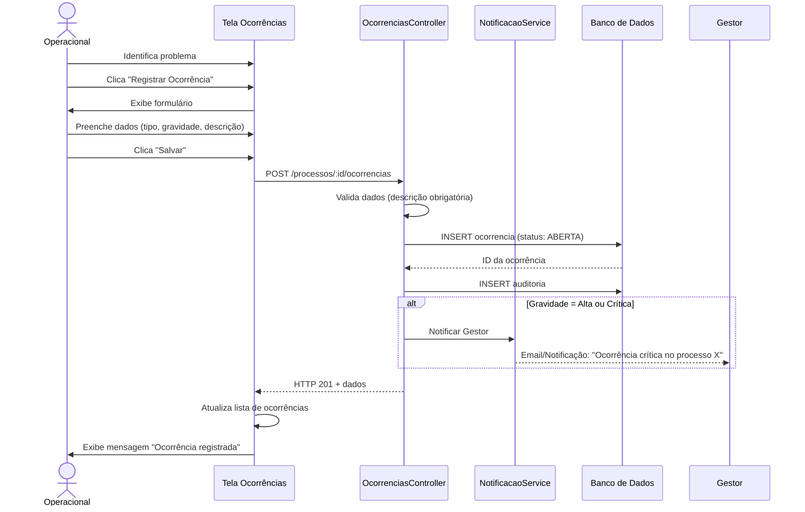
```mermaid
sequenceDiagram
    actor O as Operacional
    participant UI as Tela Ocorrências
    participant C as OcorrenciasController
    participant N as NotificacaoService
    participant DB as Banco de Dados

    O->>UI: Identifica problema
    O->>UI: Clica "Registrar Ocorrência"
    UI->>O: Exibe formulário
    O->>UI: Preenche dados (tipo, gravidade, descrição)
    O->>UI: Clica "Salvar"
    UI->>C: POST /processos/:id/ocorrencias
    C->>C: Valida dados (descrição obrigatória)
    C->>DB: INSERT ocorrencia (status: ABERTA)
    DB-->>C: ID da ocorrência
    C->>DB: INSERT auditoria

    alt Gravidade = Alta ou Crítica
        C->>N: Notificar Gestor
        N-->>Gestor: Email/Notificação: "Ocorrência crítica no processo X"
    end

    C-->>UI: HTTP 201 + dados
    UI->>UI: Atualiza lista de ocorrências
    UI->>O: Exibe mensagem "Ocorrência registrada"
```

### Diagrama de Estado - Status da Ocorrência

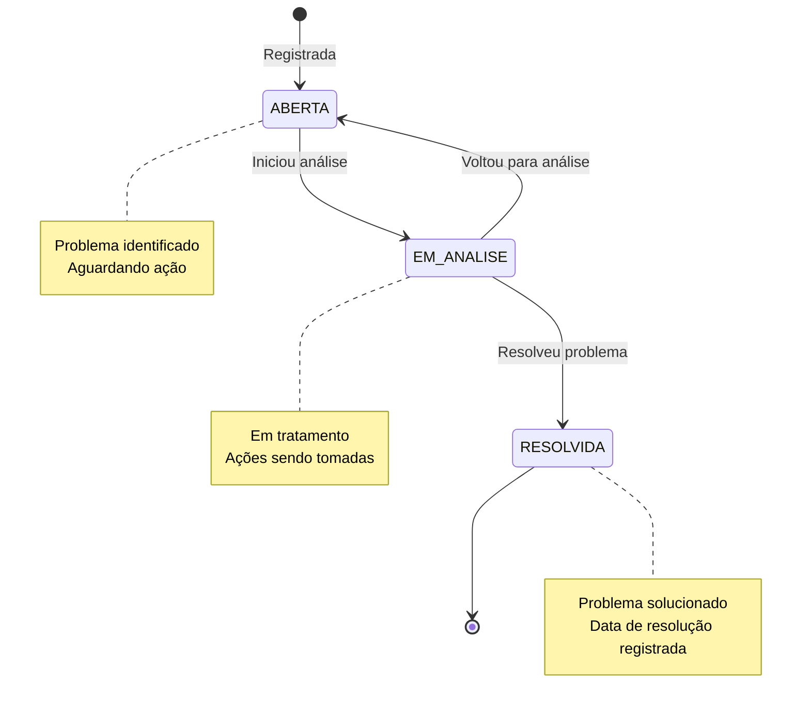
```mermaid
stateDiagram-v2
    [*] --> ABERTA: Registrada
    ABERTA --> EM_ANALISE: Iniciou análise
    EM_ANALISE --> RESOLVIDA: Resolveu problema
    EM_ANALISE --> ABERTA: Voltou para análise
    RESOLVIDA --> [*]

    note right of ABERTA
        Problema identificado
        Aguardando ação
    end note

    note right of EM_ANALISE
        Em tratamento
        Ações sendo tomadas
    end note

    note right of RESOLVIDA
        Problema solucionado
        Data de resolução registrada
    end note
```

### Protótipo - Aba Ocorrências

```
┌─────────────────────────────────────────────────────────────────┐
│  Processo PI-2026-001 | Status: EM TRÂNSITO                      │
├─────────────────────────────────────────────────────────────────┤
│  [Dados Básicos] [Custos] [Logística] [Documentos] [Ocorrências]│
│                                                                  │
│  ┌────────────────────────────────────────────────────────────┐ │
│  │  OCORRÊNCIAS                      [+ Registrar Ocorrência] │ │
│  ├───────┬──────────────┬──────────┬────────┬──────┬─────────┤ │
│  │ Tipo  │ Descrição    │ Gravidade│ Status │ Data │ Ações   │ │
│  ├───────┼──────────────┼──────────┼────────┼──────┼─────────┤ │
│  │Atraso │Greve no      │🟡 Média  │✅Resolv.│18/02 │ ✏️ 👁️  │ │
│  │Embarq.│porto origem  │          │        │      │         │ │
│  ├───────┼──────────────┼──────────┼────────┼──────┼─────────┤ │
│  │Atraso │Navio atrasou │🔴 Alta   │🔄Anál. │20/03 │ ✏️ 👁️  │ │
│  │Chegada│10 dias       │          │        │      │         │ │
│  └───────┴──────────────┴──────────┴────────┴──────┴─────────┘ │
│                                                                  │
│  Total: 2 ocorrências (1 resolvida, 1 em análise)               │
│                                                                  │
│  ⚠️ 1 ocorrência de gravidade ALTA requer atenção                │
│                                                                  │
└─────────────────────────────────────────────────────────────────┘
```

### Modal - Registrar Ocorrência

```
┌─────────────────────────────────────────────────────────┐
│  Registrar Ocorrência                               ✕   │
├─────────────────────────────────────────────────────────┤
│                                                         │
│  Tipo de Ocorrência *                                   │
│  ┌─────────────────────────────────────────────────┐   │
│  │ Atraso no Embarque                            ▼ │   │
│  └─────────────────────────────────────────────────┘   │
│                                                         │
│  Gravidade *                                            │
│  ⚪ Baixa  ⚪ Média  ⚫ Alta  ⚪ Crítica                 │
│                                                         │
│  Data da Ocorrência *                                   │
│  ┌─────────────────────────────────────────────────┐   │
│  │ 18/02/2026                                   📅 │   │
│  └─────────────────────────────────────────────────┘   │
│                                                         │
│  Descrição *                                            │
│  ┌─────────────────────────────────────────────────┐   │
│  │ Greve no porto de Xangai atrasou embarque em 3 │   │
│  │ dias. Previsão de normalização em 48h.         │   │
│  │                                                 │   │
│  └─────────────────────────────────────────────────┘   │
│                                                         │
│  Responsável                                            │
│  ┌─────────────────────────────────────────────────┐   │
│  │ João Silva                                    ▼ │   │
│  └─────────────────────────────────────────────────┘   │
│                                                         │
│  Ações Tomadas                                          │
│  ┌─────────────────────────────────────────────────┐   │
│  │ Contactado freight forwarder. Aguardando...    │   │
│  │                                                 │   │
│  └─────────────────────────────────────────────────┘   │
│                                                         │
│  ┌──────────┐  ┌─────────────┐                         │
│  │ Cancelar │  │   Salvar    │                         │
│  └──────────┘  └─────────────┘                         │
│                                                         │
└─────────────────────────────────────────────────────────┘
```

### Critérios de Aceitação
- [ ] Operacional consegue registrar ocorrências em processos aprovados/em execução
- [ ] Sistema valida tipo, gravidade e descrição obrigatórios
- [ ] Sistema registra ocorrência com status ABERTA
- [ ] Sistema permite editar ocorrência (status, ações tomadas)
- [ ] Sistema permite atualizar status: Aberta → Em Análise → Resolvida
- [ ] Sistema cria ocorrência automaticamente para atrasos > 2 dias (embarque) e > 7 dias (chegada)
- [ ] Sistema envia notificação ao Gestor para ocorrências de gravidade Alta/Crítica
- [ ] Sistema exibe contador de ocorrências no cabeçalho do processo
- [ ] Sistema registra auditoria de criação e edições
- [ ] Sistema exibe histórico de alterações da ocorrência
- [ ] Se processo FINALIZADO, não permite criar/editar ocorrências (apenas visualização)
- [ ] Sistema exibe badge visual de gravidade (🟢 🟡 🟠 🔴)
- [ ] Operacional consegue filtrar ocorrências por status/gravidade
- [ ] Sistema destaca ocorrências não resolvidas de gravidade Alta/Crítica

### Notas de Implementação
- Endpoints:
  - `POST /processos/:id/ocorrencias` - Criar
  - `GET /processos/:id/ocorrencias` - Listar
  - `GET /ocorrencias/:id` - Detalhes
  - `PUT /ocorrencias/:id` - Atualizar
- Controller: `OcorrenciasController`
- Model: `Ocorrencia` (relacionamento com `Processo`, `Usuario` responsável)
- Service: `NotificacaoService`, `OcorrenciaAutomaticaService`
- Tela: `pages/processos/ProcessosForm.vue` (aba "Ocorrências")
- Componentes: `OcorrenciasList`, `ModalOcorrencia`, `BadgeGravidade`

### Permissões
| Perfil | Pode Criar | Pode Editar | Pode Visualizar | Pode Resolver |
|--------|------------|-------------|-----------------|---------------|
| Administrador | ✅ | ✅ | ✅ | ✅ |
| Gestor | ❌ | ❌ | ✅ | ❌ |
| Operacional | ✅ | ✅ (próprias ou atribuídas) | ✅ | ✅ |

---

## RF013 - Gestão de Usuários e Perfis

### Descrição
O sistema deve permitir o cadastro e gerenciamento de usuários com diferentes perfis de acesso (Administrador, Gestor, Operacional), controlando permissões de forma granular.

### Atores
- **Ator Principal:** Administrador
- **Atores Secundários:** -

### Pré-condições
1. Usuário deve ter perfil Administrador
2. Usuário deve estar autenticado

### Pós-condições
1. Usuário criado/editado com perfil definido
2. Permissões aplicadas conforme perfil
3. Credenciais de acesso enviadas (se novo usuário)
4. Registro de auditoria

### Fluxo Principal - Cadastrar Usuário

1. Administrador acessa menu "Configurações > Usuários"
2. Sistema exibe lista de usuários cadastrados
3. Administrador clica em "Novo Usuário"
4. Sistema exibe formulário com campos:
   - Nome Completo
   - Email (login)
   - Perfil (Administrador/Gestor/Operacional)
   - Status (Ativo/Inativo)
   - Senha (gerada automaticamente ou manual)
5. Administrador preenche dados
6. Administrador seleciona perfil:
   - **Administrador**: Acesso total
   - **Gestor**: Visualização, aprovações, relatórios
   - **Operacional**: Cadastros, lançamentos, execução
7. Sistema valida email único
8. Administrador clica em "Salvar"
9. Sistema cria usuário
10. Sistema gera senha temporária (ou usa a informada)
11. Sistema envia email ao novo usuário com credenciais
12. Sistema registra auditoria
13. Sistema exibe mensagem: "Usuário criado com sucesso"

### Fluxo Alternativo - Editar Usuário

1. Administrador clica em "Editar" em usuário existente
2. Sistema exibe formulário preenchido
3. Administrador altera dados desejados (nome, perfil, status)
4. Administrador clica em "Salvar"
5. Sistema valida alterações
6. Sistema atualiza usuário
7. Sistema registra auditoria
8. Sistema exibe mensagem: "Usuário atualizado"

### Fluxo Alternativo - Desativar Usuário

1. Administrador clica em "Desativar" em usuário ativo
2. Sistema exibe confirmação: "Deseja desativar este usuário?"
3. Sistema avisa: "Usuário perderá acesso ao sistema imediatamente"
4. Administrador confirma
5. Sistema altera status para Inativo
6. Sistema invalida sessões ativas do usuário
7. Sistema registra auditoria
8. Sistema exibe mensagem: "Usuário desativado"

### Fluxo Alternativo - Redefinir Senha

1. Administrador clica em "Redefinir Senha" no usuário
2. Sistema gera nova senha temporária
3. Sistema envia email ao usuário com nova senha
4. Sistema marca senha como "deve ser alterada no próximo login"
5. Sistema registra auditoria
6. Sistema exibe mensagem: "Senha redefinida. Email enviado ao usuário."

### Fluxos de Exceção

**FE1 - Email Duplicado**
- No passo 7, se email já cadastrado:
  1. Sistema exibe erro: "Email já cadastrado no sistema"
  2. Campo email é destacado
  3. Retorna ao passo 5

**FE2 - Único Administrador Ativo**
- No passo 4 do fluxo de desativação, se tentativa de desativar último admin:
  1. Sistema exibe erro: "Não é possível desativar o último administrador ativo"
  2. Desativação é bloqueada

**FE3 - Auto-Desativação**
- Se administrador tentar desativar a própria conta:
  1. Sistema exibe aviso: "Você está desativando sua própria conta. Confirma?"
  2. Administrador deve confirmar explicitamente

### Regras de Negócio Relacionadas
- RN007 - Auditoria de Modificações
- Email deve ser único no sistema
- Deve sempre existir ao menos 1 administrador ativo
- Senha inicial deve ser temporária e exigir troca no primeiro login

### Perfis e Permissões

| Funcionalidade | Administrador | Gestor | Operacional |
|----------------|---------------|--------|-------------|
| **Processos** |
| Criar processo | ✅ | ❌ | ✅ |
| Editar processo | ✅ | ❌ | ✅ (não finalizado) |
| Excluir processo | ✅ | ❌ | ❌ |
| Solicitar aprovação | ✅ | ❌ | ✅ |
| Aprovar/Rejeitar | ✅ | ✅ | ❌ |
| Finalizar processo | ✅ | ❌ | ✅ |
| Reabrir finalizado | ✅ | ❌ | ❌ |
| **Custos** |
| Cadastrar previstos | ✅ | ❌ | ✅ |
| Lançar reais | ✅ | ❌ | ✅ |
| Ver comparação | ✅ | ✅ | ✅ |
| **Logística** |
| Registrar eventos | ✅ | ❌ | ✅ |
| Ver timeline | ✅ | ✅ | ✅ |
| **Ocorrências** |
| Criar ocorrência | ✅ | ❌ | ✅ |
| Editar ocorrência | ✅ | ❌ | ✅ |
| Ver ocorrências | ✅ | ✅ | ✅ |
| **Documentos** |
| Anexar documentos | ✅ | ❌ | ✅ |
| Excluir documentos | ✅ | ❌ | ✅ (não finalizado) |
| Ver/Baixar | ✅ | ✅ | ✅ |
| **Fornecedores/Prestadores** |
| Cadastrar | ✅ | ❌ | ✅ |
| Editar | ✅ | ❌ | ✅ |
| Desativar | ✅ | ❌ | ✅ |
| **Relatórios e Dashboards** |
| Ver dashboards | ✅ | ✅ | ❌ |
| Exportar Excel/PDF | ✅ | ✅ | ❌ (limitado) |
| **Administração** |
| Gerenciar usuários | ✅ | ❌ | ❌ |
| Configurar alíquotas | ✅ | ❌ | ❌ |
| Auditoria completa | ✅ | ✅ (próprio setor) | ❌ |

### Diagrama de Sequência - Criação de Usuário

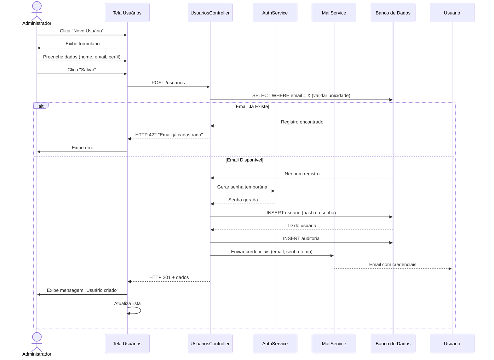
```mermaid
sequenceDiagram
    actor A as Administrador
    participant UI as Tela Usuários
    participant C as UsuariosController
    participant Auth as AuthService
    participant Mail as MailService
    participant DB as Banco de Dados

    A->>UI: Clica "Novo Usuário"
    UI->>A: Exibe formulário
    A->>UI: Preenche dados (nome, email, perfil)
    A->>UI: Clica "Salvar"
    UI->>C: POST /usuarios
    C->>DB: SELECT WHERE email = X (validar unicidade)

    alt Email Já Existe
        DB-->>C: Registro encontrado
        C-->>UI: HTTP 422 "Email já cadastrado"
        UI->>A: Exibe erro
    else Email Disponível
        DB-->>C: Nenhum registro
        C->>Auth: Gerar senha temporária
        Auth-->>C: Senha gerada
        C->>DB: INSERT usuario (hash da senha)
        DB-->>C: ID do usuário
        C->>DB: INSERT auditoria
        C->>Mail: Enviar credenciais (email, senha temp)
        Mail-->>Usuario: Email com credenciais
        C-->>UI: HTTP 201 + dados
        UI->>A: Exibe mensagem "Usuário criado"
        UI->>UI: Atualiza lista
    end
```

### Protótipo - Lista de Usuários

```
┌─────────────────────────────────────────────────────────────────┐
│  ☰  SGICI - Usuários                        Admin        👤 ▼   │
├─────────────────────────────────────────────────────────────────┤
│                                                                  │
│  Configurações > Usuários                                        │
│                                                                  │
│  ┌──────────────────────────────┐  ┌───────────────────────┐   │
│  │ 🔍 Buscar por nome ou email... │  │ [+ Novo Usuário]     │   │
│  └──────────────────────────────┘  └───────────────────────┘   │
│                                                                  │
│  ┌────────────────────────────────────────────────────────────┐ │
│  │ Nome         │ Email        │ Perfil       │Status│ Ações  │ │
│  ├────────────────────────────────────────────────────────────┤ │
│  │ João Silva   │ joao@...com  │ Admin        │🟢Ativo│✏️ 🔑  │ │
│  │ Maria Santos │ maria@...com │ Gestor       │🟢Ativo│✏️ 🔑 ❌│ │
│  │ Pedro Costa  │ pedro@...com │ Operacional  │🟢Ativo│✏️ 🔑 ❌│ │
│  │ Ana Lima     │ ana@...com   │ Operacional  │⚫Inativo│✏️ 🔄│ │
│  └────────────────────────────────────────────────────────────┘ │
│                                                                  │
│  ✏️ Editar  |  🔑 Redefinir Senha  |  ❌ Desativar  |  🔄 Reativar│
│                                                                  │
│  Total: 4 usuários (3 ativos, 1 inativo)                         │
│                                                                  │
└─────────────────────────────────────────────────────────────────┘
```

### Protótipo - Formulário de Usuário

```
┌─────────────────────────────────────────────────────────┐
│  Novo Usuário                                       ✕   │
├─────────────────────────────────────────────────────────┤
│                                                         │
│  Nome Completo *                                        │
│  ┌─────────────────────────────────────────────────┐   │
│  │ João Silva                                      │   │
│  └─────────────────────────────────────────────────┘   │
│                                                         │
│  Email (login) *                                        │
│  ┌─────────────────────────────────────────────────┐   │
│  │ joao.silva@empresa.com                          │   │
│  └─────────────────────────────────────────────────┘   │
│                                                         │
│  Perfil *                                               │
│  ┌─────────────────────────────────────────────────┐   │
│  │ Operacional                                   ▼ │   │
│  └─────────────────────────────────────────────────┘   │
│                                                         │
│  ℹ️ Permissões do perfil Operacional:                  │
│  - Cadastrar e gerenciar processos                      │
│  - Lançar custos e registrar eventos logísticos         │
│  - Anexar documentos e registrar ocorrências            │
│  - Não pode aprovar processos nem acessar dashboards    │
│                                                         │
│  Status                                                 │
│  ⚫ Ativo  ⚪ Inativo                                    │
│                                                         │
│  ✅ Gerar senha temporária e enviar por email          │
│                                                         │
│  ┌──────────┐  ┌─────────────┐                         │
│  │ Cancelar │  │   Salvar    │                         │
│  └──────────┘  └─────────────┘                         │
│                                                         │
└─────────────────────────────────────────────────────────┘
```

### Critérios de Aceitação
- [ ] Administrador consegue cadastrar novos usuários
- [ ] Sistema valida email único
- [ ] Sistema permite selecionar perfil (Administrador/Gestor/Operacional)
- [ ] Sistema gera senha temporária automaticamente
- [ ] Sistema envia email com credenciais ao novo usuário
- [ ] Administrador consegue editar usuários existentes
- [ ] Administrador consegue desativar usuários
- [ ] Sistema impede desativação do último administrador ativo
- [ ] Sistema invalida sessões ao desativar usuário
- [ ] Administrador consegue redefinir senha de usuários
- [ ] Sistema exige troca de senha no primeiro login
- [ ] Sistema exibe lista de usuários com filtros (nome, email, perfil, status)
- [ ] Sistema registra auditoria de todas as operações em usuários
- [ ] Permissões são aplicadas automaticamente conforme perfil

### Notas de Implementação
- Endpoints:
  - `GET /usuarios` - Listar
  - `POST /usuarios` - Criar
  - `GET /usuarios/:id` - Visualizar
  - `PUT /usuarios/:id` - Editar
  - `DELETE /usuarios/:id` - Desativar (soft delete)
  - `POST /usuarios/:id/redefinir_senha` - Redefinir senha
- Controller: `UsuariosController`
- Model: `Usuario` (campo `perfil`, `status`, `senha_temporaria`)
- Service: `AuthService` (gerar senhas), `MailService` (enviar credenciais)
- Middleware: `PermissaoMiddleware` (verificar permissões por perfil)
- Tela: `pages/usuarios/UsuariosIndex.vue`, `pages/usuarios/UsuariosForm.vue`
- Componentes: `DataTable`, `ModalUsuario`, `BadgePerfil`

### Permissões
| Perfil | Pode Gerenciar Usuários |
|--------|-------------------------|
| Administrador | ✅ |
| Gestor | ❌ |
| Operacional | ❌ |

---

## RF014 - Auditoria de Modificações

### Descrição
O sistema deve registrar automaticamente todas as modificações realizadas em processos, custos, eventos logísticos, ocorrências e configurações, mantendo histórico completo com quem modificou, quando, e o que foi alterado.

### Atores
- **Ator Principal:** Sistema (automático)
- **Atores Secundários:** Administrador, Gestor (consultam)

### Pré-condições
1. Sistema deve estar configurado para auditoria
2. Usuário deve estar autenticado (rastreamento)

### Pós-condições
1. Registro de auditoria criado
2. Histórico de alterações persistido
3. Dados disponíveis para consulta

### Fluxo Principal - Registro Automático de Auditoria

1. Usuário realiza qualquer operação rastreável:
   - Criar/Editar/Excluir processo
   - Lançar/Editar custos (previstos ou reais)
   - Registrar evento logístico
   - Criar/Resolver ocorrência
   - Anexar/Excluir documento
   - Aprovar/Rejeitar processo
   - Finalizar/Reabrir processo
   - Criar/Editar/Desativar usuário
   - Alterar configurações do sistema
2. Sistema captura automaticamente:
   - Usuário responsável (ID e nome)
   - Data e hora da operação
   - Tipo de operação (CREATE, UPDATE, DELETE)
   - Entidade afetada (Processo, Custo, Evento, etc.)
   - ID do registro afetado
   - Valores ANTES da alteração (para UPDATE)
   - Valores DEPOIS da alteração (para UPDATE)
   - IP do usuário (opcional)
   - User Agent (navegador)
3. Sistema serializa dados para JSON
4. Sistema insere registro na tabela `auditorias`
5. Operação original prossegue normalmente

### Fluxo Alternativo - Consultar Auditoria de Processo

1. Gestor ou Administrador acessa processo
2. Gestor clica em aba "Histórico" ou ícone de auditoria
3. Sistema exibe timeline de modificações:
   - Data/Hora
   - Usuário
   - Ação realizada
   - Campos alterados (antes/depois)
4. Gestor pode filtrar por:
   - Tipo de operação
   - Usuário
   - Período
5. Sistema exibe histórico ordenado (mais recente primeiro)

### Fluxo Alternativo - Auditoria Global (Administrador)

1. Administrador acessa menu "Auditoria"
2. Sistema exibe painel de auditoria com filtros:
   - Período (data início/fim)
   - Usuário
   - Tipo de entidade (Processo, Custo, etc.)
   - Tipo de operação (CREATE, UPDATE, DELETE)
3. Administrador aplica filtros
4. Sistema exibe lista de registros de auditoria
5. Administrador pode exportar relatório de auditoria (Excel/PDF)

### Dados Capturados na Auditoria

| Campo | Tipo | Descrição | Exemplo |
|-------|------|-----------|---------|
| id | Integer | ID único do registro de auditoria | 12345 |
| usuario_id | Integer | ID do usuário que realizou a ação | 5 |
| usuario_nome | String | Nome do usuário | "João Silva" |
| data_hora | Timestamp | Data e hora da operação | 2026-01-15 14:30:25 |
| tipo_operacao | Enum | CREATE, UPDATE, DELETE | UPDATE |
| entidade | String | Tipo de entidade afetada | "Processo" |
| entidade_id | Integer | ID do registro afetado | 101 |
| descricao | String | Descrição legível da ação | "Alterou status de PLANEJADO para APROVADO" |
| valores_antes | JSONB | Dados antes da alteração | `{"status": "PLANEJADO"}` |
| valores_depois | JSONB | Dados após a alteração | `{"status": "APROVADO"}` |
| ip_address | String | IP do usuário | "192.168.1.100" |
| user_agent | String | Navegador | "Mozilla/5.0..." |

### Diagrama de Sequência - Auditoria Automática

```mermaid
sequenceDiagram
    actor U as Usuário
    participant C as Controller
    participant M as Model
    participant Aud as AuditoriaService
    participant DB as Banco de Dados

    U->>C: Solicita operação (ex: editar processo)
    C->>M: Busca registro atual
    M->>DB: SELECT * FROM processos WHERE id = X
    DB-->>M: Dados atuais (ANTES)
    M-->>C: Registro atual

    U->>C: Submete alterações
    C->>M: Atualiza registro
    M->>DB: UPDATE processos SET ...
    DB-->>M: Sucesso

    C->>Aud: Registrar auditoria
    Aud->>Aud: Captura contexto:
    Aud->>Aud:   - usuario_id, usuario_nome
    Aud->>Aud:   - tipo_operacao: UPDATE
    Aud->>Aud:   - entidade: "Processo"
    Aud->>Aud:   - valores_antes (dados antigos)
    Aud->>Aud:   - valores_depois (dados novos)
    Aud->>Aud:   - data_hora, IP
    Aud->>DB: INSERT INTO auditorias
    DB-->>Aud: Registro criado

    Aud-->>C: Auditoria registrada
    C-->>U: Resposta da operação (sucesso)
```

### Exemplo de Registro de Auditoria (JSON)

```json
{
  "id": 12345,
  "usuario_id": 5,
  "usuario_nome": "João Silva",
  "data_hora": "2026-01-15T14:30:25Z",
  "tipo_operacao": "UPDATE",
  "entidade": "Processo",
  "entidade_id": 101,
  "descricao": "Alterou status do processo PI-2026-001",
  "valores_antes": {
    "status": "PLANEJADO",
    "custo_total_previsto": 507756.90
  },
  "valores_depois": {
    "status": "APROVADO",
    "custo_total_previsto": 510000.00,
    "aprovado_por": 8,
    "aprovado_em": "2026-01-15T14:30:25Z"
  },
  "campos_alterados": ["status", "custo_total_previsto", "aprovado_por", "aprovado_em"],
  "ip_address": "192.168.1.100",
  "user_agent": "Mozilla/5.0 (Windows NT 10.0; Win64; x64) Chrome/120.0.0.0"
}
```

### Protótipo - Timeline de Auditoria (Processo)

```
┌─────────────────────────────────────────────────────────────────┐
│  Processo PI-2026-001 | Status: FINALIZADO                       │
├─────────────────────────────────────────────────────────────────┤
│  [Dados Básicos] [Custos] [Logística] [Ocorrências] [Histórico] │
│                                                                  │
│  ┌────────────────────────────────────────────────────────────┐ │
│  │  HISTÓRICO DE MODIFICAÇÕES                                 │ │
│  │                                                            │ │
│  │  🕐 20/03/2026 14:30 - João Silva                          │ │
│  │     Finalizou o processo                                   │ │
│  │     • Status: DESEMBARAÇADO → FINALIZADO                   │ │
│  │     • Custo Total Real: R$ 525,100.00                      │ │
│  │                                                            │ │
│  │  🕐 19/03/2026 10:15 - Maria Santos                        │ │
│  │     Registrou fim do desembaraço                           │ │
│  │     • DI: 26/1234567-8                                     │ │
│  │     • Impostos reais lançados automaticamente              │ │
│  │                                                            │ │
│  │  🕐 18/03/2026 08:45 - João Silva                          │ │
│  │     Registrou chegada da carga                             │ │
│  │     • Data Chegada Real: 18/03/2026                        │ │
│  │     • Desvio: +3 dias                                      │ │
│  │     • Ocorrência criada automaticamente (atraso > 7 dias) │ │
│  │                                                            │ │
│  │  🕐 15/02/2026 16:20 - João Silva                          │ │
│  │     Registrou embarque                                     │ │
│  │     • Status: APROVADO → EM TRÂNSITO                       │ │
│  │     • Container: ABCD1234567                               │ │
│  │                                                            │ │
│  │  🕐 14/01/2026 14:30 - Carlos Souza (Gestor)               │ │
│  │     Aprovou o processo                                     │ │
│  │     • Status: AGUARDANDO APROVAÇÃO → APROVADO              │ │
│  │     • Observação: "Aprovado. Monitorar prazo."             │ │
│  │                                                            │ │
│  │  🕐 14/01/2026 10:00 - João Silva                          │ │
│  │     Solicitou aprovação                                    │ │
│  │     • Status: PLANEJADO → AGUARDANDO APROVAÇÃO             │ │
│  │                                                            │ │
│  │  🕐 13/01/2026 15:45 - João Silva                          │ │
│  │     Criou o processo                                       │ │
│  │     • Número: PI-2026-001                                  │ │
│  │     • Fornecedor: ABC Manufacturing Ltd                    │ │
│  │     • Custo Previsto: R$ 507,756.90                        │ │
│  └────────────────────────────────────────────────────────────┘ │
│                                                                  │
│  [Exportar Histórico]                                            │
│                                                                  │
└─────────────────────────────────────────────────────────────────┘
```

### Critérios de Aceitação
- [ ] Sistema registra automaticamente todas as operações rastreáveis
- [ ] Sistema captura usuário, data/hora, tipo de operação
- [ ] Sistema captura valores ANTES e DEPOIS para operações UPDATE
- [ ] Sistema serializa dados em JSON para flexibilidade
- [ ] Sistema não permite exclusão de registros de auditoria
- [ ] Administrador consegue consultar auditoria global com filtros
- [ ] Gestor consegue consultar auditoria de processos do seu setor
- [ ] Sistema exibe timeline visual de modificações por processo
- [ ] Sistema exibe descrição legível das alterações (ex: "Alterou status de X para Y")
- [ ] Sistema permite exportar relatório de auditoria (Excel/PDF)
- [ ] Auditoria não afeta performance das operações (assíncrono se necessário)
- [ ] Sistema mantém auditoria por prazo indefinido (ou conforme política)
- [ ] Sistema captura IP e User Agent para rastreamento adicional

### Notas de Implementação
- Tabela: `auditorias` (campos: id, usuario_id, data_hora, tipo_operacao, entidade, entidade_id, descricao, valores_antes, valores_depois, ip_address, user_agent)
- Service: `AuditoriaService` (capturar e registrar automaticamente)
- Middleware: `AuditoriaMiddleware` (interceptar operações)
- Callbacks: `after_create`, `after_update`, `after_destroy` nos Models
- Endpoints:
  - `GET /auditorias` - Listar (Administrador)
  - `GET /processos/:id/auditoria` - Auditoria de processo específico
  - `GET /auditorias/export.xlsx` - Exportar
- Tela: `pages/auditoria/AuditoriaIndex.vue`, `pages/processos/ProcessosForm.vue` (aba Histórico)
- Componentes: `TimelineAuditoria`, `FiltrosAuditoria`

### Permissões
| Perfil | Pode Ver Auditoria Global | Pode Ver Auditoria de Processo | Pode Exportar |
|--------|--------------------------|------------------------------|---------------|
| Administrador | ✅ (todos) | ✅ (todos) | ✅ |
| Gestor | ✅ (do setor) | ✅ (do setor) | ✅ |
| Operacional | ❌ | ✅ (próprios processos) | ❌ |

---

## RF015 - Notificações Automáticas

### Descrição
O sistema deve enviar notificações automáticas por email e/ou in-app para usuários sobre eventos importantes: processos pendentes de aprovação, atrasos críticos, custos excedidos, ocorrências de alta gravidade e mudanças de status.

### Atores
- **Ator Principal:** Sistema (automático)
- **Atores Secundários:** Todos os usuários (recebem notificações)

### Pré-condições
1. Sistema deve estar configurado para envio de emails (SMTP)
2. Usuários devem ter emails cadastrados
3. Preferências de notificação configuradas (opcional)

### Pós-condições
1. Notificação enviada via email e/ou in-app
2. Registro de notificação persistido
3. Status de entrega registrado (enviado/falhou)

### Tipos de Notificações Automáticas

#### 1. Processo Pendente de Aprovação
- **Gatilho:** Operacional solicita aprovação de processo (RF011)
- **Destinatário:** Gestores
- **Conteúdo:**
  - Assunto: "Processo PI-2026-001 aguarda aprovação"
  - Corpo: Resumo do processo (fornecedor, custo, prazo)
  - Link direto para tela de aprovação

#### 2. Processo Aprovado/Rejeitado
- **Gatilho:** Gestor aprova ou rejeita processo (RF011)
- **Destinatário:** Operacional solicitante
- **Conteúdo:**
  - Assunto: "Processo PI-2026-001 aprovado" ou "Processo PI-2026-001 rejeitado"
  - Corpo: Observação do gestor (se aprovado) ou Justificativa (se rejeitado)
  - Link direto para o processo

#### 3. Custo Excedido (Desvio > 10%)
- **Gatilho:** Desvio de custo real vs previsto > 10% (RN011, RF005)
- **Destinatário:** Gestor responsável
- **Conteúdo:**
  - Assunto: "⚠️ Custo excedido no processo PI-2026-001 (+13.5%)"
  - Corpo: Detalhes do desvio por categoria
  - Link para comparação previsto × real

#### 4. Atraso Crítico (> 7 dias)
- **Gatilho:** Atraso na chegada > 7 dias (RN012, RF004)
- **Destinatário:** Operacional responsável e Gestor
- **Conteúdo:**
  - Assunto: "🔴 Atraso crítico no processo PI-2026-001 (+10 dias)"
  - Corpo: Detalhes do atraso e impacto no lead time
  - Link para registrar ocorrência (se não criada automaticamente)

#### 5. Ocorrência de Alta Gravidade
- **Gatilho:** Ocorrência criada com gravidade Alta ou Crítica (RF012)
- **Destinatário:** Gestor responsável
- **Conteúdo:**
  - Assunto: "🔴 Ocorrência crítica no processo PI-2026-001"
  - Corpo: Tipo, descrição e responsável pela ocorrência
  - Link para visualizar ocorrência

#### 6. Ocorrência Resolvida
- **Gatilho:** Status da ocorrência alterado para Resolvida (RF012)
- **Destinatário:** Gestor responsável
- **Conteúdo:**
  - Assunto: "✅ Ocorrência resolvida no processo PI-2026-001"
  - Corpo: Ações tomadas e data de resolução
  - Link para visualizar histórico

#### 7. Processo Finalizado
- **Gatilho:** Processo finalizado (RF007)
- **Destinatário:** Operacional responsável e Gestor
- **Conteúdo:**
  - Assunto: "✅ Processo PI-2026-001 finalizado"
  - Corpo: Métricas finais (lead time, custo total, desvios)
  - Link para visualizar processo finalizado

#### 8. Lembrete de Prazo Próximo
- **Gatilho:** Data de chegada prevista em 3 dias e processo ainda em trânsito
- **Destinatário:** Operacional responsável
- **Conteúdo:**
  - Assunto: "⏰ Lembrete: Carga do processo PI-2026-001 chega em 3 dias"
  - Corpo: Data prevista de chegada e checklist de preparação
  - Link para o processo

### Fluxo Principal - Envio de Notificação

1. Sistema detecta evento que requer notificação (ex: desvio de custo > 10%)
2. Sistema identifica destinatário(s) conforme tipo de notificação
3. Sistema verifica preferências de notificação do usuário (se configuradas)
4. Sistema prepara conteúdo da notificação:
   - Assunto
   - Corpo (template HTML)
   - Link direto para a funcionalidade relacionada
5. Sistema envia notificação:
   - **Email:** via SMTP
   - **In-App:** insere na tabela `notificacoes` para exibição no sistema
6. Sistema registra envio na tabela `notificacoes_log`:
   - ID da notificação
   - Destinatário
   - Data/hora de envio
   - Status (enviado/falhou)
   - Motivo da falha (se aplicável)
7. Se envio falhar:
   - Sistema registra falha
   - Sistema tenta reenviar após 5 minutos (até 3 tentativas)

### Fluxo Alternativo - Notificações In-App

1. Usuário faz login no sistema
2. Sistema verifica notificações não lidas do usuário
3. Sistema exibe badge no ícone de notificações: 🔔(3)
4. Usuário clica no ícone de notificações
5. Sistema exibe dropdown/painel com lista de notificações:
   - Não lidas (destaque)
   - Lidas (opacidade reduzida)
6. Usuário clica em notificação
7. Sistema marca como lida
8. Sistema redireciona para funcionalidade relacionada

### Fluxo Alternativo - Configurar Preferências de Notificação

1. Usuário acessa "Meu Perfil > Notificações"
2. Sistema exibe lista de tipos de notificações:
   - Processo pendente de aprovação
   - Custo excedido
   - Atraso crítico
   - Ocorrência alta gravidade
   - Processo finalizado
   - Lembretes de prazo
3. Para cada tipo, usuário pode configurar:
   - ✅ Email (sim/não)
   - ✅ In-App (sim/não)
4. Usuário clica em "Salvar Preferências"
5. Sistema atualiza configurações
6. Sistema exibe mensagem: "Preferências salvas"

### Diagrama de Sequência - Notificação Automática

```mermaid
sequenceDiagram
    participant Sys as Sistema
    participant Event as EventTrigger
    participant N as NotificacaoService
    participant Mail as MailService
    participant DB as Banco de Dados

    Note over Sys: Evento ocorre (ex: custo excedido)
    Sys->>Event: Detecta desvio > 10%
    Event->>N: Criar notificação (tipo: CUSTO_EXCEDIDO)
    N->>N: Identificar destinatários (Gestor)
    N->>DB: SELECT usuario WHERE perfil = Gestor
    DB-->>N: Lista de gestores
    N->>N: Verificar preferências de notificação

    loop Para cada destinatário
        alt Email habilitado
            N->>Mail: Enviar email
            Mail->>Mail: Preparar template HTML
            Mail->>SMTP: Enviar via SMTP
            SMTP-->>Mail: Status (sucesso/falha)
            Mail-->>N: Status
        end

        alt In-App habilitado
            N->>DB: INSERT notificacao (usuario_id, tipo, lida: false)
            DB-->>N: Notificação criada
        end

        N->>DB: INSERT notificacoes_log (status, data_envio)
    end

    N-->>Sys: Notificações processadas
```

### Template de Email - Custo Excedido

```html
<!DOCTYPE html>
<html>
<head>
    <style>
        body { font-family: Arial, sans-serif; }
        .header { background: #dc2626; color: white; padding: 20px; }
        .content { padding: 20px; }
        .alert { background: #fef2f2; border-left: 4px solid #dc2626; padding: 15px; }
        .button { background: #2563eb; color: white; padding: 10px 20px; text-decoration: none; }
    </style>
</head>
<body>
    <div class="header">
        <h2>⚠️ Custo Excedido - SGICI</h2>
    </div>
    <div class="content">
        <p>Olá, <strong>Carlos Souza</strong></p>

        <div class="alert">
            <strong>Alerta de Custo Excedido</strong><br>
            O processo <strong>PI-2026-001</strong> excedeu o orçamento previsto.
        </div>

        <h3>Detalhes:</h3>
        <ul>
            <li><strong>Fornecedor:</strong> ABC Manufacturing Ltd</li>
            <li><strong>Custo Previsto:</strong> R$ 507,756.90</li>
            <li><strong>Custo Real:</strong> R$ 525,100.00</li>
            <li><strong>Desvio:</strong> +R$ 17,343.10 (+3.4%)</li>
        </ul>

        <p><a href="https://sgici.empresa.com/processos/101/comparacao" class="button">Ver Comparação Detalhada</a></p>

        <p>Atenciosamente,<br>Sistema SGICI</p>
    </div>
</body>
</html>
```

### Protótipo - Painel de Notificações In-App

```
┌─────────────────────────────────────────────────────────┐
│  ☰  SGICI                      Gestor     🔔(3)  👤 ▼   │
├─────────────────────────────────────────────────────────┤
│  [Clique em 🔔]                                          │
│                                                         │
│  ┌─────────────────────────────────────────────────┐   │
│  │  NOTIFICAÇÕES                         [Marcar...] │   │
│  ├─────────────────────────────────────────────────┤   │
│  │  🔴 Custo excedido - PI-2026-001      5min atrás│   │
│  │     Desvio de +13.5% detectado                  │   │
│  │     [Ver Detalhes]                              │   │
│  ├─────────────────────────────────────────────────┤   │
│  │  🔔 Processo pendente - PI-2026-002   1h atrás  │   │
│  │     João Silva solicitou aprovação              │   │
│  │     [Revisar]                                   │   │
│  ├─────────────────────────────────────────────────┤   │
│  │  🔴 Ocorrência crítica - PI-2026-003  2h atrás  │   │
│  │     Retenção alfandegária registrada            │   │
│  │     [Ver Ocorrência]                            │   │
│  ├─────────────────────────────────────────────────┤   │
│  │  ✅ Processo finalizado - PI-2026-004 (lida)    │   │
│  │     Lead time: 45 dias, custo: R$ 525k          │   │
│  └─────────────────────────────────────────────────┘   │
│                                                         │
│  [Ver Todas]                                            │
│                                                         │
└─────────────────────────────────────────────────────────┘
```

### Critérios de Aceitação
- [ ] Sistema envia notificação ao Gestor quando processo aguarda aprovação
- [ ] Sistema envia notificação ao Operacional quando processo é aprovado/rejeitado
- [ ] Sistema envia notificação ao Gestor quando desvio de custo > 10%
- [ ] Sistema envia notificação quando atraso crítico (> 7 dias) é detectado
- [ ] Sistema envia notificação ao Gestor quando ocorrência de alta gravidade é criada
- [ ] Sistema envia notificação quando ocorrência é resolvida
- [ ] Sistema envia notificação quando processo é finalizado
- [ ] Sistema envia lembretes de prazos próximos (3 dias antes da chegada prevista)
- [ ] Sistema exibe notificações in-app com badge de contagem
- [ ] Sistema marca notificações como lidas ao clicar
- [ ] Sistema permite configurar preferências de notificação (email/in-app)
- [ ] Sistema registra log de envio de notificações (sucesso/falha)
- [ ] Sistema tenta reenviar notificações falhadas (até 3 tentativas)
- [ ] Emails utilizam templates HTML responsivos
- [ ] Notificações incluem links diretos para funcionalidades relacionadas

### Notas de Implementação
- Tabelas:
  - `notificacoes` (para notificações in-app: id, usuario_id, tipo, titulo, mensagem, lida, link, created_at)
  - `notificacoes_log` (log de envios: id, notificacao_id, usuario_id, tipo_envio, status, tentativas, error_message, sent_at)
  - `preferencias_notificacoes` (preferências do usuário: usuario_id, tipo_notificacao, email_enabled, inapp_enabled)
- Service: `NotificacaoService` (criar e enviar notificações)
- Mailer: `NotificacaoMailer` (templates de email)
- Background Job: `EnviarNotificacaoJob` (processamento assíncrono)
- Endpoints:
  - `GET /notificacoes` - Listar notificações in-app
  - `PUT /notificacoes/:id/marcar_lida` - Marcar como lida
  - `GET /preferencias_notificacoes` - Obter preferências
  - `PUT /preferencias_notificacoes` - Atualizar preferências
- Componentes: `NotificacoesDropdown`, `NotificacaoItem`, `PreferenciasNotificacoes`
- Bibliotecas: Action Mailer (Rails), Sidekiq/Resque (jobs assíncronos)

### Permissões
| Perfil | Recebe Notificações | Pode Configurar Preferências |
|--------|-------------------|------------------------------|
| Administrador | ✅ (todas relevantes) | ✅ |
| Gestor | ✅ (aprovações, custos, ocorrências) | ✅ |
| Operacional | ✅ (aprovações, alertas de processos próprios) | ✅ |

---

## Sumário Final - Requisitos Funcionais Documentados

Este documento consolida **15 Requisitos Funcionais** do Sistema de Gestão de Importações, Custos e Indicadores (SGICI):

### Requisitos MVP (Alta Prioridade)
1. **RF001** - Cadastro de Processos de Importação
2. **RF002** - Planejamento e Simulação de Custos
3. **RF003** - Cadastro de Fornecedores e Prestadores
4. **RF004** - Acompanhamento Logístico
5. **RF005** - Lançamento de Custos Reais
6. **RF006** - Comparação Previsto × Real
7. **RF007** - Fechamento do Processo
8. **RF008** - Dashboards e Indicadores
9. **RF009** - Exportação de Dados
10. **RF011** - Aprovação de Processos
11. **RF012** - Gestão de Ocorrências
12. **RF013** - Gestão de Usuários e Perfis
13. **RF014** - Auditoria de Modificações

### Requisitos Pós-MVP (Média/Baixa Prioridade)
14. **RF010** - Anexação de Documentos
15. **RF015** - Notificações Automáticas

### Estatísticas
- **Total de Requisitos:** 15
- **Diagramas Mermaid:** 28+
- **Protótipos ASCII:** 25+
- **Tabelas de Dados:** 50+
- **Fluxos Documentados:** 60+
- **Critérios de Aceitação:** 200+

### Próximos Passos
1. Revisar e validar requisitos com stakeholders
2. Priorizar implementação (RF001 → RF015)
3. Criar User Stories detalhadas por RF
4. Implementar MVP (RF001-RF009, RF011-RF014)
5. Implementar Pós-MVP (RF010, RF015)
6. Testes e homologação por RF
7. Deploy em produção

---

**Documento atualizado em:** 15/01/2026
**Versão:** 1.0
**Responsável:** Equipe SGICI
